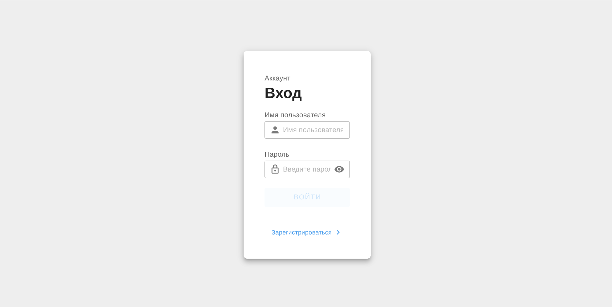
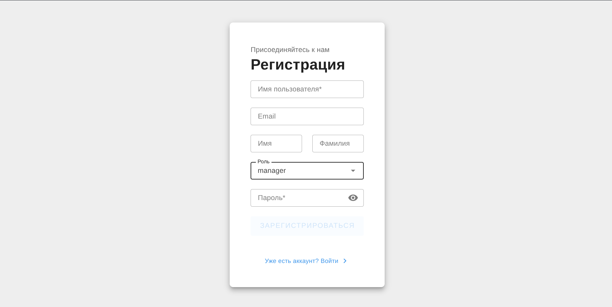
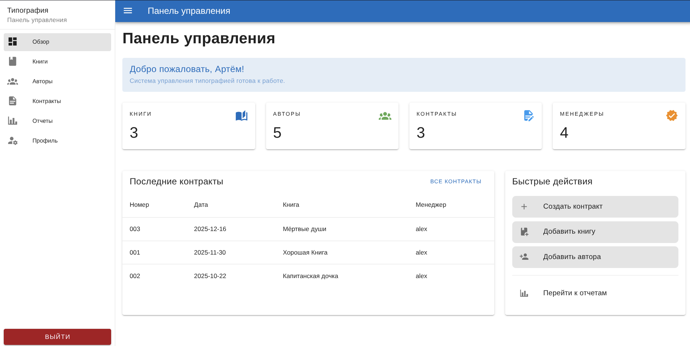
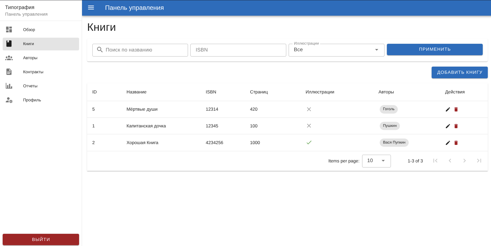
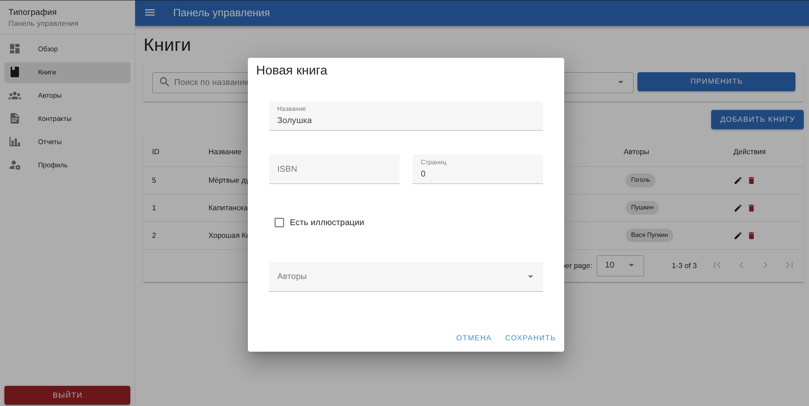
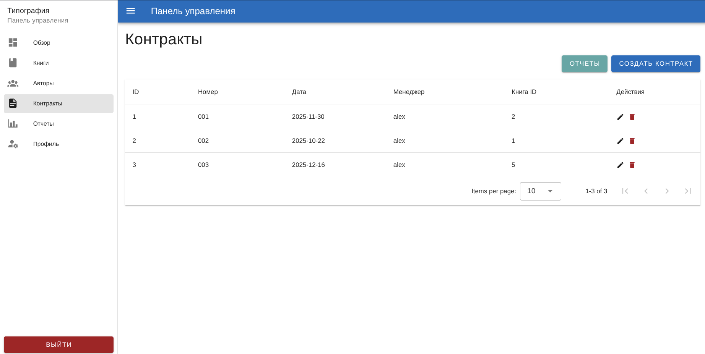
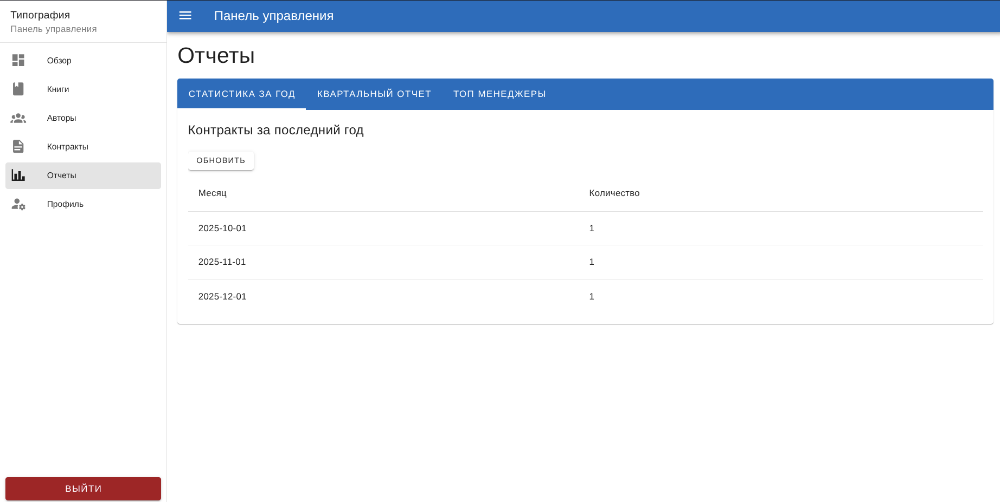
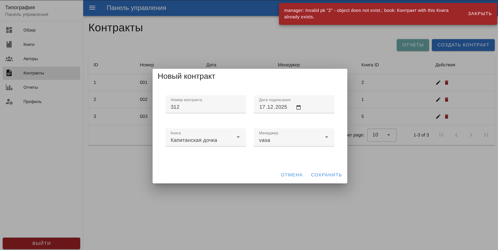

## Цель работы

Разработать клиентскую часть для веб-приложения "Типография" с использованием фреймворка Vue.js 3, взаимодействующую с
API на Django REST Framework. Реализовать полный набор функций: аутентификацию, CRUD-операции,
фильтрацию и отображение отчетов.

### Используемые технологии

* **Vue.js 3 (Composition API)**: Основной JS-фреймворк.
* **Vite**: Сборщик проекта.
* **Vuetify 3**: UI-библиотека компонентов (Material Design).
* **Pinia**: State Management (управление состоянием) для хранения данных пользователя и уведомлений.
* **Vue Router**: Маршрутизация в SPA.
* **Axios**: HTTP-клиент для запросов к API.

## Структура проекта

Проект был инициализирован через Vite. Основная структура:

* `src/api/` — конфигурация Axios и методы для работы с API (typography.js).
* `src/layouts/` — шаблоны страниц (AuthLayout для входа/регистрации, DefaultLayout для панели управления).
* `src/stores/` — хранилища Pinia (auth.js, alert.js).
* `src/views/` — страницы приложения (Login, Register, Dashboard, Books, Authors, Contracts, Reports).
* `src/components/` — переиспользуемые компоненты (в данной работе в основном использовались готовые из Vuetify).

## Ход работы

### 1. Настройка окружения и API

В файле `vite.config.js` был настроен прокси для перенаправления запросов `/api` и `/auth` на сервер Django (localhost:
8000), чтобы избежать CORS проблем при разработке.
Были созданы экземпляры axios с интерцепторами для автоматического добавления JWT токена в заголовки запросов.

### 2. Аутентификация и Авторизация

Реализованы страницы входа и регистрации. Состояние пользователя хранится в Pinia Store (`auth.js`). При успешном входе
токен сохраняется в `localStorage`.

*Скриншот страницы входа:*

*Скриншот страницы регистрации:*

Также реализована страница профиля, где пользователь может изменить свои данные (Email, Имя, Фамилию).

### 3. Панель управления (Dashboard)

Разработана главная страница с дашбордом, который отображает:

* Карточки со статистикой (Количество книг, авторов, контрактов).
* Таблицу с последними 5 контрактами.
* Кнопки быстрых действий.

*Скриншот дашборда:*

### 4. Управление ресурсами (CRUD)

**Книги (Books):**
Реализован просмотр списка книг с фильтрацией по названию и ISBN.

*Код метода сохранения книги (Books.vue):*

*Скриншот списка книг:*

*Скриншот модального окна создания книги:*

**Авторы и Контракты:**
Аналогично реализованы страницы для авторов и контрактов. В контрактах реализован выбор менеджера и книги из выпадающих
списков.

*Скриншот страницы контрактов:*

### 5. Отчеты и Статистика

Создана страница с вкладками (Tabs) для отображения различных отчетов, предоставляемых API:

* Статистика за год (таблица по месяцам).
* Квартальный отчет.
* Топ менеджеров (с выбором дат).

*Скриншот страницы отчетов:*

### 6. Глобальная обработка ошибок

Для улучшения UX был создан глобальный store `alert.js` и компонент `VSnackbar` в `App.vue`. Теперь любые ошибки API (
например, валидация полей или 500-е ошибки) перехватываются и отображаются пользователю в красивом уведомлении.

*Скриншот уведомления об ошибке:*

## Вывод

В ходе лабораторной работы было разработано полноценное одностраничное приложение на Vue.js. Были закреплены
навыки работы с компонентами, реактивностью, роутингом, взаимодействием с REST API и управлением состоянием приложения.
Интерфейс полностью переведен на русский язык и адаптирован для удобного использования.