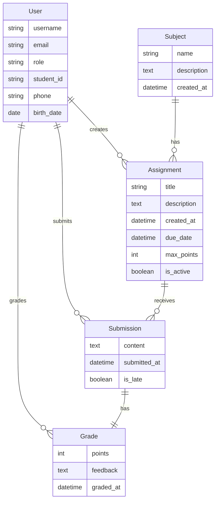

# Доска домашних заданий (Homework Board)

## 📖 Обзор проекта

**Homework Board** - это современная веб-система для управления домашними заданиями в учебных заведениях. Проект разработан с использованием Django Framework и предоставляет полный набор функций для организации учебного процесса.

## 🎯 Основные возможности

### Для студентов
- 📚 Просмотр списка всех домашних заданий
- 🔍 Поиск и фильтрация заданий по предметам и статусу
- 📤 Сдача выполненных работ
- 📊 Просмотр своих оценок и комментариев преподавателей
- 📈 Отслеживание статистики успеваемости
- ⏰ Уведомления о приближающихся дедлайнах

### Для преподавателей
- ➕ Создание новых домашних заданий
- ✏️ Редактирование и удаление заданий
- 📥 Просмотр сданных работ студентов
- ⭐ Выставление оценок и написание комментариев
- 📊 Статистика по заданиям и успеваемости
- 🔔 Отслеживание несданных работ

### Для администраторов
- 👥 Управление пользователями
- 📚 Управление предметами
- 🛠️ Полный доступ ко всем функциям системы

## 🏗️ Архитектура проекта

### Структура приложения

```
homework_board/
├── homework_board/          # Настройки проекта
│   ├── settings.py         # Конфигурация Django
│   ├── urls.py             # Главный URL конфигуратор
│   ├── wsgi.py             # WSGI entry point
│   └── asgi.py             # ASGI entry point
│
├── assignments/            # Основное приложение
│   ├── models.py          # Модели данных
│   ├── views.py           # Представления
│   ├── forms.py           # Формы
│   ├── urls.py            # URL маршруты
│   ├── admin.py           # Настройки админ-панели
│   └── migrations/        # Миграции БД
│
├── templates/             # HTML шаблоны
│   ├── base.html         # Базовый шаблон
│   ├── assignments/      # Шаблоны приложения
│   └── registration/     # Шаблоны аутентификации
│
├── static/               # Статические файлы
│   ├── css/             # Стили
│   └── js/              # JavaScript
│
└── manage.py            # Управление Django
```

## 🗄️ Модели данных

### User (Пользователь)
Расширенная модель пользователя Django с дополнительными полями:

- `role` - роль пользователя (студент/преподаватель/администратор)
- `student_id` - номер студенческого билета
- `phone` - номер телефона
- `birth_date` - дата рождения

### Subject (Предмет)
Учебный предмет:

- `name` - название предмета
- `description` - описание предмета
- `created_at` - дата создания

### Assignment (Домашнее задание)
Задание для студентов:

- `subject` - связь с предметом (ForeignKey)
- `teacher` - преподаватель, создавший задание (ForeignKey)
- `title` - название задания
- `description` - описание задания
- `created_at` - дата выдачи
- `due_date` - срок выполнения
- `max_points` - максимальный балл
- `is_active` - статус активности

### Submission (Сдача задания)
Работа, сданная студентом:

- `assignment` - связь с заданием (ForeignKey)
- `student` - студент (ForeignKey)
- `content` - текст сдачи
- `submitted_at` - дата сдачи
- `is_late` - признак опоздания

### Grade (Оценка)
Оценка за выполненное задание:

- `submission` - связь со сдачей (OneToOneField)
- `points` - полученные баллы
- `feedback` - комментарий преподавателя
- `graded_by` - преподаватель, выставивший оценку (ForeignKey)
- `graded_at` - дата оценки

## 📊 ER-диаграмма



## 🚀 Функционал

### Управление заданиями

**Создание задания** (только преподаватели):
```python
# URL: /assignments/create/
# View: AssignmentCreateView
# Template: assignment_form.html
```

**Просмотр списка заданий**:
```python
# URL: /assignments/
# View: AssignmentListView
# Features: Поиск, фильтрация, пагинация
```

**Детали задания**:
```python
# URL: /assignments/<id>/
# View: AssignmentDetailView
# Показывает: описание, дедлайн, статус сдачи
```

### Сдача работ

**Форма сдачи** (только студенты):
```python
# URL: /assignments/<id>/submit/
# View: submit_assignment
# Проверяет: дедлайн, уникальность сдачи
```

### Оценивание

**Выставление оценки** (только преподаватели):
```python
# URL: /grades/submission/<id>/
# View: grade_submission
# Форма: баллы + комментарий
```

## 🎨 Интерфейс

### Дизайн
- **Framework**: Bootstrap 5
- **Адаптивность**: Полная поддержка мобильных устройств
- **Цветовая схема**: Синий (primary), голубой (accent)

### Основные страницы

1. **Главная страница** (`home.html`)
   - Статистика по заданиям
   - Последние задания
   - Быстрый доступ к функциям

2. **Список заданий** (`assignment_list.html`)
   - Карточки заданий
   - Поиск и фильтры
   - Индикаторы статуса

3. **Детали задания** (`assignment_detail.html`)
   - Полное описание
   - Форма сдачи (для студентов)
   - Список сдач (для преподавателей)

4. **Личный кабинет** (`profile.html`)
   - Информация о пользователе
   - История активности
   - Статистика

## 🔐 Система безопасности

### Аутентификация
- Вход/выход из системы
- Регистрация новых пользователей
- Восстановление пароля

### Авторизация
- Разграничение прав доступа по ролям
- Защита представлений через `@login_required`
- Проверка прав через `UserPassesTestMixin`

### Валидация данных
- Проверка на стороне сервера
- Django формы с валидаторами
- Защита от SQL-инъекций (ORM)
- CSRF защита

## 📈 Дополнительные возможности

### Статистика
- Средний балл студента
- Процент выполненных заданий
- Рейтинг студентов
- Статистика по предметам

### Уведомления
- Приближающиеся дедлайны
- Новые оценки
- Комментарии преподавателей

### Поиск и фильтрация
- Полнотекстовый поиск
- Фильтр по предметам
- Фильтр по статусу (активные/просроченные/сданные)
- Сортировка

## 🔗 Связанные разделы

- [Модели данных](models.md) - подробное описание моделей
- [Представления](views.md) - логика обработки запросов
- [Формы](forms.md) - формы и валидация
- [URL маршруты](urls.md) - настройка маршрутизации
- [Шаблоны](templates.md) - структура шаблонов
- [Установка и запуск](setup.md) - инструкция по развертыванию

---

!!! success "Готово к использованию"
    Проект полностью функционален и готов к использованию в учебных заведениях!
