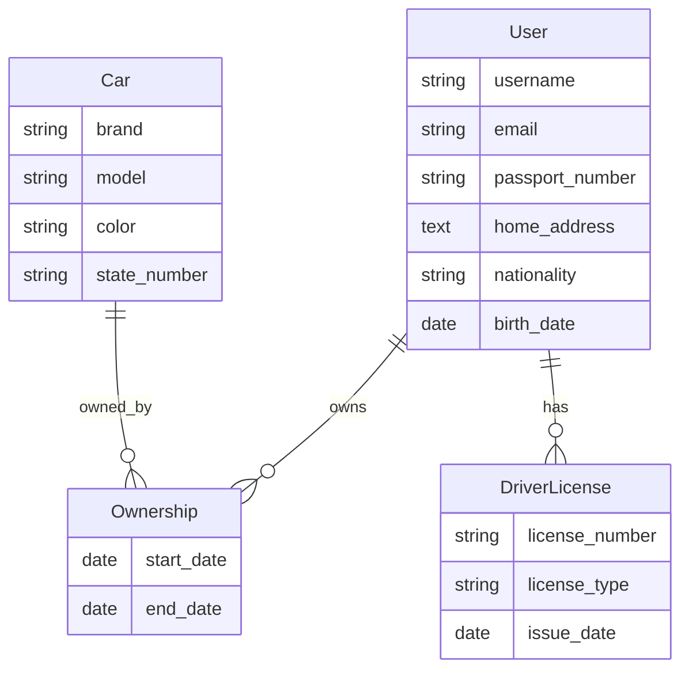

# Система управления автовладельцами (Car Owners Management)

## 📖 Обзор проекта

**Car Owners Management System** - веб-приложение для управления информацией об автовладельцах, их автомобилях, водительских удостоверениях и истории владения транспортными средствами.

## 🎯 Основные возможности

### Управление владельцами
- 👤 Создание профилей владельцев
- ✏️ Редактирование информации
- 🗑️ Удаление записей
- 📋 Просмотр детальной информации
- 🔍 Список всех владельцев

### Управление автомобилями
- 🚗 Регистрация автомобилей
- 📝 Редактирование данных о ТС
- 🗑️ Удаление записей
- 📊 Просмотр истории владения
- 🔍 Каталог всех автомобилей

### Водительские удостоверения
- 🪪 Регистрация удостоверений
- 📋 Управление категориями
- 📅 Отслеживание дат выдачи
- 🔗 Привязка к владельцам

### Аутентификация
- 🔐 Регистрация пользователей
- 🔑 Вход/выход из системы
- 👤 Личный кабинет
- 🛡️ Защита данных

## 🏗️ Архитектура проекта

### Структура приложения

```
tutorial/
├── django_project_tonikx/     # Настройки проекта
│   ├── settings.py           # Конфигурация Django
│   ├── urls.py               # Главный URL конфигуратор
│   ├── wsgi.py               # WSGI entry point
│   └── asgi.py               # ASGI entry point
│
├── project_first_app/        # Основное приложение
│   ├── models.py            # Модели данных
│   ├── views.py             # Представления
│   ├── forms.py             # Формы
│   ├── urls.py              # URL маршруты
│   ├── admin.py             # Настройки админ-панели
│   └── migrations/          # Миграции БД
│
├── templates/               # HTML шаблоны
│   ├── home.html           # Главная страница
│   ├── owners_list.html    # Список владельцев
│   ├── owner.html          # Детали владельца
│   ├── owner_form.html     # Форма владельца
│   ├── car_list.html       # Список автомобилей
│   ├── car_detail.html     # Детали автомобиля
│   ├── car_form.html       # Форма автомобиля
│   ├── profile.html        # Профиль
│   └── registration/       # Шаблоны аутентификации
│
└── manage.py               # Управление Django
```

## 🗄️ Модели данных

### User (Владелец)
Расширенная модель пользователя с информацией о владельце:

- `passport_number` - номер паспорта
- `home_address` - домашний адрес
- `nationality` - национальность
- `birth_date` - дата рождения

### Car (Автомобиль)
Информация о транспортном средстве:

- `brand` - марка автомобиля
- `model` - модель автомобиля
- `color` - цвет
- `state_number` - государственный номер

### Ownership (Владение)
Связь владельца и автомобиля:

- `owner` - владелец (ForeignKey → User)
- `car` - автомобиль (ForeignKey → Car)
- `start_date` - дата начала владения
- `end_date` - дата окончания владения

### DriverLicense (Водительское удостоверение)
Информация об удостоверении:

- `owner` - владелец (ForeignKey → User)
- `license_number` - номер удостоверения
- `license_type` - тип/категория (A, B, C, D)
- `issue_date` - дата выдачи

## 📊 ER-диаграмма



## 🚀 Функционал

### Функциональные представления (владельцы)

- `home()` - главная страница с статистикой
- `owners_list()` - список всех владельцев
- `owner_detail(owner_id)` - детали владельца
- `owner_create()` - создание владельца
- `owner_update(owner_id)` - редактирование
- `owner_delete(owner_id)` - удаление

### Классовые представления (автомобили)

- `CarListView` - список автомобилей (ListView)
- `CarDetailView` - детали автомобиля (DetailView)
- `CarCreateView` - создание автомобиля (CreateView)
- `CarUpdateView` - редактирование (UpdateView)
- `CarDeleteView` - удаление (DeleteView)

### Аутентификация

- `register()` - регистрация пользователя
- `profile()` - профиль пользователя
- Встроенные представления Django для входа/выхода

## 🎨 Интерфейс

### Главная страница
- Статистика (количество владельцев, автомобилей, владений, удостоверений)
- Список последних владельцев
- Быстрый доступ к функциям

### Список владельцев
- Карточки владельцев
- Информация о количестве автомобилей
- Ссылки на детали

### Детали владельца
- Полная информация о владельце
- Список автомобилей во владении
- Водительские удостоверения
- Кнопки редактирования и удаления

### Управление автомобилями
- Список всех автомобилей
- Детальная информация
- История владения
- CRUD операции

## 🔐 Безопасность

### Аутентификация
- Регистрация новых пользователей
- Вход/выход из системы
- Защита паролей

### Авторизация
- Защита представлений через `@login_required`
- Разграничение доступа к данным
- Проверка прав на редактирование/удаление

### Валидация
- Проверка данных на стороне сервера
- Django формы с валидаторами
- Ограничения на поля моделей

## 📈 Особенности реализации

### Смешанный подход к представлениям
- Функциональные представления для владельцев
- Классовые представления для автомобилей
- Демонстрация обоих подходов Django

### Оптимизация запросов
- `select_related()` для ForeignKey
- Уменьшение количества запросов к БД

### Адаптивный дизайн
- Responsive layout
- Мобильная версия
- Bootstrap компоненты

## 🔗 Связанные разделы

- [Модели данных](models.md) - подробное описание моделей
- [Представления](views.md) - логика обработки запросов
- [Формы](forms.md) - формы и валидация
- [URL маршруты](urls.md) - настройка маршрутизации
- [Шаблоны](templates.md) - структура шаблонов
- [Установка и запуск](setup.md) - инструкция по развертыванию

---

!!! info "Учебный проект"
    Проект создан в учебных целях для изучения Django Framework и демонстрации различных подходов к разработке веб-приложений.
