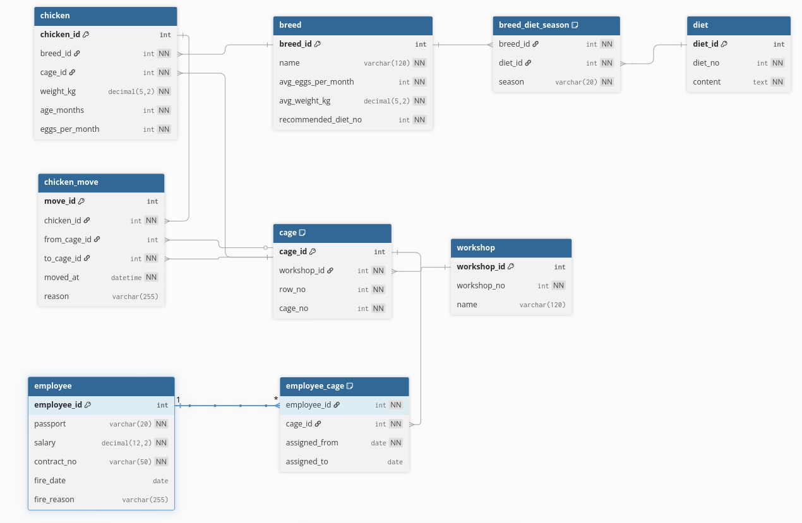

# Модель базы данных

<p align="center">
  
  <br>
  <em>Рисунок 1 — ER/DB модель базы данных проекта</em>
</p>

---

## Код для вставки в dbdiagram.io

```dbml
// Use DBML to define your database structure
// Docs: https://dbml.dbdiagram.io/docs


Table chicken {
  chicken_id int [pk, increment]

  breed_id int [not null, ref: > breed.breed_id]   // порода
  cage_id int [not null, ref: > cage.cage_id]      // местонахождение (текущая клетка)

  weight_kg decimal(5,2) [not null]  // вес
  age_months int [not null]          // возраст (в месяцах)
  eggs_per_month int [not null]      // яиц в месяц (факт)
}


Table breed {
  breed_id int [pk, increment]

  name varchar(120) [not null, unique]     // название породы
  avg_eggs_per_month int [not null]        // среднее яиц/месяц (производительность)
  avg_weight_kg decimal(5,2) [not null]    // средний вес

  recommended_diet_no int [not null]       // номер рекомендованной диеты (как атрибут породы)
}

Table diet {
  diet_id int [pk, increment]

  diet_no int [not null, unique]     // номер диеты
  content text [not null]            // содержание диеты (описание, рацион)
}

Table breed_diet_season {
  breed_id int [not null, ref: > breed.breed_id]   // порода
  diet_id int [not null, ref: > diet.diet_id]      // диета

  season varchar(20) [not null]                    // сезон (WINTER, SPRING, SUMMER, AUTUMN)

  Note: "Для каждой породы в каждом сезоне должна быть ровно одна диета"

  Indexes {
    (breed_id, season) [unique]                    // одна диета на породу в сезон
  }
}

Table workshop {
  workshop_id int [pk, increment]

  workshop_no int [not null, unique]   // номер цеха (используется в коде клетки)
  name varchar(120)                    // название/описание (опционально)
}

Table cage {
  cage_id int [pk, increment]

  workshop_id int [not null, ref: > workshop.workshop_id]  // цех
  
  row_no int [not null]                                    // номер ряда в цехе
  cage_no int [not null]                                   // номер клетки в ряду

  Note: "Код клетки = номер цеха + номер ряда + номер клетки в ряду"

  Indexes {
    (workshop_id, row_no, cage_no) [unique]
  }
}


Table chicken_move {
  move_id int [pk, increment]

  chicken_id int [not null, ref: > chicken.chicken_id]   // какая курица
  from_cage_id int [ref: > cage.cage_id]                 // из какой клетки (NULL если первичное размещение)
  to_cage_id int [not null, ref: > cage.cage_id]         // в какую клетку

  moved_at datetime [not null]                           // дата/время пересадки
  reason varchar(255)                                    // причина (опционально)
}


Table employee {
  employee_id int [pk, increment]

  // паспортные данные
  passport varchar(20) [not null]

  // зарплата
  salary decimal(12,2) [not null]

  // договор о трудоустройстве
  contract_no varchar(50) [not null]

  // данные об увольнении (NULL = работает)
  fire_date date
  fire_reason varchar(255)
}


Table employee_cage {
  employee_id int [not null, ref: > employee.employee_id]  // работник
  cage_id int [not null, ref: > cage.cage_id]              // клетка

  assigned_from date [not null]                            // дата начала закрепления
  assigned_to date                                         // дата окончания (NULL = активно)

  Note: "Если assigned_to NULL — закрепление активно. История закреплений хранится по датам."

  Indexes {
    (employee_id, cage_id, assigned_from) [unique]
  }
}
