# Отчет по лабораторной работе №4

**Выполнил:** Шафиков Максим Азатович 

**Факультет:** ПИН (ИКТ)

**Группа:** К3339  

**Преподаватель:** Говоров Антон Игоревич  

---

Основной репозиторий проекта доступен по [ссылке](https://github.com/aimclub/Edulytica/)

---

## 1. Цель работы

Целью данной работы является разработка клиентской части (frontend) веб-приложения с использованием современных технологий и фреймворков. Необходимо было создать интуитивно понятный, отзывчивый и функциональный пользовательский интерфейс для взаимодействия с серверной частью системы, обеспечивающей автоматизацию проверки и оценки текстовых работ.

## 2. Задание

В рамках работы требовалось реализовать следующий функционал:
1. Реализовать систему аутентификации пользователей: регистрация, вход и выход из системы.
2. Обеспечить разграничение доступа к разным частям приложения для авторизованных и неавторизованных пользователей (защищенные маршруты).
3. Разработать личный кабинет пользователя, где отображается история его работ (тикетов).
4. Реализовать возможность загрузки файлов для обработки.
5. Отображать статус и результаты обработки файлов (исходный текст, результат рецензирования).
6. Предоставить пользователю возможность управлять своими тикетами: переименовывать, делать общедоступными и удалять.
7. Реализовать систему модальных окон для различных взаимодействий: уведомления, подтверждения действий, редактирование профиля и т.д.
8. Обеспечить взаимодействие с бэкендом через API.

## 3. Используемые технологии

*   **React:** Библиотека для создания пользовательских интерфейсов. Является основой приложения.
*   **React Router:** Для реализации навигации и маршрутизации в одностраничном приложении.
*   **Redux Toolkit:** Для управления состоянием приложения. Используется для хранения данных о пользователе, токенах аутентификации и тикетах.
*   **Axios:** HTTP-клиент для выполнения запросов к API бэкенда.
*   **Sass (SCSS):** Препроцессор CSS для написания более структурированных и поддерживаемых стилей.
*   **Framer Motion:** Библиотека для создания плавных и декларативных анимаций интерфейса.

## 4. Структура проекта

Фронтенд часть проекта расположена в директории `src/front_end/src` и имеет следующую структуру:

*   `api/`: Настройка экземпляра `axios`, включая интерцепторы для автоматического добавления токена авторизации в заголовки запросов.
*   `assets/`: Статические файлы, такие как изображения и иконки.
*   `components/`: Переиспользуемые React-компоненты, из которых строятся страницы (например, `header`, `profileModal`, `resultFile`).
*   `pages/`: Компоненты, представляющие собой отдельные страницы приложения (`home`, `account`, `registration`).
*   `routes/`: Логика маршрутизации приложения. `AppRoutes.jsx` определяет все пути, а `ProtectedRoute.jsx` реализует защиту маршрутов.
*   `services/`: Сервисы для взаимодействия с API. Абстрагируют логику HTTP-запросов от компонентов (`auth.service.js`, `ticket.service.js`).
*   `store/`: Логика управления состоянием с помощью Redux Toolkit. Содержит "слайсы" (`authSlice.js`, `ticketSlice.js`), которые определяют редьюсеры и экшены.
*   `utils/`: Вспомогательные утилиты, например, функции для валидации форм (`validationUtils.js`) или кастомные UI-элементы (`input/input.jsx`).

## 5. Реализованный функционал

### 5.1. Аутентификация и управление состоянием

Аутентификация реализована через `auth.service.js`, который отправляет запросы на регистрацию и вход. Состояние авторизации, информация о пользователе и JWT-токен хранятся в Redux-хранилище, за которое отвечает `authSlice.js`. Состояние также дублируется в `localStorage` для сохранения сессии пользователя между перезагрузками страницы.

Пример `authSlice.js`:
```javascript
const authSlice = createSlice({
  name: "auth",
  initialState: getInitialState(), // Функция для получения состояния из localStorage
  reducers: {
    loginUser: (state, action) => {
      state.currentUser = action.payload.user || state.currentUser;
      state.isAuth = true;
      state.token = action.payload.token;
      // Сохраняем состояние в localStorage
      localStorage.setItem("authState", JSON.stringify(state));
    },
    logoutUser: (state) => {
      // Очищаем состояние и localStorage
      state.currentUser = null;
      state.isAuth = false;
      state.token = null;
      localStorage.removeItem("authState");
    },
    // ...другие редьюсеры
  },
});
```

### 5.2. Маршрутизация
Маршрутизация в приложении построена с использованием react-router-dom. В файле AppRoutes.jsx определены публичные маршруты (/, /login, /registration) и защищенные (/account). Доступ к защищенным маршрутам контролируется компонентом ProtectedRoute, который проверяет флаг isAuth в Redux-состоянии.

Пример из src/front_end/src/routes/AppRoutes.jsx
```javascript
<Routes>
  <Route
    path="/"
    element={
      isAuth ? <Navigate to="/account" replace /> : <Home isAuth={isAuth} />
    }
  />
  {/* Защищенные маршруты аккаунта */}
  <Route
    path="/account"
    element={
      <ProtectedRoute>
        <Account {...props} />
      </ProtectedRoute>
    }
  />
  {/* ...другие маршруты */}
</Routes>
```

### 5.3. Личный кабинет и работа с тикетами

Основной функционал для авторизованного пользователя сосредоточен на странице account.jsx. Эта страница управляет отображением списка тикетов, загрузкой новых файлов и отображением содержимого выбранного тикета в компоненте ResultFile.

Взаимодействие с API для получения истории, создания и управления тикетами вынесено в ticket.service.js. Состояние тикетов (список, данные активного тикета, статусы загрузки) управляется через ticketSlice.js.

Компонент ResultFile.jsx отвечает за отображение исходного документа и результата его обработки. Он также содержит логику для асинхронной подгрузки текстового содержимого и запуска опроса сервера (polling) для обновления статуса тикета, если он находится в обработке.

Пример из src/front_end/src/components/resultFile/resultFile.jsx
```javascript
// ...
// Функция для получения контента на основе активной секции
const getTextContent = () => {
  // Раздел Исходного документа
  if (activeSectionResult === 1) {
    if (files.file) return files.file.split("\n");
    return "Загрузка исходного документа...";
  }

  // Раздел Результата
  if (activeSectionResult === 2) {
    if (ticketData?.status === "In progress") {
      return `Документ в обработке...`;
    }
    if (files.result) return files.result.split("\n");
    return "Загрузка результата...";
  }
  return "";
};
// ...
```

### 5.4. Пользовательский интерфейс и анимации

Для улучшения пользовательского опыта в приложении используются плавные анимации, реализованные с помощью библиотеки framer-motion. Анимации применяются при переходах между страницами и при появлении/исчезновении элементов, таких как модальные окна или блоки с контентом. Стилизация компонентов выполнена с использованием препроцессора SCSS, что позволило организовать стили в соответствии с БЭМ-методологией и использовать переменные и вложенность для удобства поддержки.

### 6. Скриншоты приложения
#### 6.1 **Стартовый экран для неавторизованных пользователей**
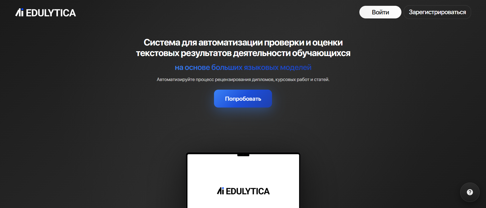

#### 6.2 **Экраны регистрации / авторизации**
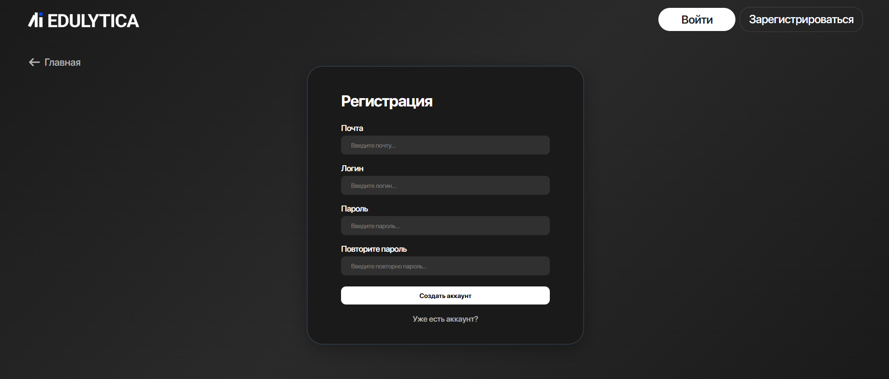
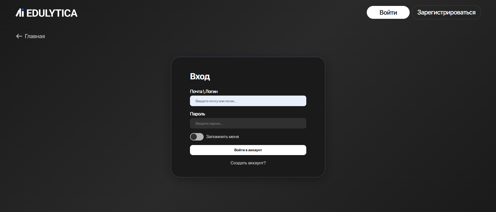

#### 6.3 **Личный кабинет пользователя с историей тикетов**
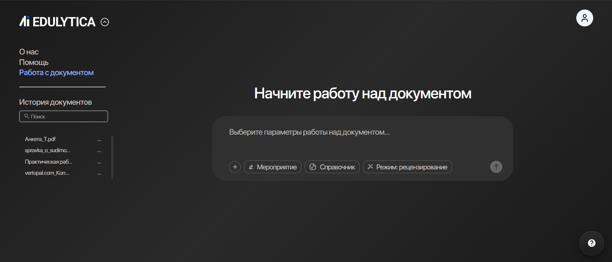

#### 6.4 **Загрузка файла и создание нового тикета**
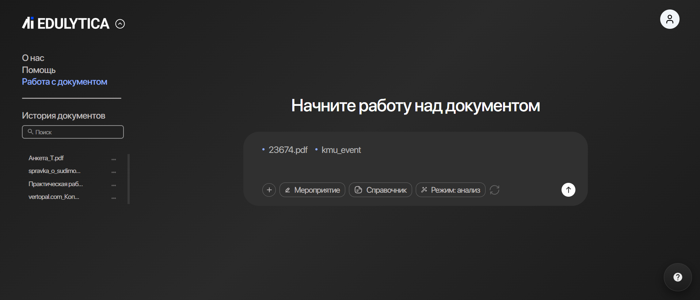
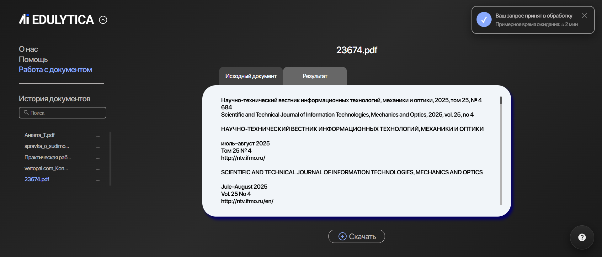

#### 6.5 **Просмотр исходного документа и результата рецензирования**
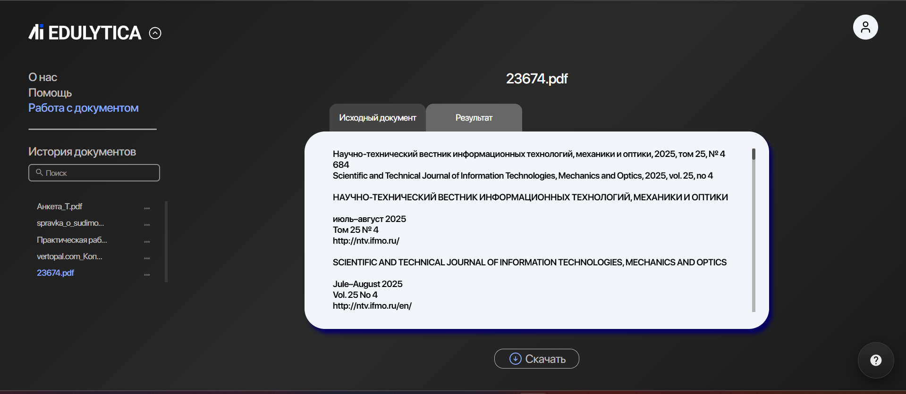
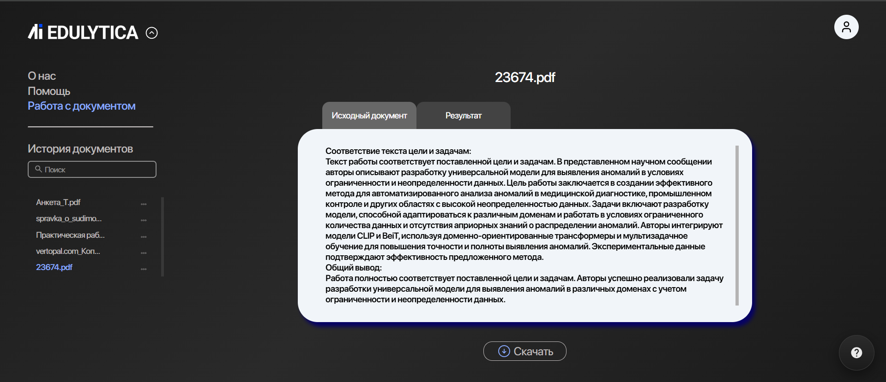

#### 6.6 **Панель для переименования, удаления и управления доступом к тикету**
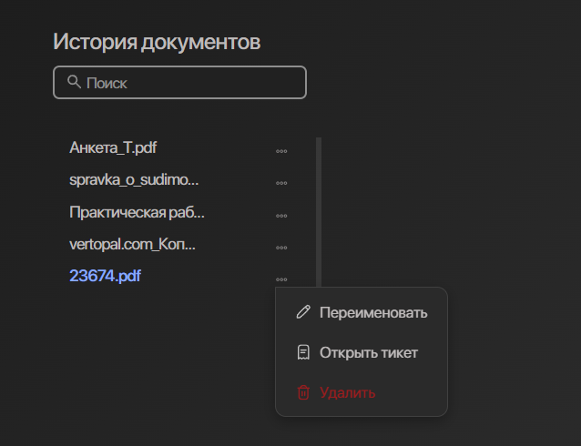

#### 6.7 **Модальные окна с информацией о профиле и для ее редактирования**
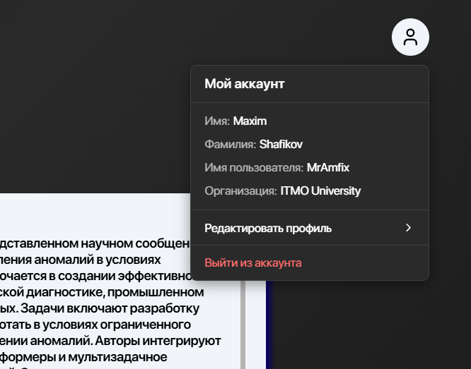
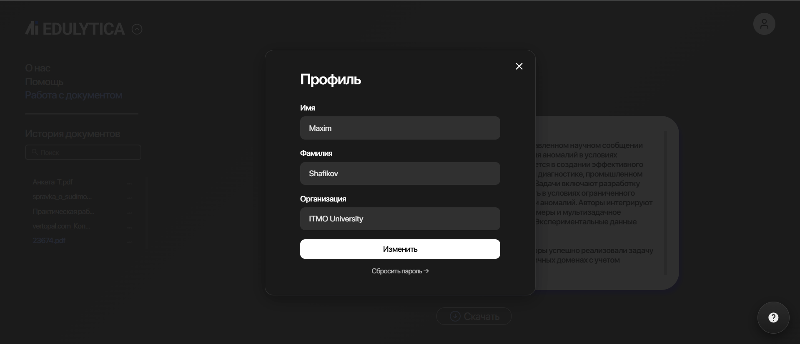

#### 6.8 **Модальное окно для отправки обратной связи**
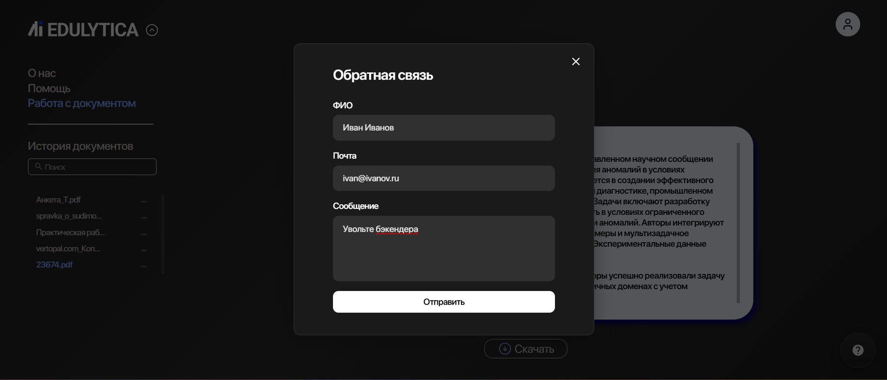

## 7. Вывод

В ходе выполнения работы была успешно спроектирована и реализована фронтенд-часть веб-приложения. Создан современный, отзывчивый и функциональный пользовательский интерфейс с использованием стека технологий React/Redux/React Router. Архитектура приложения, основанная на разделении логики на компоненты, сервисы и хранилище состояния, обеспечивает хорошую масштабируемость и поддерживаемость кода. Весь заявленный в задании функционал был реализован.