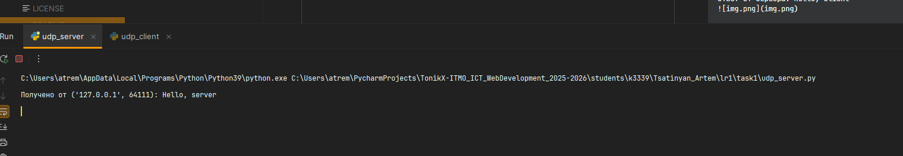
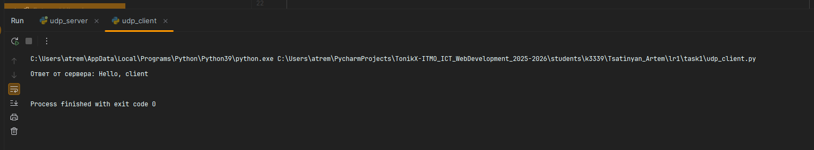

# ЛР1 — Задание 1

## Как запустить и проверить
1. В одном терминале запустите сервер:
   ```bash
   python udp_server.py
   ```
2. Во втором терминале запустите клиента:
   ```bash
   python udp_client.py
   ```

**Ожидаемый результат**
- На сервере появится строка вида:
  ```
  Получено от ('127.0.0.1', <порт_клиента>): Hello, server
  ```
  

- На клиенте:
  ```
  Ответ от сервера: Hello, client
  ```
  
