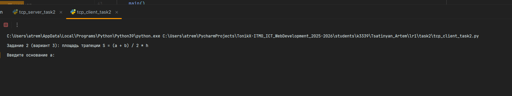
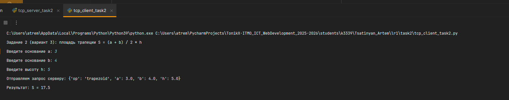
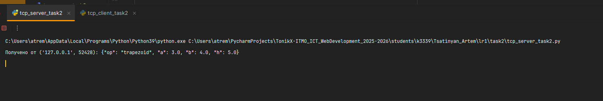

# ЛР1 — Задание 2 (TCP): Математическая операция

**Номер в журнале: 35 → вариант 3: _площадь трапеции_**  
Формула: **S = (a + b) / 2 · h**, где `a` и `b` — основания, `h` — высота.

## Протокол обмена (JSON, одна строка)
Клиент → сервер (оканчивается `\n`):
```json
{ "op": "trapezoid", "a": 10, "b": 6, "h": 4 }
```
Сервер → клиент:
```json
{ "status": "ok", "result": 32.0 }
```
или
```json
{ "status": "error", "message": "описание проблемы" }
```

## Как запустить
1. Сервер (терминал 1):
   ```bash
   python tcp_server_task2.py
   ```
2. Клиент (терминал 2):
   ```bash
   python tcp_client_task2.py
   ```
   Введите значения `a`, `b`, `h` по запросу клиента.

### Пример
```
Задание 2 (вариант 3): площадь трапеции S = (a + b) / 2 * h
Введите основание a: 10
Введите основание b: 6
Введите высоту h: 4
Отправляем запрос серверу: {'op': 'trapezoid', 'a': 10.0, 'b': 6.0, 'h': 4.0}
Результат: S = 32.0
```







## Выводы

В ходе выполнения задания я:

- Реализовал **TCP-клиента и сервер** для обмена структурированными данными в формате **JSON**.
- Научился устанавливать и использовать **надёжное соединение TCP**, в отличие от UDP.
- Освоил формирование и обработку сообщений в JSON-формате (`json.dumps`, `json.loads`).
- Реализовал вычисление площади трапеции по формуле **S = (a + b) / 2 · h** с проверкой корректности введённых данных.
- Добавил обработку ошибок и возврат ответов с полями `"status"` и `"message"`.
- Проверил обмен: клиент отправляет параметры, сервер вычисляет и возвращает результат — связь работает корректно.

В результате я понял, как работает передача данных по TCP, чем он отличается от UDP, и как можно использовать JSON-протокол для обмена структурированной информацией между приложениями.
