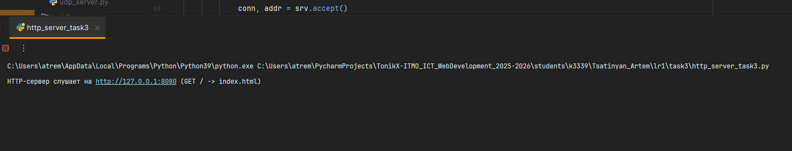
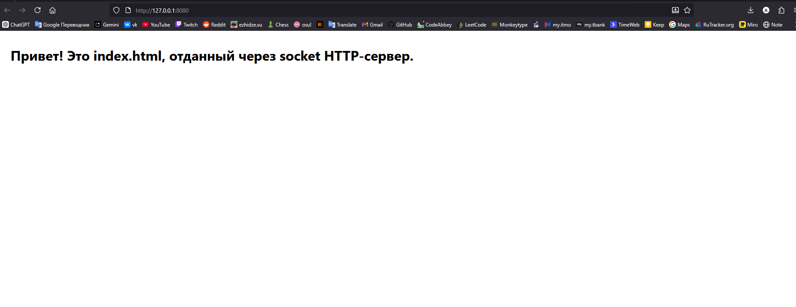

# ЛР1 — Задание 3 (HTTP): Отдача HTML-файла по сокетам

**Задача:** Реализовать сервер, который принимает подключение от клиента и возвращает **HTTP-сообщение**, содержащее HTML-страницу, подгружаемую из файла `index.html`.

## Как запустить
1. Убедитесь, что рядом с сервером лежит `index.html` (пример ниже).
2. Запустите HTTP-сервер:
   ```bash
   python http_server_task3.py
   ```
3. Откройте в браузере:
   - http://127.0.0.1:8080/
   - http://127.0.0.1:8080/index.html

**Если файла `index.html` нет**, сервер вернёт `404 Not Found`.



