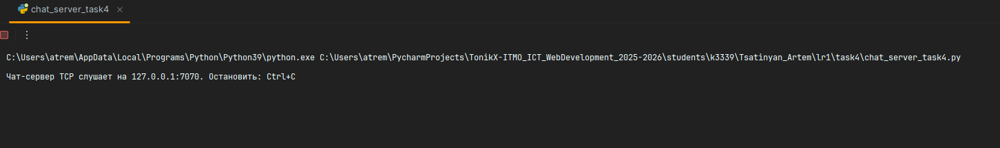
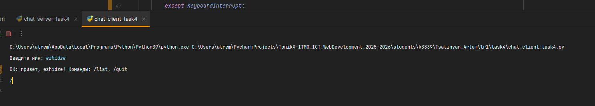
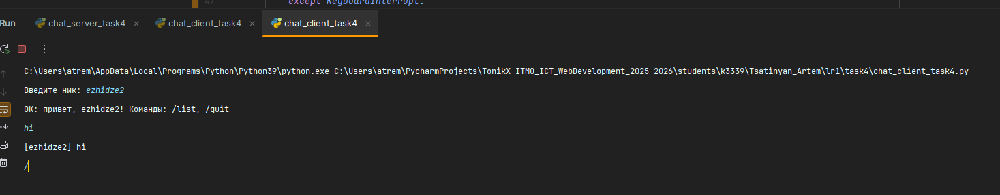
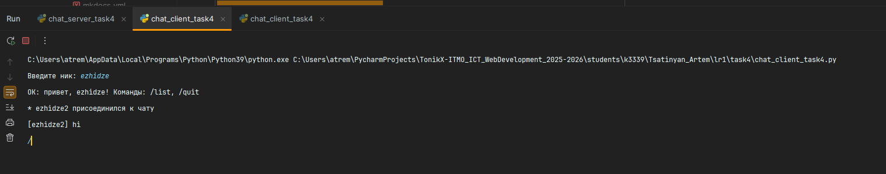

# ЛР1 — Задание 4 (Чат): многопользовательский чат на TCP + threading

**Задача:** Реализовать многопользовательский чат. Для максимума баллов — **TCP + threading**: каждый клиент обслуживается в отдельном потоке, сервер пересылает сообщения всем подключённым пользователям.

## Как работает
- Клиент после подключения отправляет первую строку с ником: `NICK:<ваше имя>`.
- Команды в клиенте:
  - `/list` — список участников
  - `/quit` — выйти из чата
- Любая другая строка — обычное сообщение, транслируется всем.

## Как запустить
1. Сервер (терминал 1):
   ```bash
   python chat_server_task4.py
   ```
2. Несколько клиентов (каждый — новый терминал):
   ```bash
   python chat_client_task4.py
   ```
   Введите ник и начните переписку. Завершение — командой `/quit` или `Ctrl+C`.









## Выводы

В ходе выполнения задания я:

- Реализовал многопользовательский **чат на TCP**, где каждый клиент обслуживается сервером в отдельном потоке с помощью модуля **threading**.
- Научился организовывать одновременное взаимодействие нескольких клиентов и обеспечивать безопасный доступ к общим данным через **блокировки (Lock)**.
- Реализовал протокол обмена сообщениями: передача ника (`NICK:`), команды (`/list`, `/quit`) и широковещательная рассылка сообщений всем пользователям.
- Освоил создание потоков для приёма и отправки сообщений, что позволяет клиенту одновременно писать и получать сообщения.
- Проверил работу: при подключении нескольких клиентов чат корректно отображает вход и выход участников, а сообщения доставляются всем пользователям.

В результате я закрепил навыки работы с **TCP-соединениями**, многопоточностью и синхронизацией потоков, а также понял, как реализуется базовая логика сетевого чата.
