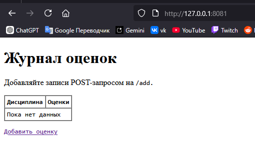
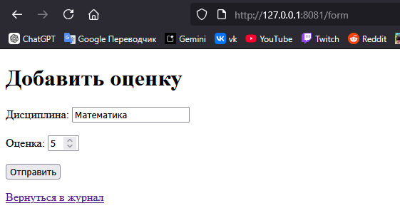
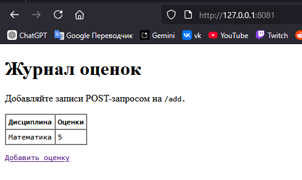
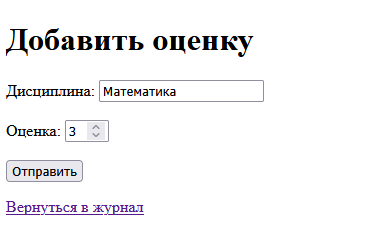
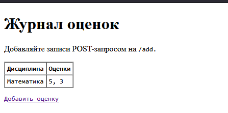
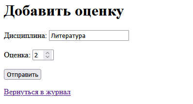
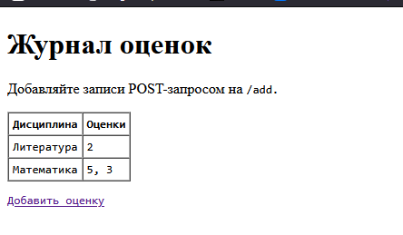

# ЛР1 — Задание 5 (HTTP): Журнал оценок

**Идея:** простой сервер на `socket`, храним оценки в памяти.
- `GET /` или `/index.html` — выдаёт HTML-страницу со списком дисциплин и оценок.
- `GET /form` — отдаёт HTML-форму для добавления новой оценки.
- `POST /add` — принимает данные (`subject`, `grade`) в формате `application/x-www-form-urlencoded`, добавляет запись и делает редирект обратно на `/`.
- Оценки агрегируются по дисциплине

## Как запустить
```bash
python http_grades_min_task5.py
# затем в браузер:
# http://127.0.0.1:8081/
```

## Как пользоваться
1. `http://127.0.0.1:8081/` - список оценок (пока пустой) и ссылку «Добавить оценку».
2. `http://127.0.0.1:8081/form` — откроется форма для ввода дисциплины и оценки.
3. После отправки формы сервер сделает редирект на `/`, где уже появится новая запись.















