# Hotel API — ЛР3 (Django REST + Djoser)

Проект реализует серверную часть системы управления гостиницей:

- учёт номеров (1-,2-,3-местные, цена, телефон);
- учёт клиентов: паспорт, ФИО, город, дата заселения/выезда;
- учёт служащих и их расписания уборки по этажам и дням недели;
- операции администратора: заселить/выселить клиента, нанять/уволить сотрудника, изменить расписание;
- отчёт по кварталу.

## Технологии

- Python, Django, Django REST Framework
- Djoser — регистрация/авторизация по токенам
- drf-yasg — Swagger/Redoc документация
- MkDocs (+ Material) — общая документация по API

## Запуск

```bash
python -m venv venv
source venv/bin/activate

pip install -r requirements.txt

python manage.py migrate
python manage.py createsuperuser
python manage.py runserver
```

##  Основные эндпоинты

- /auth/users/, /auth/token/login/ — регистрация и авторизация (Djoser)
- /api/rooms/, /api/clients/, /api/employees/, /api/stays/ — CRUD
- /api/reports/quarter/ — квартальный отчёт
- /swagger/ — Swagger UI
- /redoc/ — Redoc

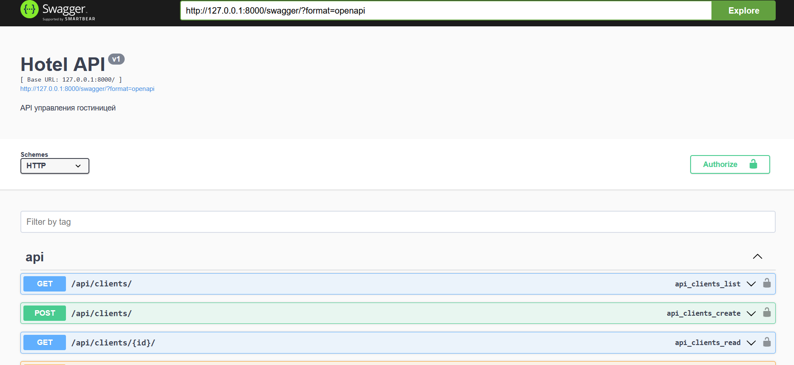

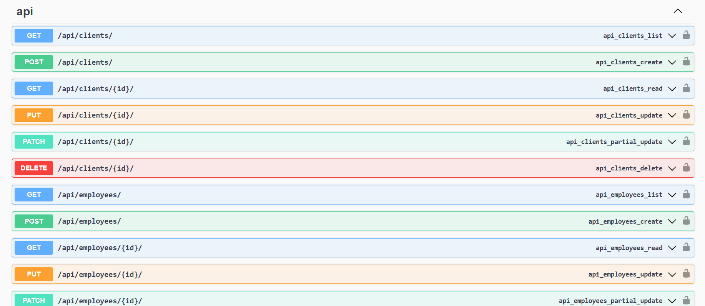

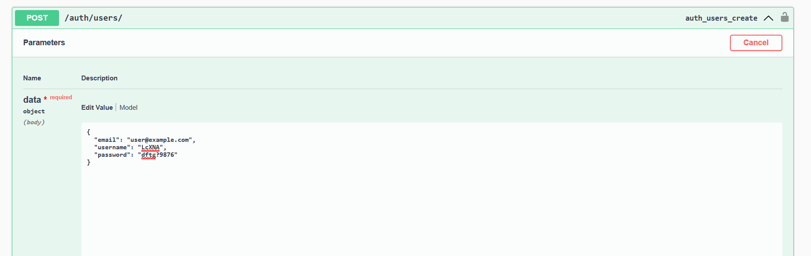

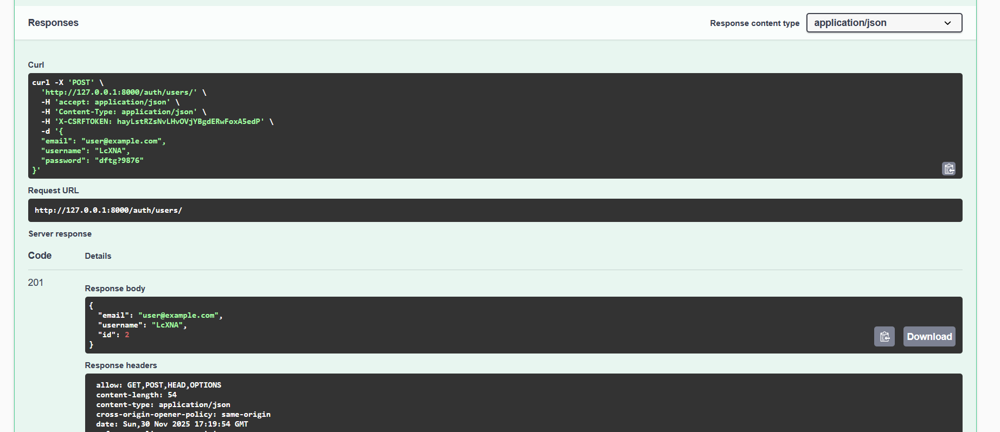

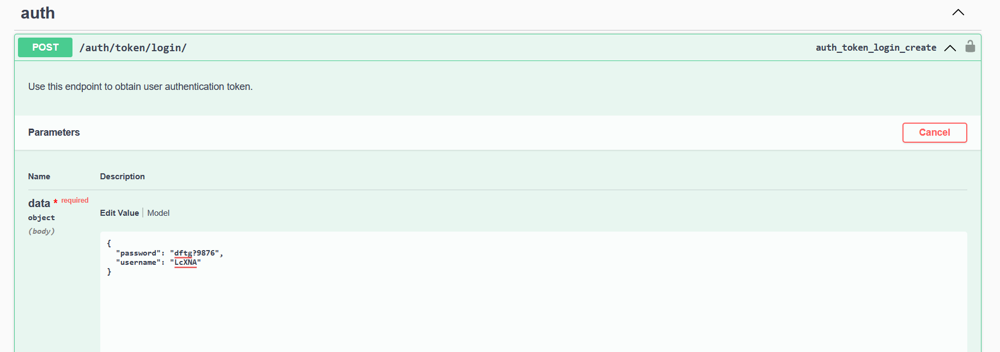

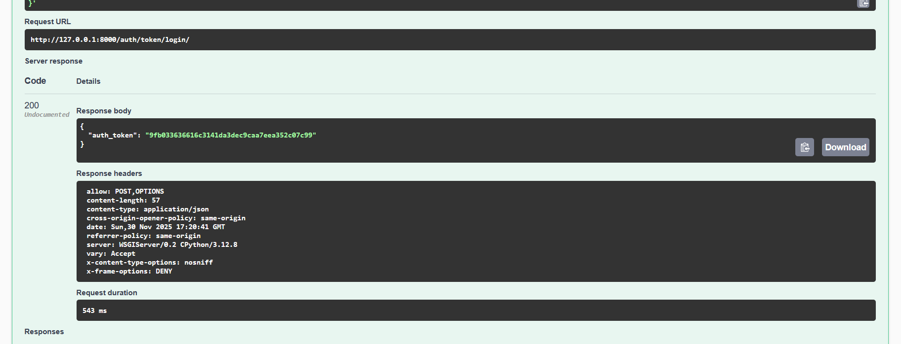

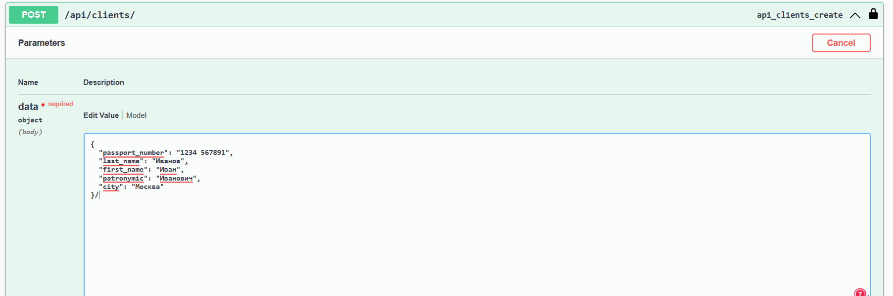

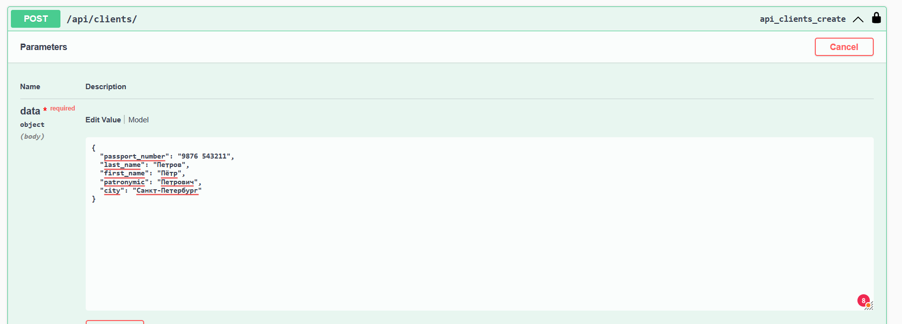

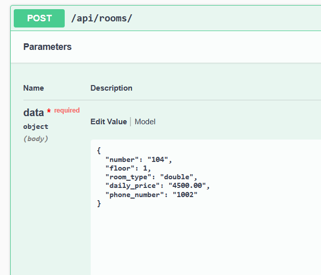

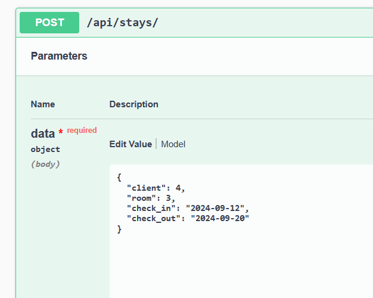

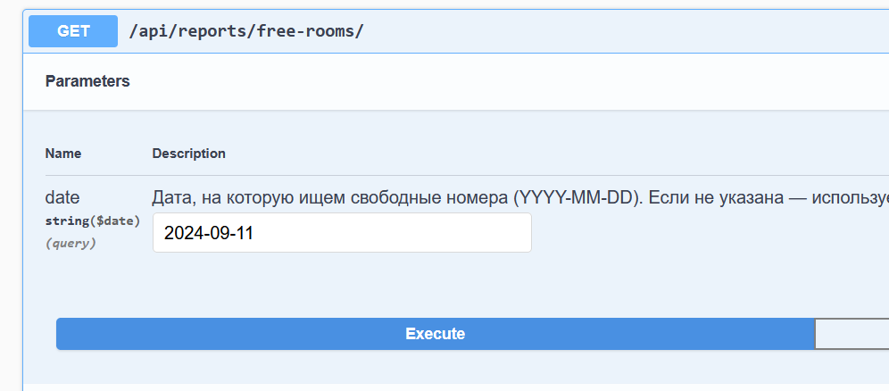

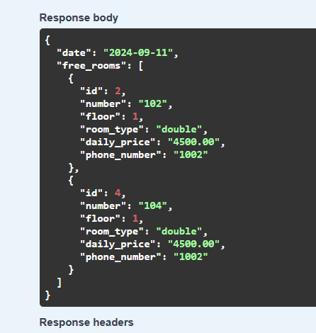

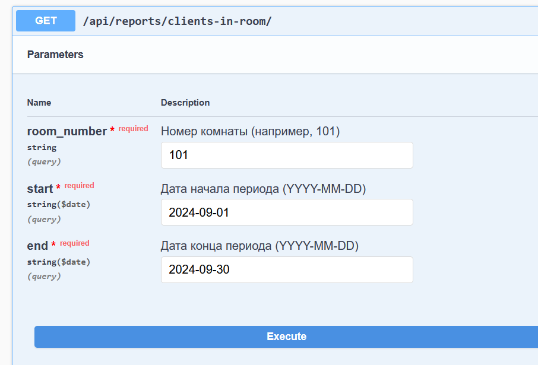

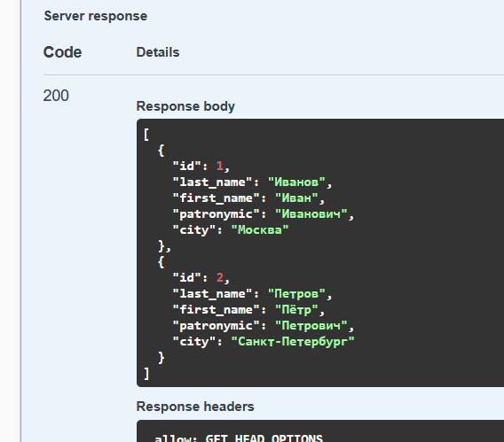

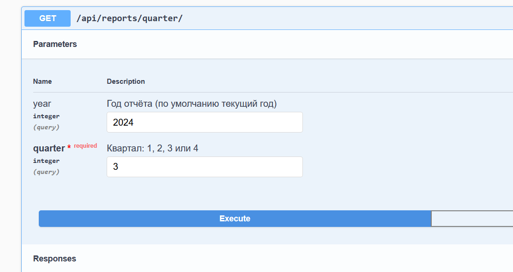

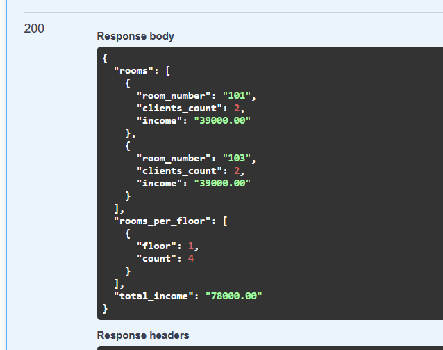