# Лабораторная работа №2 — Разработка веб‑приложения на Django

## 📘 Общие сведения

**Дисциплина:** Веб‑программирование  
**Цель работы:** Освоить основы построения серверных веб‑приложений с использованием фреймворка **Django** и системы управления базами данных **PostgreSQL**.

---

## 🧩 Общее условие

Необходимо разработать веб‑сервис с использованием **Django 3** и **PostgreSQL**, реализующий хранение и отображение данных, регистрацию пользователей, а также базовый интерактивный функционал.  
Дополнительно рекомендуется внедрить:

* меню с использованием Bootstrap,
* пагинацию (деление данных на страницы),
* поиск по объектам,
* оформление интерфейса с помощью CSS.

---

## 🎓 Индивидуальный вариант

**Вариант 6:** *«Список научных конференций»*

### Требуемый функционал

1. Отображение списка конференций с указанием названия, тематик, места и периода проведения, условий участия и описания.
2. Регистрация пользователей.
3. Возможность подачи заявки на участие (добавление, редактирование, удаление).
4. Возможность написания отзывов с рейтингом (1–10).
5. Администратор в панели Django Admin отмечает результаты выступления («рекомендовано к публикации»).
6. На клиентской части — таблица всех участников по конференциям.
7. Поиск и пагинация списка конференций.
8. Оформление с использованием Bootstrap 5 и пользовательских CSS‑стилей.

---

## ⚙️ Реализация

### Используемые технологии

| Компонент | Технология |
|------------|-------------|
| Backend | Python 3.11 + Django 3.2 |
| Database | PostgreSQL 12+ |
| Frontend | HTML + Bootstrap 5 + CSS |
| ORM | Django ORM |
| Средства разработки | PyCharm / VS Code |

### Основные модули проекта

| Файл / каталог | Назначение |
|----------------|------------|
| `models.py` | Определяет модели БД: Conference, Venue, Topic, Registration, Review |
| `views.py` | Представления: список и детали конференций, CRUD‑операции, отзывы, таблица участников |
| `urls.py` | Маршруты всех страниц сайта |
| `forms.py` | Django ModelForm для заявок и отзывов |
| `admin.py` | Регистрация моделей в админ‑панели |
| `templates/` | HTML‑шаблоны с Bootstrap и пользовательским оформлением |
| `static/css/site.css` | Индивидуальные стили оформления интерфейса |

### Логика работы

1. **Модели** формируют структуру базы данных.  
   Django создаёт таблицы автоматически при выполнении миграций.
2. **Views (представления)** обрабатывают запросы пользователей:
    - `ConferenceListView` — список конференций с поиском и пагинацией;
    - `ConferenceDetailView` — подробная страница конференции с заявками и отзывами;
    - `RegistrationCreateView`, `UpdateView`, `DeleteView` — подача и изменение заявок;
    - `ReviewCreateView`, `UpdateView`, `DeleteView` — работа с отзывами;
    - `ParticipantsTableView` — таблица участников.
3. **Шаблоны** отвечают за внешний вид страниц, реализованы с помощью Bootstrap и собственных CSS.
4. **Админ‑панель** позволяет управлять конференциями и участниками, проставлять отметки «рекомендовано к публикации».

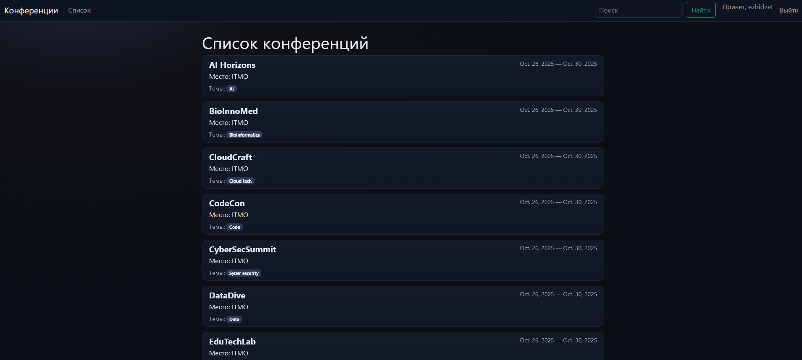

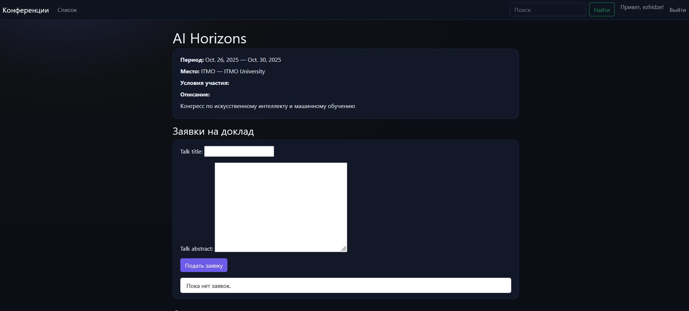

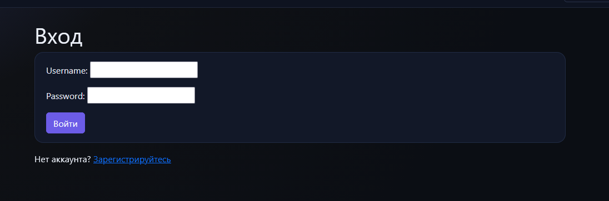

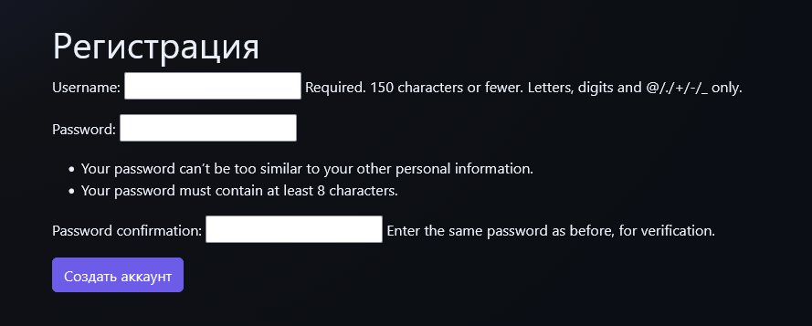

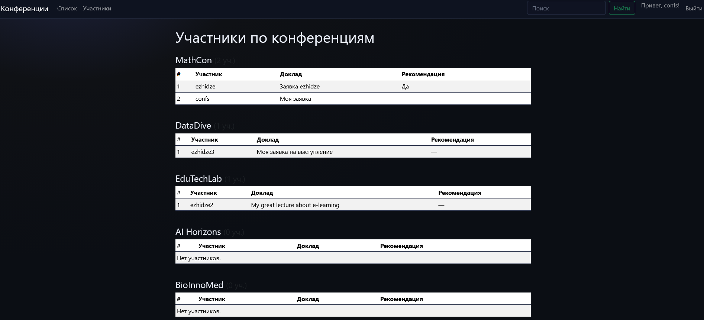

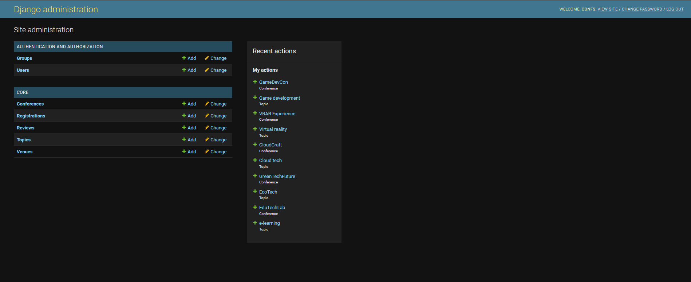

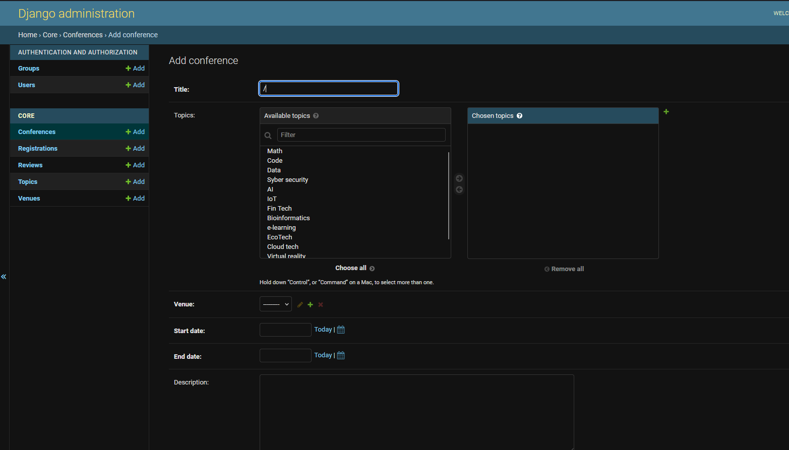

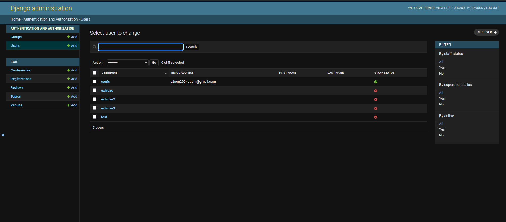

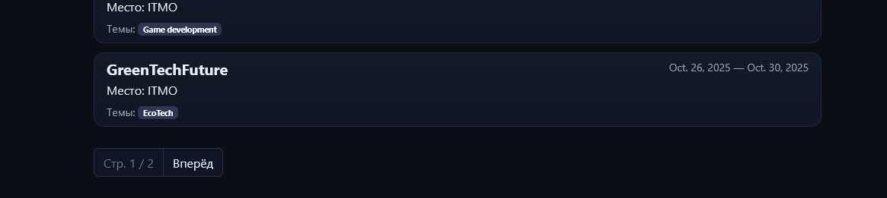

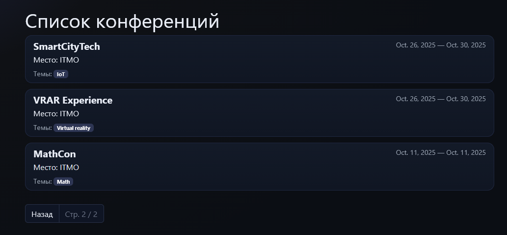

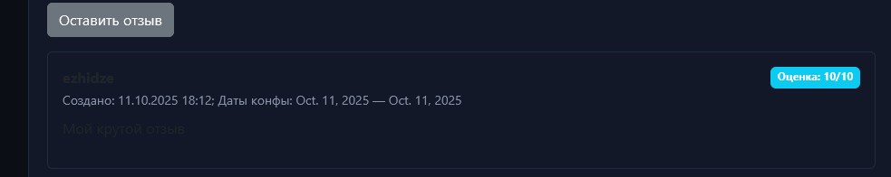

---

## 🚀 Как запустить проект

1. Установить зависимости:
   ```bash
   py -m venv .venv
   .\.venv\Scripts\activate
   pip install "Django>=3.2,<3.3" psycopg2-binary python-dotenv
   ```
2. Создать базу данных PostgreSQL и пользователя:
   ```sql
   CREATE DATABASE confs;
   CREATE USER confs WITH PASSWORD 'confs';
   GRANT ALL PRIVILEGES ON DATABASE confs TO confs;
   ```
3. В корне проекта создать файл `.env`:
   ```env
   DEBUG=1
   SECRET_KEY=dev-key
   DB_NAME=confs
   DB_USER=confs
   DB_PASSWORD=confs
   DB_HOST=127.0.0.1
   DB_PORT=5432
   ```
4. Применить миграции и создать суперпользователя:
   ```bash
   py manage.py makemigrations
   py manage.py migrate
   py manage.py createsuperuser
   ```
5. Запустить сервер:
   ```bash
   py manage.py runserver
   ```
6. Открыть в браузере:
    - Главная страница — http://127.0.0.1:8000/
    - Админка — http://127.0.0.1:8000/admin/

---

## 🖥️ Как пользоваться

* **Регистрация пользователя:** `/signup/`
* **Список конференций:** `/` — поиск и пагинация.
* **Просмотр конференции:** подача заявки и отзывы.
* **Администратор:** через `/admin/` управляет всеми моделями.
* **Участники:** страница `/participants/` отображает таблицу участников по конференциям.

---

## 📚 Выводы

В ходе выполнения лабораторной работы были изучены и реализованы:

1. Основные компоненты фреймворка **Django (MVT‑архитектура)**.
2. Настройка **PostgreSQL** и взаимодействие с БД через **Django ORM**.
3. Создание **моделей, форм, маршрутов и шаблонов**.
4. Использование **дженериковых классов View** (`ListView`, `DetailView`, `CreateView`, `UpdateView`, `DeleteView`).
5. Реализация **регистрации пользователей, поиска и пагинации**.
6. Настройка и использование **админ‑панели Django**.
7. Подключение **Bootstrap 5** и собственных CSS для создания современного интерфейса.

**Результат:** разработан и оформлен полноценный веб‑сервис учёта и взаимодействия участников научных конференций с удобной админкой и динамическим фронтендом.
