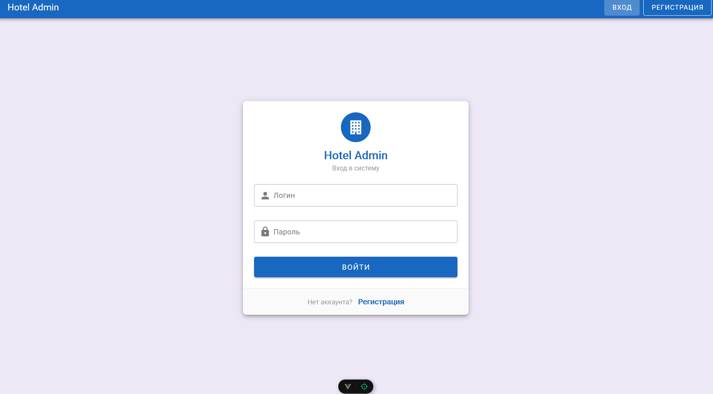
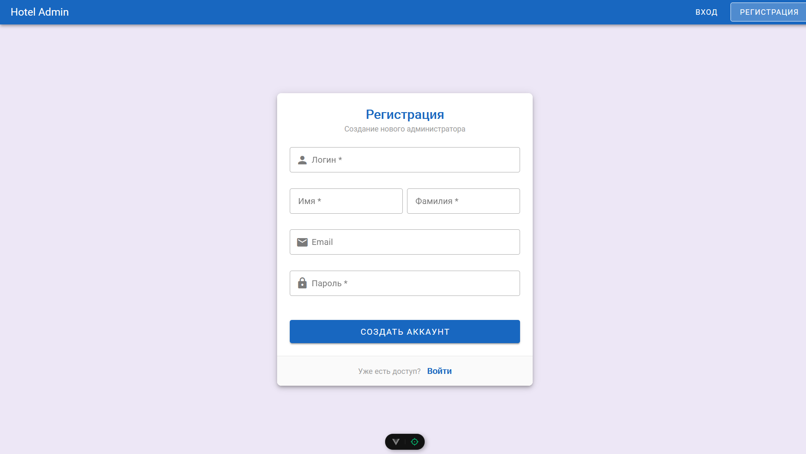
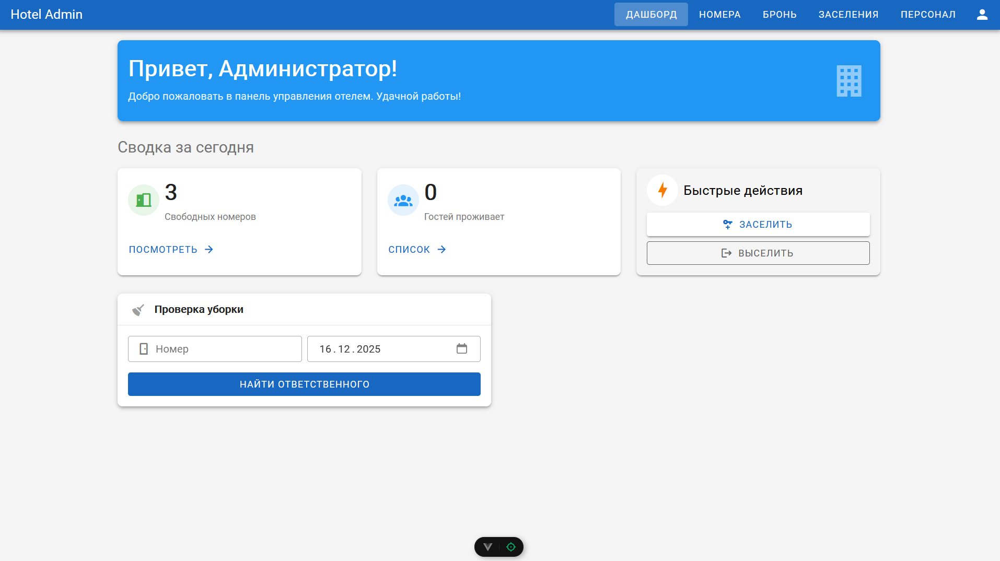
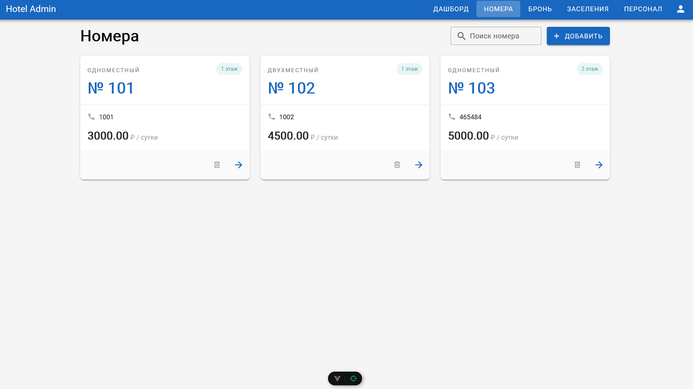
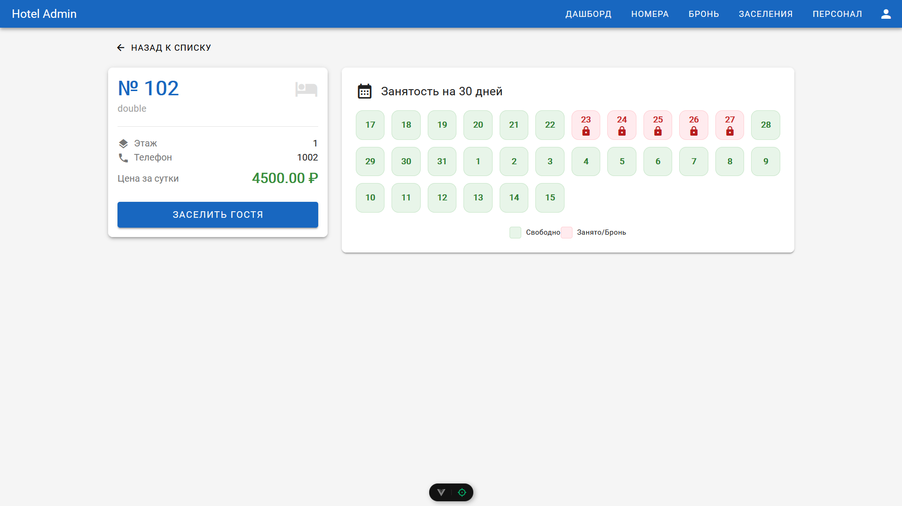
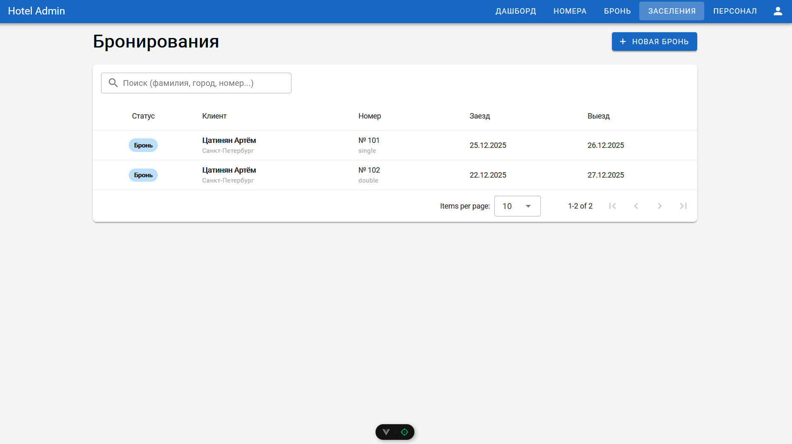
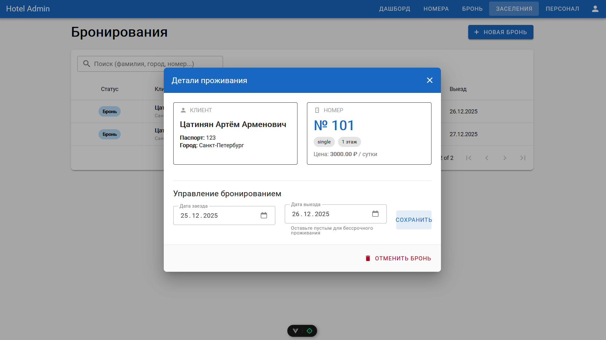
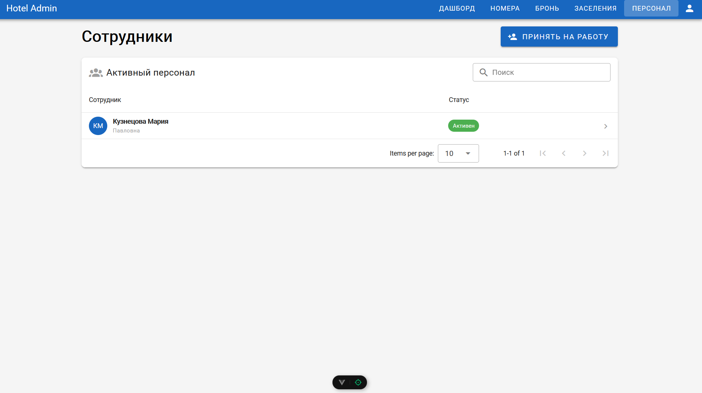
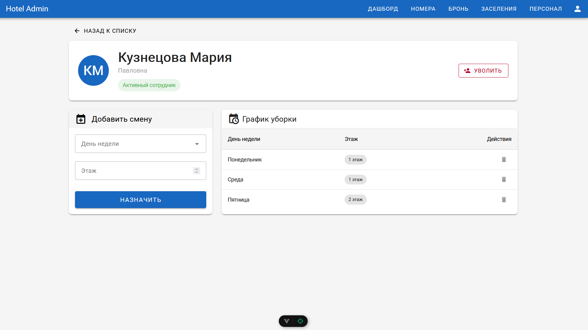
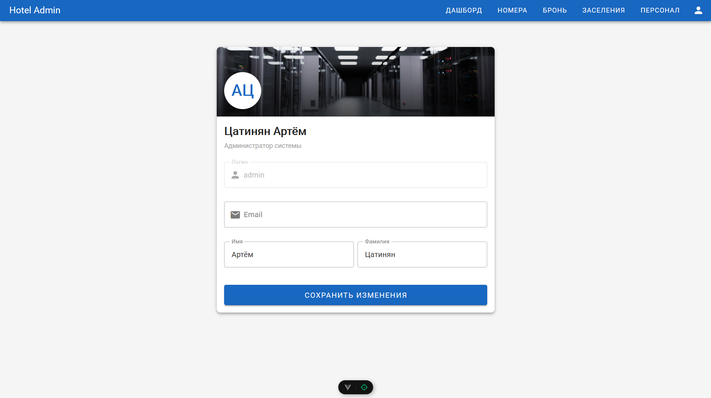

# Лабораторная работа №4 — Клиентская часть (Vue.js)

## Цель работы
Разработать клиентскую часть веб-приложения (Single Page Application) для управления гостиницей, используя фреймворк **Vue.js 3**, и настроить взаимодействие с API из Лабораторной работы №3.

---

## Технологии

*   **Vue.js 3** (Composition API) — основной фреймворк.
*   **Vuetify 3** — библиотека компонентов (Material Design).
*   **Vue Router** — навигация по страницам.
*   **Axios** — запросы к серверу.
*   **Vite** — сборка проекта.

---

## Запуск проекта

1.  **Backend (Django):**
    Убедиться, что сервер запущен и настроен CORS (`CORS_ALLOW_ALL_ORIGINS = True`).
2.  **Frontend (Vue):**
    ```bash
    npm install
    npm run dev
    ```
    Адрес: `http://localhost:5173/`

---

## Реализация интерфейса

### 1. Авторизация и Регистрация
Реализованы страницы входа и регистрации. При регистрации указываются ФИО для корректной работы системы. Токен авторизации хранится в LocalStorage.





### 2. Дашборд (Главная)
Сводная панель администратора. Отображает количество свободных номеров на сегодня, текущих постояльцев и виджет для быстрого поиска ответственного за уборку.



### 3. Список номеров
Карточки номеров с основной информацией (цена, этаж, тип). Реализован поиск и фильтрация. Можно добавить новый номер или удалить существующий.



### 4. Детали номера и Календарь
При клике на номер открывается страница с интерактивным календарем занятости на ближайшие 30 дней (зеленый — свободно, красный — занято). Отсюда можно быстро заселить гостя.



### 5. Бронирования
Единая таблица для управления проживающими. Цветом выделен статус (живет сейчас, будущая бронь). Есть поиск по фамилии.



В модальном окне можно изменить даты проживания (например, продлить аренду) или выселить клиента.



### 6. Персонал
Управление сотрудниками. Отображаются только активные сотрудники. Есть поиск и форма найма.



На странице сотрудника можно составить график уборки (день недели — этаж) или уволить его.



### 7. Профиль
Страница редактирования данных администратора (Email, Имя, Фамилия). Аватар генерируется из инициалов.



---

## Вывод
В ходе работы было разработано SPA-приложение на Vue.js. Реализован полный цикл работы администратора отеля: управление номерным фондом, заселение/выселение гостей, работа с персоналом и просмотр статистики. Настроена реактивность интерфейса и обработка ошибок при работе с API.