# Лабораторная работа 4. Реализация клиентской части средствами Vue.js.

Вход

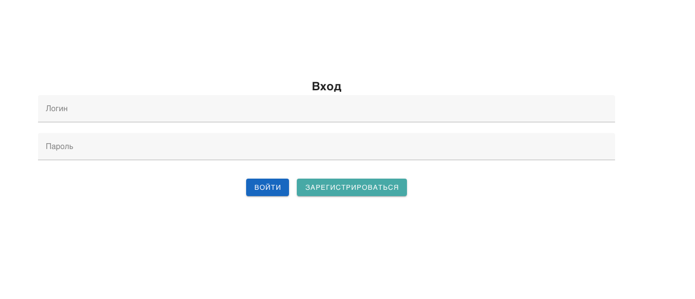

Регистрация

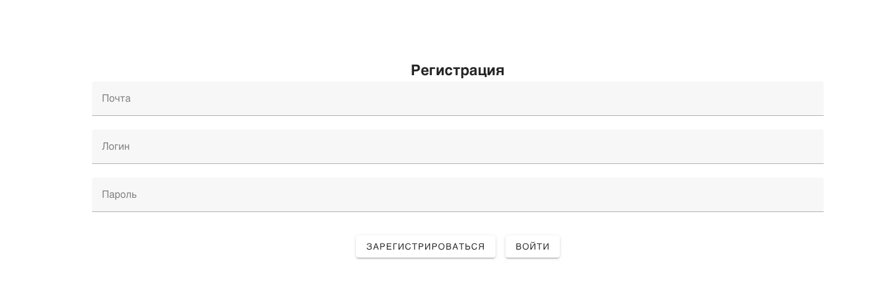

Список сотрудников

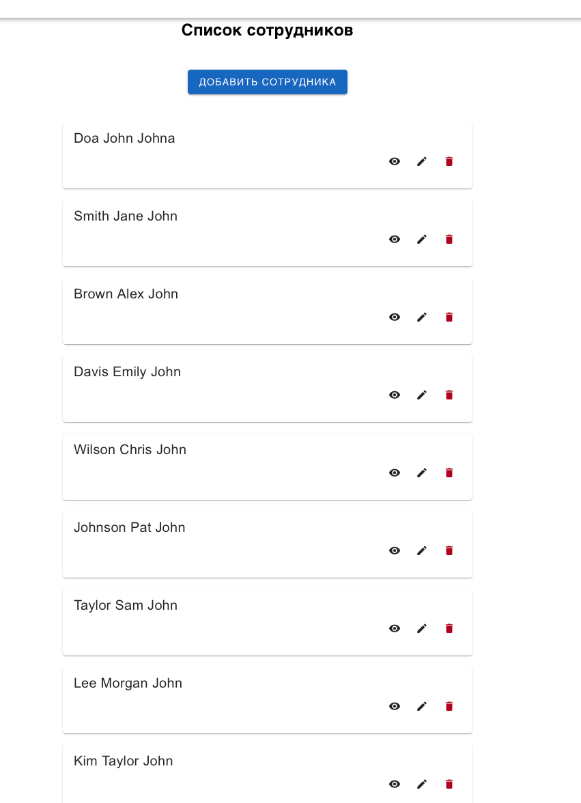

Окно для изменения сотрудника

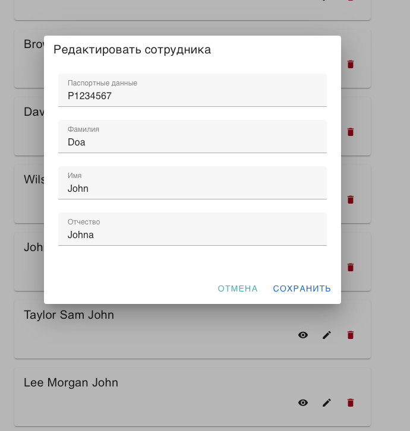

Окно для добавления сотрудника

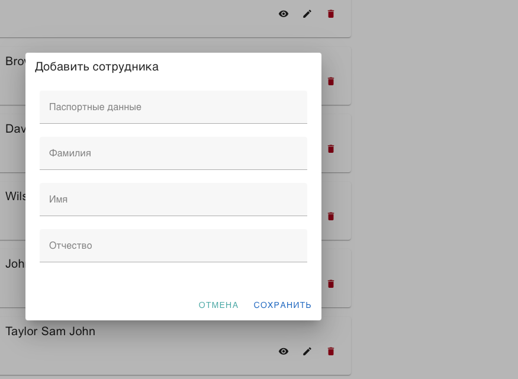

Страница сотрудника

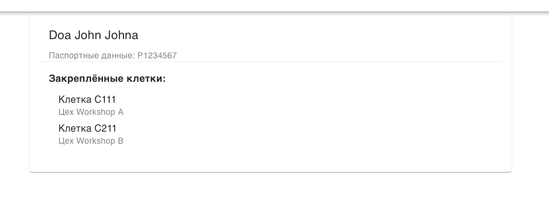

Список куриц

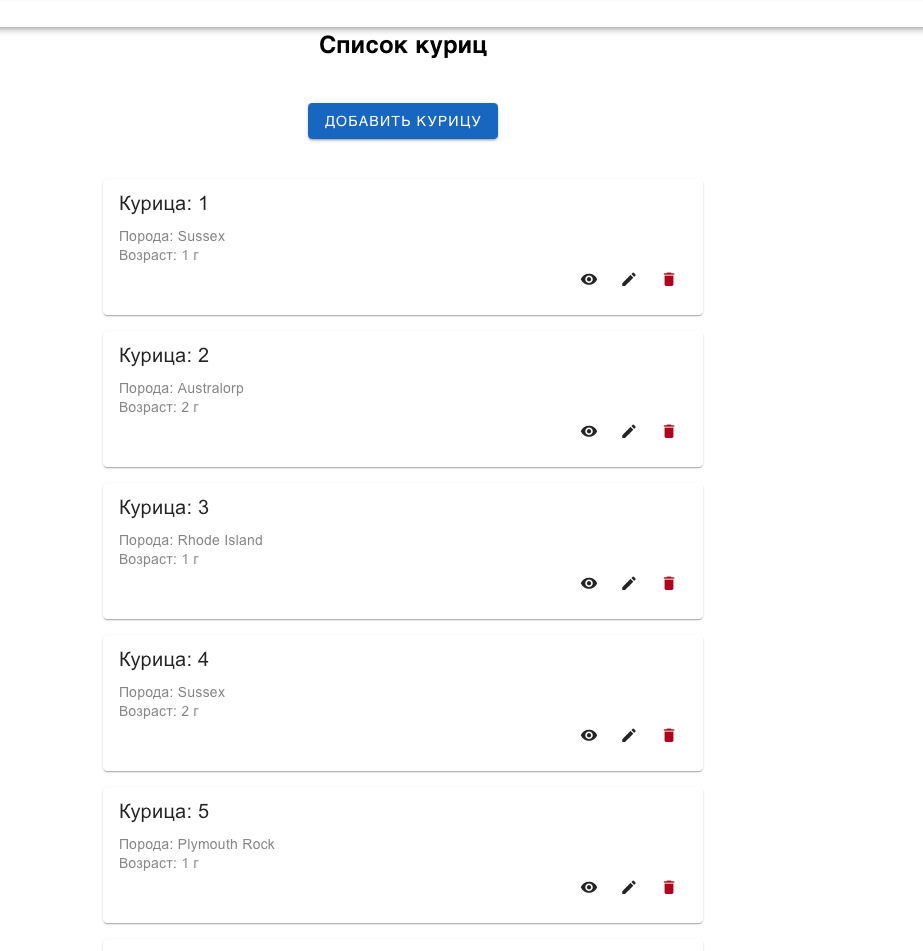

Окно для добавления курицы

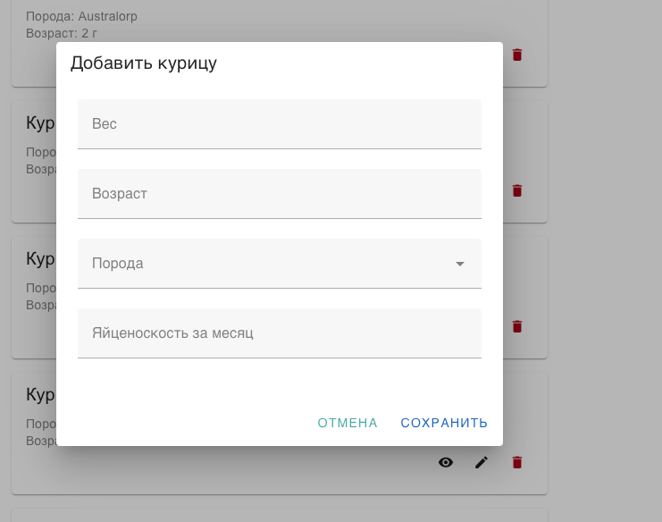

Окно для изменения курицы

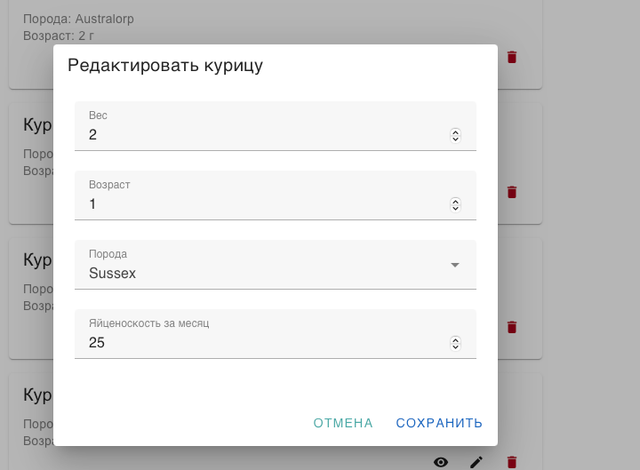

Страница курицы

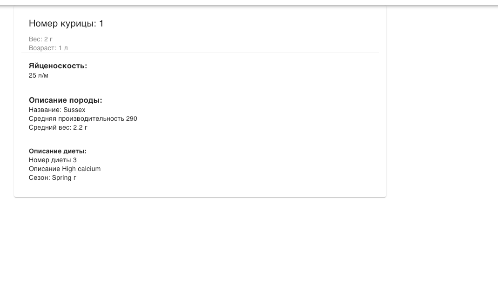

Список клеток

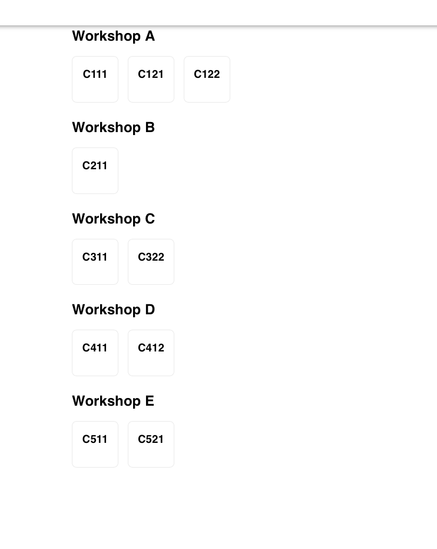

Страница клетки

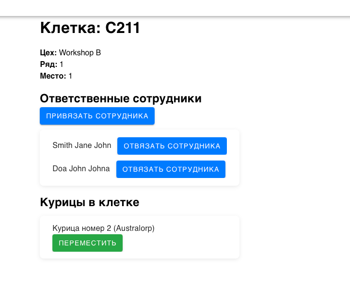

Окно для привязки сотрудника к клетке

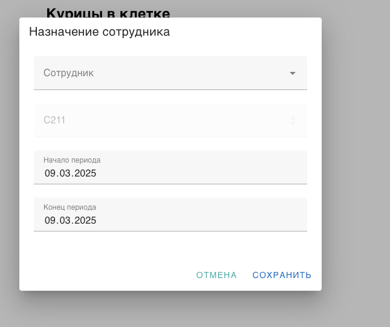

Окно для перемещения курицы в другую клетку

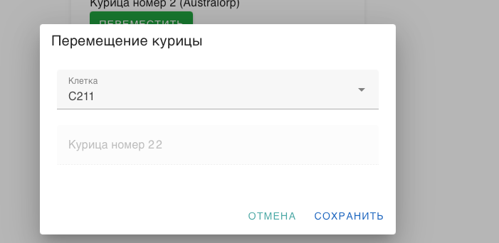

Отчёт

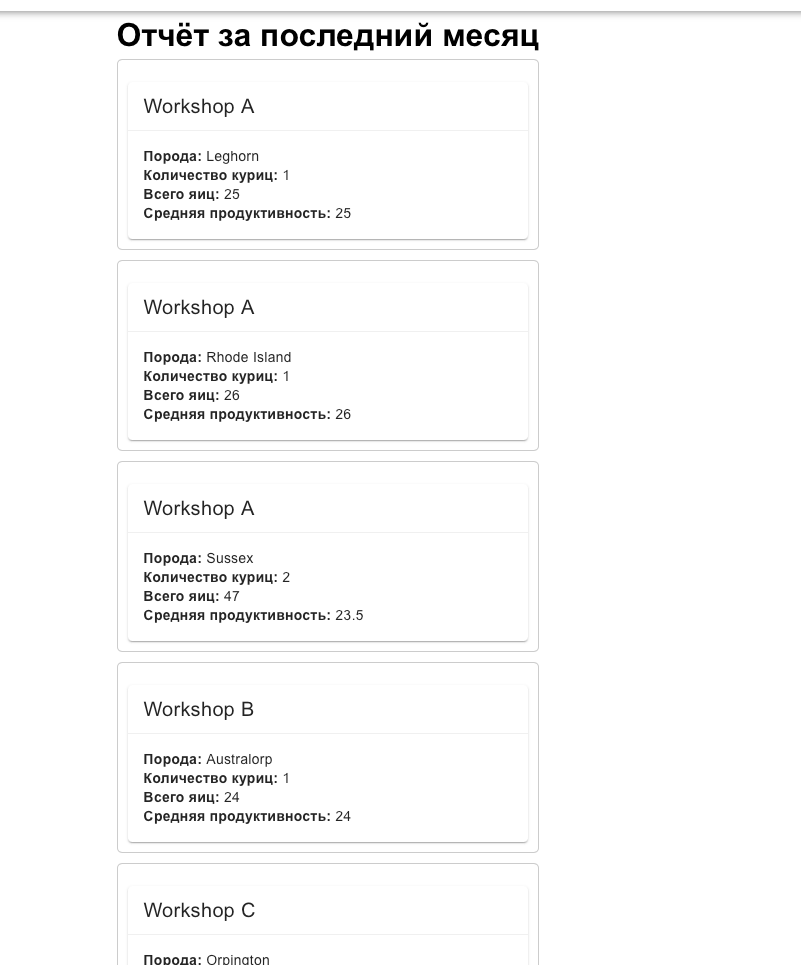