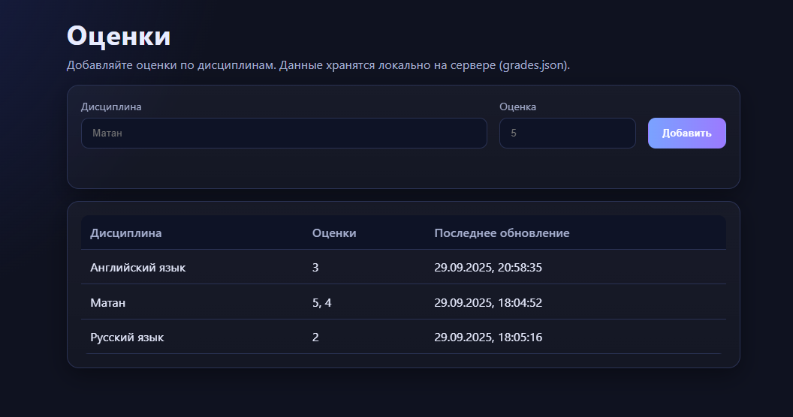
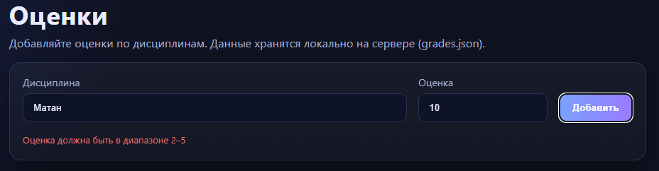
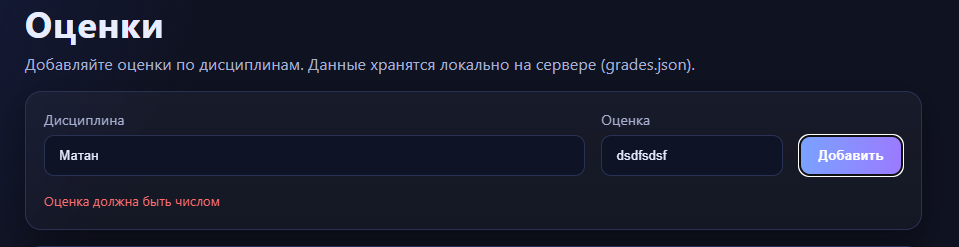

# Задание 5: HTTP-сервер с поддержкой GET и POST-запросов

## Условие

Необходимо написать простой веб-сервер для обработки GET и POST HTTP-запросов с использованием библиотеки socket.

**Требования:**

* Сервер должен принимать и записывать информацию о дисциплине и оценке по дисциплине.
* Сервер должен отдавать информацию обо всех оценках в виде HTML-страницы.

---

## Принцип работы

Сервер реализован на языке **Go** с использованием стандартной библиотеки `net`. Работа с HTTP протоколом выполнена вручную поверх TCP-сокета.

* При **GET /index.html** сервер отдает статическую HTML-страницу (шаблон).
* При **GET /api/grades** возвращается список всех сохранённых дисциплин и их оценок в формате JSON.
* При **POST /api/grades** сервер принимает данные в формате `application/json` или `application/x-www-form-urlencoded`, проверяет их, сохраняет в JSON-файл и возвращает результат.
* Все данные об оценках хранятся в файле `grades.json`. Это позволяет сохранять введённые значения между перезапусками сервера.

---

## Архитектура решения

Код разбит на несколько логических частей:

1. **Хранение данных (`journal`)**

    * Используется `map[string]SubjectRecord`, где ключ — название дисциплины, а значение — структура с оценками и временем обновления.
    * Для сохранения состояния данные сериализуются в `grades.json`.

2. **Валидация**

    * Проверяется корректность введённого предмета (не пустой, не длиннее 100 символов).
    * Проверяется корректность оценки (целое число от 2 до 5).

3. **Обработка HTTP-запросов**

    * Запрос разбирается вручную: читается стартовая строка, заголовки и тело.
    * Для ответа формируется строка с заголовками и телом ответа.
    * Реализована поддержка статических файлов (`/index.html`, `/assets/...`).

4. **Маршрутизация**

    * `GET /index.html` → отдача HTML-страницы.
    * `GET /api/grades` → JSON со всеми предметами и оценками.
    * `POST /api/grades` → добавление новой оценки.

---

### Код: [https://github.com/exPriceD/TonikX-ITMO_ICT_WebDevelopment_2025-2026/tree/lab1/students/k3340/Bogdanov_Maxim/Lr1/5](https://github.com/exPriceD/TonikX-ITMO_ICT_WebDevelopment_2025-2026/tree/lab1/students/k3340/Bogdanov_Maxim/Lr1/5)


## Пример работы

1. **Старт сервера**

```bash
go run ./cmd
```

2. **Добавление оценки**
   Через `curl`:

```bash
curl -X POST http://127.0.0.1:8080/api/grades \
     -H "Content-Type: application/json" \
     -d '{"subject":"Математика","grade":5}'
```

Ответ:

```json
{
  "ok": true,
  "message": "оценка добавлена"
}
```

3. **Получение всех оценок**

```bash
curl http://127.0.0.1:8080/api/grades
```

Ответ:

```json
{
  "data": {
    "Математика": {
      "grades": [5],
      "updated": "2025-09-29T12:34:56Z"
    }
  }
}
```

4. **Просмотр через браузер**
   При открытии `http://127.0.0.1:8080/` отображается HTML-страница с таблицей оценок.

---

## JSON-файл

Все данные сохраняются в `grades.json`.

Пример содержимого после нескольких POST-запросов:

```json
{
  "Математика": {
    "grades": [5, 4],
    "updated": "2025-09-29T12:35:20Z"
  },
  "Физика": {
    "grades": [3],
    "updated": "2025-09-29T12:36:10Z"
  }
}
```





---

## Тестирование

* Проверена работа с JSON и `application/x-www-form-urlencoded`.
* Выполнена проверка через браузер и `curl`.
* Подтверждено сохранение данных в `grades.json` после перезапуска сервера.
* Реализована обработка ошибок: неверный метод → 405, неверный запрос → 400, отсутствующий маршрут → 404.

---

## Выводы

* Реализован **HTTP-сервер на Go**, работающий поверх TCP-сокета без использования встроенного пакета `net/http`.
* Поддержаны методы **GET** и **POST**.
* Данные о дисциплинах и оценках сохраняются в JSON-файл, что обеспечивает их сохранность между перезапусками.
* Сервер корректно обслуживает как API-запросы, так и выдачу статической HTML-страницы.
