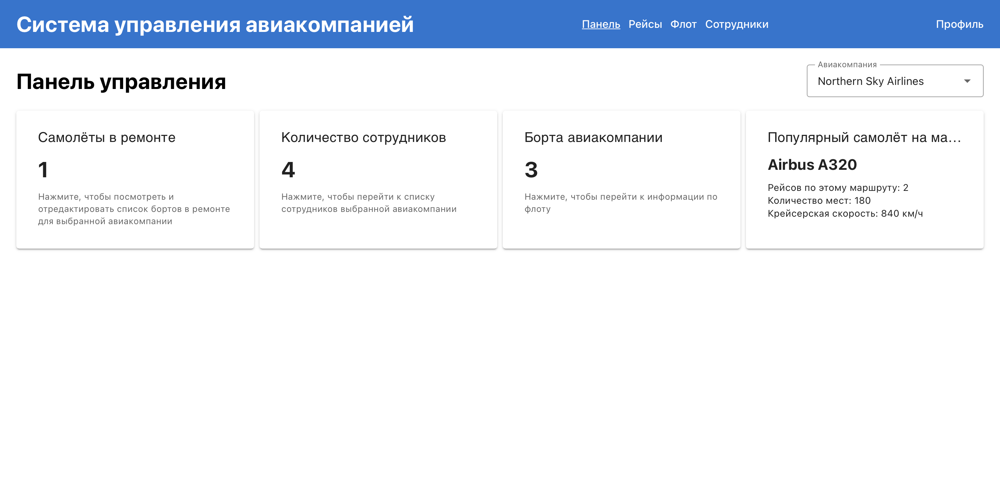

# Лабораторная работа №4

## Vue.js клиент для системы управления аэропортом

В четвёртой лабораторной работе реализован клиентский интерфейс на
**Vue.js 3** с использованием **Vuetify** для взаимодействия с REST API
из лабораторной работы №3.\
Проект включает авторизацию по токенам (Djoser), работу с данными
авиакомпании, аналитические разделы, модальные окна и таблицы рейсов,
самолётов и сотрудников.

------------------------------------------------------------------------

## Вариант задания

-   Настроить CORS для серверной части из лабораторной работы №3.\
-   Реализовать интерфейсы авторизации, регистрации и просмотра
    профиля.\
-   Создать клиентские интерфейсы для:
    -   флота самолётов;
    -   сотрудников авиакомпании;
    -   рейсов и конкретных вылетов;
    -   свободных мест на вылете;
    -   аналитики по недозаполненным рейсам.
-   Подключить Vuetify для стилизации всех элементов.

------------------------------------------------------------------------

## Ход выполнения

### Задание 1: Настройка CORS в Django

**Установка**

-   Добавлен пакет `django-cors-headers` в зависимости.
-   В `settings.py` добавлен `corsheaders` в `INSTALLED_APPS`, а также
    middleware `CorsMiddleware`.

**Конфигурация**

``` python
CORS_ALLOW_ALL_ORIGINS = True
```

Это обеспечило корректный доступ Vue-клиента (localhost:5173) к DRF API.

------------------------------------------------------------------------

### Задание 2: Структура Vue.js проекта

**Технологии**

-   Vue.js 3 (Composition API + `<script setup>`)
-   Vite --- сборщик и dev-server
-   Vue Router --- маршрутизация с auth-guards
-   Axios --- запросы к Django REST Framework
-   Vuetify --- UI-фреймворк
-   LocalStorage --- хранение токена

**Структура**

    lr4/
    ├── src/
    │   ├── main.js             # Инициализация Vue и Vuetify
    │   ├── App.vue             # Шапка/навигация
    │   ├── api/api.js          # axios с токеном
    │   ├── auth.js             # логика авторизации
    │   ├── router.js           # маршруты и защита
    │   └── views/
    │       ├── LoginView.vue
    │       ├── RegisterView.vue
    │       ├── ProfileView.vue
    │       ├── DashboardView.vue
    │       ├── StaffView.vue
    │       ├── FleetView.vue
    │       ├── FlightsView.vue

------------------------------------------------------------------------

### Задание 3: Авторизация и регистрация

**Auth-модуль**

-   Хранит token, username, isAuthenticated.\
-   Методы: `setAuth`, `clearAuth`.\
-   Токен сохраняется в `localStorage`.

**Интерсептор Axios**

-   Добавляет заголовок `Authorization: Token ...` ко всем запросам.

**Страницы**

-   `LoginView.vue` --- вход, обработка ошибок, Vuetify-поля.\
-   `RegisterView.vue` --- регистрация через Djoser (`/auth/users/`).\
-   `ProfileView.vue` --- просмотр токена и данных пользователя.

**Router Guards**

-   Маршруты Dashboard, Flights, Fleet, Staff доступны только
    авторизованным.

------------------------------------------------------------------------

### Задание 4: Интерфейсы для работы с данными аэропорта

Общий паттерн:

-   `v-table` для вывода списков\
-   `v-dialog` для детальной информации\
-   `v-btn` для действий

**FleetView.vue**

-   Список самолётов: ID, регистрационный номер, тип, статус\
-   Переключение состояния: "в ремонте" ↔ "в строю"\
-   Модальное окно с таблицей бортов авиакомпании

**StaffView.vue**

-   Список сотрудников: ФИО, роль, стаж, допуск\
-   Модалка редактирования (v-dialog)\
-   Возможность удаления сотрудника

**FlightsView.vue**

-   Список вылетов (`FlightInstance`)\
-   Кнопка «Свободные места» → модалка\
-   Отображение статуса и времени вылета

**Аналитика недозаполненных рейсов**

    GET /api/analytics/underfilled-routes/?percent=X

Используется Vuetify‑слайдер:

    <v-slider v-model="percent" min="1" max="100" thumb-label="always" />

------------------------------------------------------------------------

### Задание 5: Главная панель (Dashboard)

**Статистика**

-   Количество сотрудников\
-   Самолёты в ремонте\
-   Количество бортов\
-   Самый популярный тип самолёта

Все блоки реализованы через `v-card` и сетку `v-row`.

Особенность:\
При клике на карточку «Самолёты в ремонте» открывается `v-dialog` с
таблицей для изменения статуса самолётов.

------------------------------------------------------------------------

### Задание 6: Навигация и UI

Верхняя панель (`v-app-bar`) отображает:

**Для гостя:**\
- Вход\
- Регистрация

**Для авторизованного пользователя:**\
- Панель управления\
- Рейсы\
- Флот\
- Сотрудники\
- Профиль\
- Выход

Используемые компоненты:\
`v-app`, `v-app-bar`, `v-main`, `v-container`,\
`v-card`, `v-data-table`, `v-dialog`,\
`v-text-field`, `v-select`, `v-slider`, `v-btn`.


Скриншот интерфейса:

------------------------------------------------------------------------

## Выводы

В ходе лабораторной работы:

-   создан современный клиент для системы управления аэропортом на
    Vue.js + Vuetify;
-   реализована регистрация, авторизация и профиль пользователя;
-   созданы разделы работы с самолётами, сотрудниками, рейсами и
    аналитикой;
-   интерфейс оформлен в соответствии с Material Design;
-   реализованы таблицы, модальные окна, фильтры, карточки.

