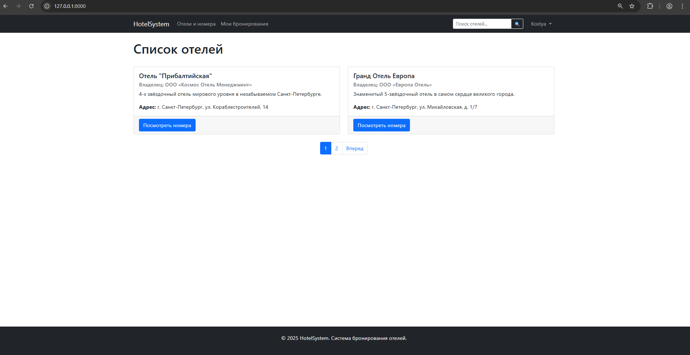
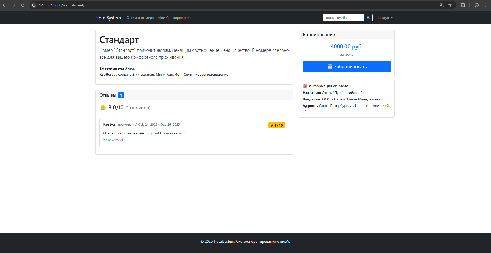
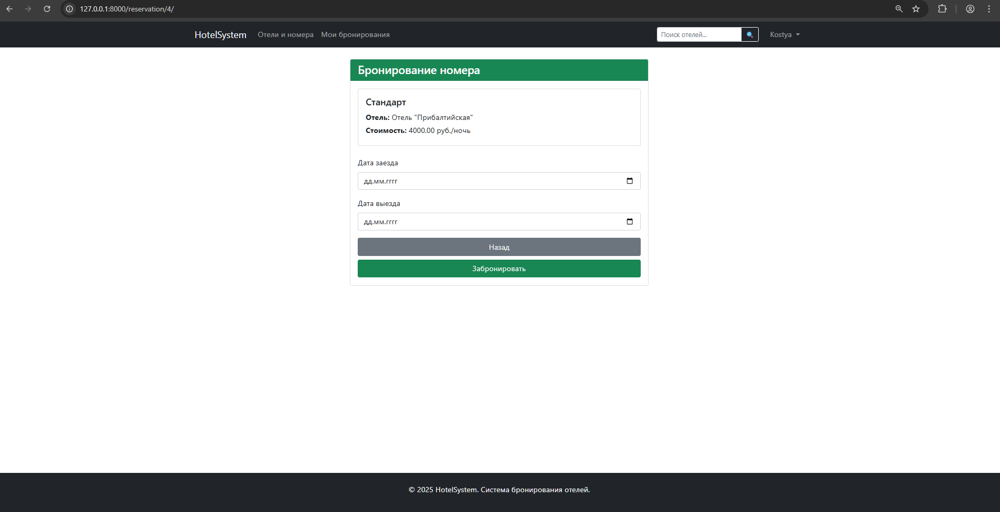

# РЕАЛИЗАЦИЯ ПРОСТОГО САЙТА СРЕДСТВАМИ DJANGO

## Цель
Овладеть практическими навыками и умениями реализации web-сервисов средствами Django 2.2.

## Практическое задание
Реализовать сайт используя фреймворк Django 3 и СУБД PostgreSQL\*, в соответствии с вариантом задания лабораторной работы.

**Вариант:** 1 (по списку 7)  

**Список отелей**  
Необходимо учитывать название отеля, владельца отеля, адрес, описание, типы
номеров, стоимость, вместимость, удобства.
Необходимо реализовать следующий функционал:  
 - Регистрация новых пользователей.  
 - Просмотр и резервирование номеров. Пользователь должен иметь возможность редактирования и удаления своих резервирований.  
 - Написание отзывов к номерам. При добавлении комментариев, должны сохраняться период проживания, текст комментария, рейтинг (1-10), информация о комментаторе.  
 - Администратор должен иметь возможность заселить пользователя в отель и
выселить из отеля средствами Django-admin.  
 - В клиентской части должна формироваться таблица, отображающая постояльцев отеля за последний месяц.

## Решение

### Структура проекта

```
hotels/
├── manage.py
├── hotels/
│   ├── __init__.py
│   ├── settings.py
│   ├── urls.py
│   ├── asgi.py
│   └── wsgi.py
├── hotel_management/                         # Основное приложение
│   ├── __init__.py
│   ├── admin.py                              # Админ-панель
│   ├── apps.py
│   ├── tests.py                              # Тесты (отсутствуют)
│   ├── models.py                             # Модели данных
│   ├── views.py                              # Представления (CBV)
│   ├── forms.py                              # Формы с валидацией
│   ├── urls.py                               # Маршруты приложения
│   ├── mixins.py                             # Кастомные миксины
│   ├── templates/                            # Шаблоны приложения
│   │   └── hotel_management/
│   │   	└── add_review.html               # Шаблон страницы создания отзыва на номер в отеле
│   │   	└── base.html                     # Шаблон для шапки и подвала сайта. Является базовым для других шаблонов
│   │   	└── delete_reservation.html       # Шаблон страницы отмены (удаления) резервирования
│   │   	└── edit_reservation.html         # Шаблон страницы редактирования параметров резервирования
│   │   	└── guests_last_month.html        # Шаблон страницы с таблицой посетителей отелей
│   │   	└── hotel_detail.html             # Шаблон страницы с подробной информацией об отеле и доступных типах номеров
│   │   	└── hotel_list.html               # Шаблон страницы со списком отелей
│   │   	└── login.html                    # Шаблон страницы авторизации
│   │   	└── make_reservation.html         # Шаблон страницы оформления резервирования
│   │   	└── my_reservations.html          # Шаблон страницы со списком резервирований пользователя
│   │   	└── register.html                 # Шаблон страницы регистрации
│   │   	└── room_type_detail.html         # Шаблон страницы с описанием типа номера
│   │   	└── search_results.html           # Шаблон страницы с найденными по поисковому запросу отелями
│   └── migrations/
│       └── __init__.py
│       └── 0001_initial.py
│       └── 0002_remove_room_hotel_roomtype_hotel.py
```

### Модели:
**Hotel** - отели (название, владелец, адрес, описание)

**RoomType** - типы номеров (название, описание, отель, стоимость, вместимость, удобства)

**Room** - конкретные комнаты (тип номера, номер комнаты)

**Reservation** - бронирования (пользователь, комната, дата заезда, дата выезда, статус, дата создания, дата обновления)

**Review** - отзывы (номер бронирования, рейтинг 1-10, комментарий, дата создания)


### Возможности системы

Для всех пользователей (без авторизации):  
 - Просмотр списка отелей;  
 - Поиск по названию отеля;  
 - Просмотр информации об отелях и номерах;  
 - Просмотр отзывов о номерах;  
 - Регистрация и вход в систему.  

Для авторизованных пользователей:  
 - Бронирование номеров с проверкой доступности;  
 - Редактирование и отмена своих бронирований;  
 - Написание отзывов после выселения;  
 - Личный кабинет с историей бронирований.  

Для персонала (администраторов):  
 - Доступ к админ-панели;  
 - Редактирование бронирований;  
 - Просмотр всех гостей за период;  
 - Заселение и выселение гостей.  


В проекте используется bootstrap, настроена пагинация для списка отелей, настроен поиск по названию отеля.


### Скриншоты работы сайта


**Стартовая страница**
  

**Информация о номере в отеле**


**Создание нового резервирования**
