# Практическая работа №3.1

## Модели базы данных
```python
class CarOwner(models.Model):
    last_name = models.CharField(max_length=30)
    first_name = models.CharField(max_length=30)
    birth_date = models.DateField(null=True, blank=True)
    
    class Meta: 
        db_table = 'car_owner'

    def __str__(self):
        return f"{self.first_name} {self.last_name}"
        

class DrivingLicense(models.Model):
    id_owner = models.ForeignKey(CarOwner, on_delete=models.CASCADE, related_name='driving_license')
    number_license = models.CharField(max_length=10)
    type = models.CharField(max_length=10)
    date_issue = models.DateField()
    
    class Meta: 
        db_table = 'driving_license'

    def __str__(self):
        return f"License {self.number_license} ({self.type}) — {self.id_owner}"
    
    
class Car(models.Model):
    state_number = models.CharField(max_length=15)
    brand = models.CharField(max_length=20)
    model = models.CharField(max_length=20)
    colour = models.CharField(max_length=30, null=True, blank=True)
    owners = models.ManyToManyField(CarOwner, through='Ownership')
    
    class Meta: 
        db_table = 'car'

    def __str__(self):
        return f"{self.brand} {self.model} ({self.state_number})"
    
    
class Ownership(models.Model):
    id_owner = models.ForeignKey(CarOwner, null=True, on_delete=models.SET_NULL, related_name="owner_car")
    id_car = models.ForeignKey(Car, null=True, on_delete=models.SET_NULL)
    start_date = models.DateField()
    final_date = models.DateField(null=True, blank=True)
    
    class Meta: 
        db_table = 'ownership'

    def __str__(self):
        owner = self.id_owner or "Unknown owner"
        car = self.id_car or "Unknown car"
        status = "current" if self.final_date is None else f"ended {self.final_date}"
        return f"{owner} → {car} ({self.start_date} – {status})"
```

## Импорт необходимых библиотек
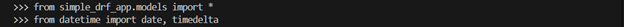

## Задание 1
### Создать 6-7 автовладельцев
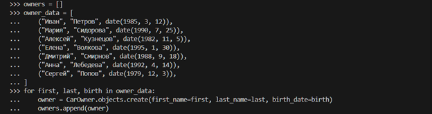

### Создать 5-6 автомобилей
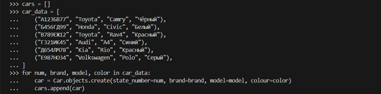

### Выдать каждому владельцу удостоверение

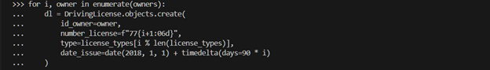

### Связать каждого владельца с 1–3 машинами через ассоциативную сущность «Владение».
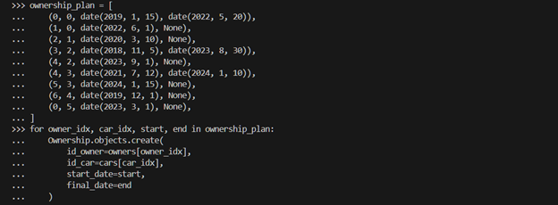

### Отобразить автомобиль
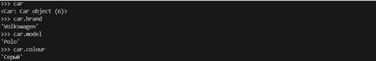

### Отобразить автовладельца
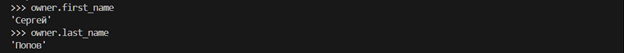

### Отобразить владельцев конкретного автомобиля
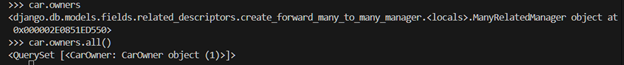

## Задание 2
### Выведете все машины марки “Toyota”
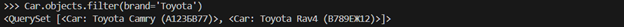

### Найти всех водителей с именем “Олег” (или любым другим именем на ваше усмотрение)


### Взяв любого случайного владельца получить его id, и по этому id получить экземпляр удостоверения в виде объекта модели (можно в 2 запроса)
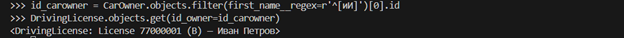

### Вывести всех владельцев красных машин (или любого другого цвета, который у вас присутствует)
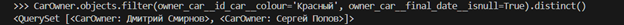

### Найти всех владельцев, чей год владения машиной начинается с 2010 (или любой другой год, который присутствует у вас в базе)
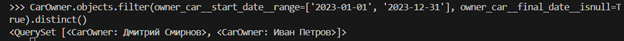

## Задание 3
### Вывод даты выдачи самого старшего водительского удостоверения
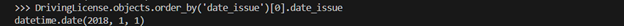

### Укажите самую позднюю дату владения машиной, имеющую какую-то из существующих моделей в вашей базе
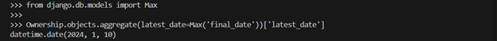

### Выведите количество машин для каждого водителя
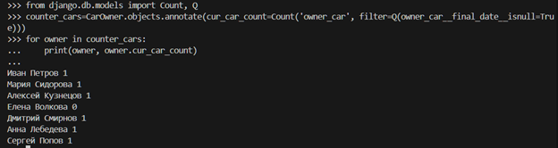

### Подсчитайте количество машин каждой марки
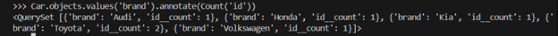

### Отсортируйте всех автовладельцев по дате выдачи удостоверения
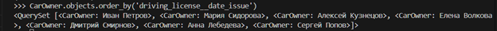