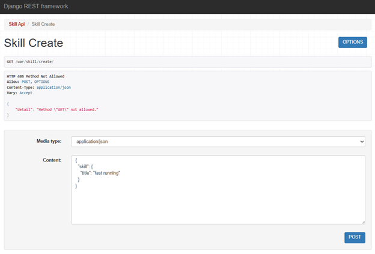
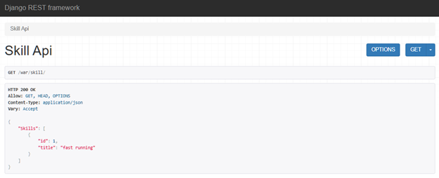
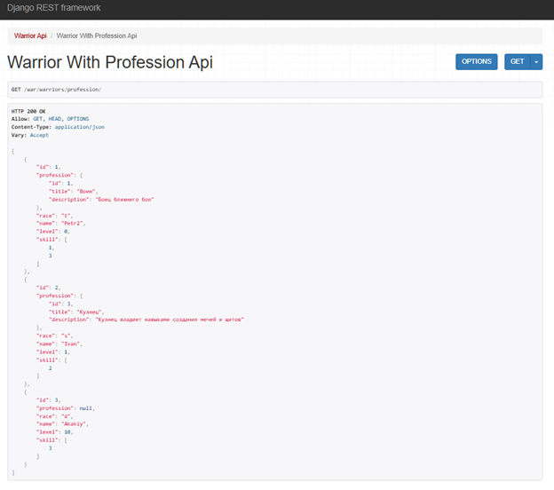
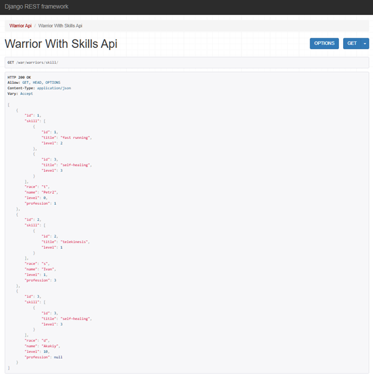
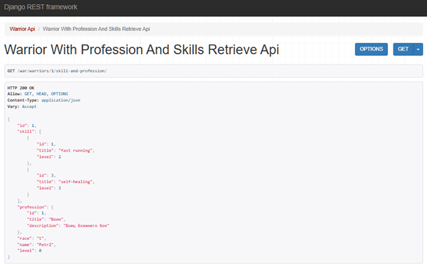
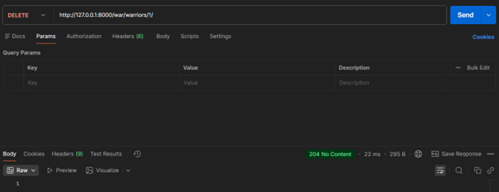
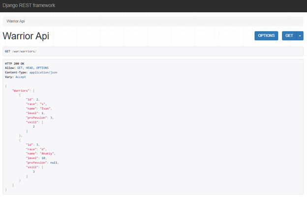
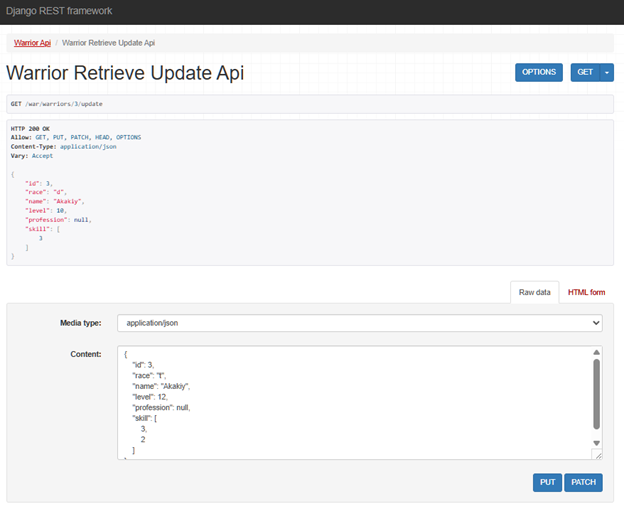
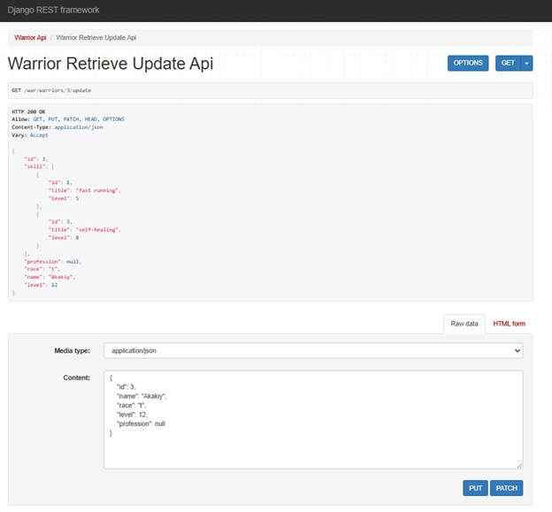

# Практическая работа №3.2

## Модели базы данных
```python
class Warrior(models.Model):
   """
   Описание война
   """

   race_types = (
       ('s', 'student'),
       ('d', 'developer'),
       ('t', 'teamlead'),
   )
   race = models.CharField(max_length=1, choices=race_types, verbose_name='Расса')
   name = models.CharField(max_length=120, verbose_name='Имя')
   level = models.IntegerField(verbose_name='Уровень', default=0)
   skill = models.ManyToManyField('Skill', verbose_name='Умения', through='SkillOfWarrior', related_name='warrior_skils')
   profession = models.ForeignKey('Profession', on_delete=models.CASCADE, verbose_name='Профессия', blank=True, null=True)


class Profession(models.Model):
   """
   Описание профессии
   """

   title = models.CharField(max_length=120, verbose_name='Название')
   description = models.TextField(verbose_name='Описание')


class Skill(models.Model):
   """
   Описание умений
   """

   title = models.CharField(max_length=120, verbose_name='Наименование')

   def __str__(self):
       return self.title


class SkillOfWarrior(models.Model):
   """
   Описание умений война
   """

   skill = models.ForeignKey('Skill', verbose_name='Умение', on_delete=models.CASCADE)
   warrior = models.ForeignKey('Warrior', verbose_name='Воин', on_delete=models.CASCADE)
   level = models.IntegerField(verbose_name='Уровень освоения умения')

```

## Задание 1
### Реализовать ендпоинты для добавления и просмотра скилов методом, описанным в пункте выше
```python
# urls.py

# добавление скилов
path('skill/create/', SkillCreateView.as_view()),

# просмотр скилов
path('skill/', SkillAPIView.as_view()),
```

```python
# views.py

class SkillCreateView(APIView):

   def post(self, request):
       skill = request.data.get("skill")
       serializer = SkillCreateSerializer(data=skill)

       if serializer.is_valid(raise_exception=True):
           skill_saved = serializer.save()

       return Response({"Success": "Skill '{}' created succesfully.".format(skill_saved.title)})


class SkillAPIView(APIView):
   def get(self, request):
       skills = Skill.objects.all()
       serializer = SkillSerializer(skills, many=True)
       return Response({"Skills": serializer.data})
```

```python
# serializers.py

class SkillSerializer(serializers.ModelSerializer):

  class Meta:
     model = Skill
     fields = "__all__"
```
Добавляем новый скил  


Просматриваем скилы  



## Задание 2
### Реализовать вывод полной информации о всех войнах и их профессиях (в одном запросе)
```python
# urls.py

path('warriors/profession/', WarriorWithProfessionAPIView.as_view()),
```

```python
# views.py

class WarriorWithProfessionAPIView(ListAPIView):
    serializer_class = WarriorsWithProfessionSerializer
    queryset = Warrior.objects.select_related('profession').all()
```

```python
# serializers.py

class ProfessionSerializer(serializers.ModelSerializer):
   
   class Meta:
      model = Profession
      fields = "__all__"

class WarriorsWithProfessionSerializer(serializers.ModelSerializer):
    profession = ProfessionSerializer(read_only=True)

    class Meta:
        model = Warrior
        fields = "__all__"
```



### Реализовать вывод полной информации о всех войнах и их скилах (в одном запросе)
```python
# urls.py

path('warriors/skill/', WarriorWithSkillsAPIView.as_view()),
```

```python
# views.py

class WarriorWithSkillsAPIView(ListAPIView):
    serializer_class = WarriorsWithSkillsSerializer
    queryset = Warrior.objects.prefetch_related('skill').all()
```

```python
# serializers.py

class SkillOfWarriorSerializer(serializers.ModelSerializer):
    id = serializers.IntegerField(source='skill.id')
    title = serializers.CharField(source='skill.title')
    
    class Meta:
        model = SkillOfWarrior
        fields = ['id', 'title', 'level']


class WarriorsWithSkillsSerializer(serializers.ModelSerializer):
    skill = SkillOfWarriorSerializer(many=True, read_only=True, source='skillofwarrior_set')

    class Meta:
       model = Warrior
       fields = "__all__"
```



### Реализовать вывод полной информации о войне (по id), его профессиях и скилах
```python
# urls.py

path('warriors/<int:pk>/skill-and-profession/', WarriorWithProfessionAndSkillsRetrieveAPIView.as_view()),
```

```python
# views.py

class WarriorWithProfessionAndSkillsRetrieveAPIView(RetrieveAPIView):
    serializer_class = WarriorWithProfessionAndSkillsSerializer
    queryset = Warrior.objects.prefetch_related('skill').select_related('profession')
```

```python
# serializers.py

class ProfessionSerializer(serializers.ModelSerializer):
   
   class Meta:
      model = Profession
      fields = "__all__"


class SkillOfWarriorSerializer(serializers.ModelSerializer):
    id = serializers.IntegerField(source='skill.id')
    title = serializers.CharField(source='skill.title')
    
    class Meta:
        model = SkillOfWarrior
        fields = ['id', 'title', 'level']


class WarriorWithProfessionAndSkillsSerializer(serializers.ModelSerializer):
    skill = SkillOfWarriorSerializer(many=True, read_only=True, source='skillofwarrior_set')
    profession = ProfessionSerializer(read_only=True)

    class Meta:
       model = Warrior
       fields = "__all__"
```




### Реализовать удаление война по id
```python
# urls.py

path('warriors/<int:pk>/delete', WarriorDestroyAPIView.as_view()),
```

```python
# views.py

class WarriorDestroyAPIView(DestroyAPIView):
    queryset = Warrior.objects.all()
```

Воспользуемся Postman:  


Убедимся, что воина с id=3 больше нет в базе данных:  



### Реализовать редактирование информации о войне
```python
# urls.py

path('warriors/<int:pk>/update', WarriorRetrieveUpdateAPIView.as_view())
```

```python
# views.py

class WarriorRetrieveUpdateAPIView(RetrieveUpdateAPIView):
    queryset = Warrior.objects.all()
    def get_serializer_class(self):
        if self.request.method in ['PUT', 'PATCH']:
            return WarriorUpdateSerializer
        return WarriorWithProfessionAndSkillsSerializer
```

```python
# serializers.py

class WarriorUpdateSerializer(serializers.ModelSerializer):
    profession = serializers.PrimaryKeyRelatedField(
        queryset=Profession.objects.all(),
        required=False,
        allow_null=True
    )
    skill = SkillUpdateItemSerializer(many=True, write_only=True, required=False)

    class Meta:
        model = Warrior
        fields = ['id', 'name', 'race', 'level', 'profession', 'skill']

    def update(self, instance, validated_data):
        instance.name = validated_data.get('name', instance.name)
        instance.race = validated_data.get('race', instance.race)
        instance.level = validated_data.get('level', instance.level)
        instance.profession = validated_data.get('profession', instance.profession)
        
        skill_data = validated_data.get('skill')
        if skill_data is not None:
            SkillOfWarrior.objects.filter(warrior=instance).delete()
            for item in skill_data:
                skill_id = item.get('skill_id')
                level = item.get('level')
                if skill_id is not None and level is not None:
                    try:
                        skill = Skill.objects.get(id=skill_id)
                        SkillOfWarrior.objects.create(
                            warrior=instance,
                            skill=skill,
                            level=level
                        )
                    except Skill.DoesNotExist:
                        raise serializers.ValidationError(f"Skill with id={skill_id} does not exist.")
        
        instance.save()
        return instance


class WarriorWithProfessionAndSkillsSerializer(serializers.ModelSerializer):
    skill = SkillOfWarriorSerializer(many=True, read_only=True, source='skillofwarrior_set')
    profession = ProfessionSerializer(read_only=True)

    class Meta:
       model = Warrior
       fields = "__all__"
```



Обратимся к тому же эндпоинту и можем убедиться, что информация успешно обновлена:  

