# Схемы процессов обработки заявок

## Обзор

В этом разделе представлены визуальные схемы, описывающие процесс обработки заявок в системе "ЖК Коннект".

## Жизненный цикл заявки

### Статусы заявки

Заявка проходит через следующие статусы:

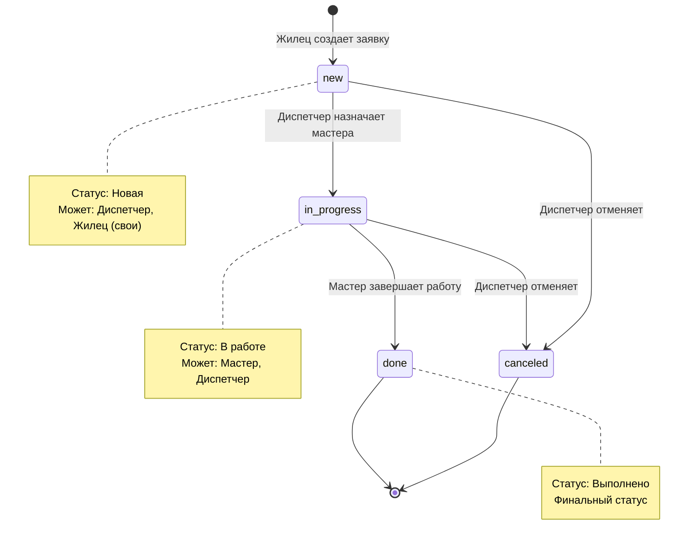

## Процесс обработки заявки (Workflow)

### Полный процесс от создания до завершения

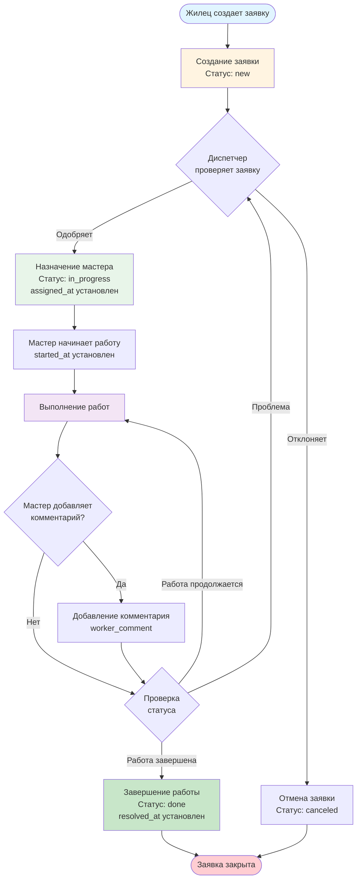

## Роли и их действия

### Кто что может делать с заявкой

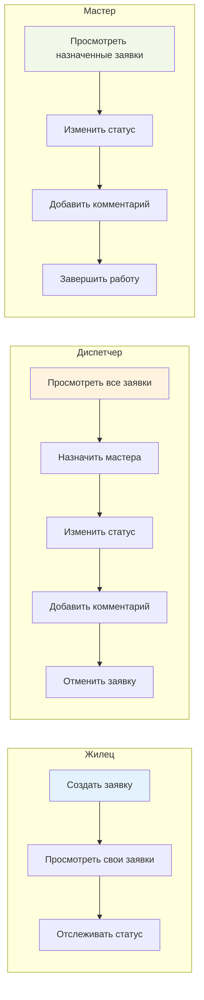

## Временная линия обработки заявки

### Отслеживание дат и событий

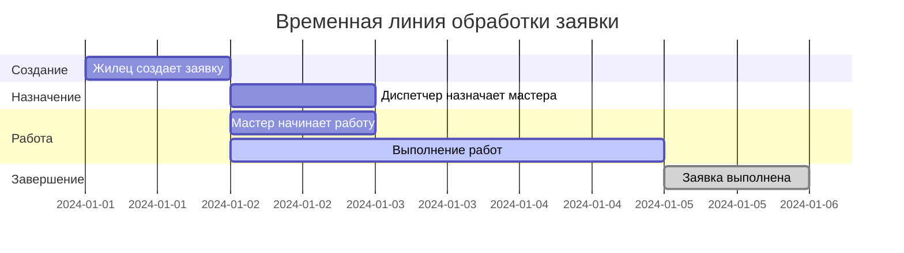

## Схема взаимодействия ролей

### Кто с кем взаимодействует

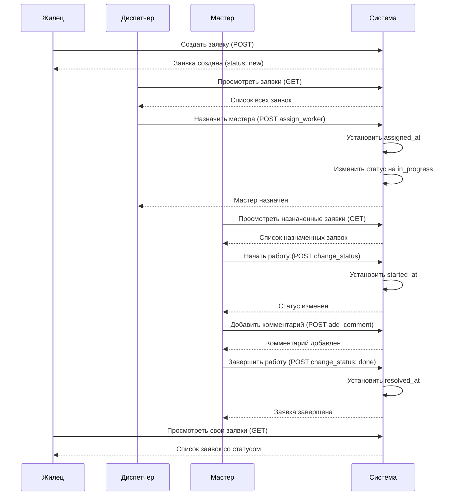

## Схема данных заявки

### Структура и связи

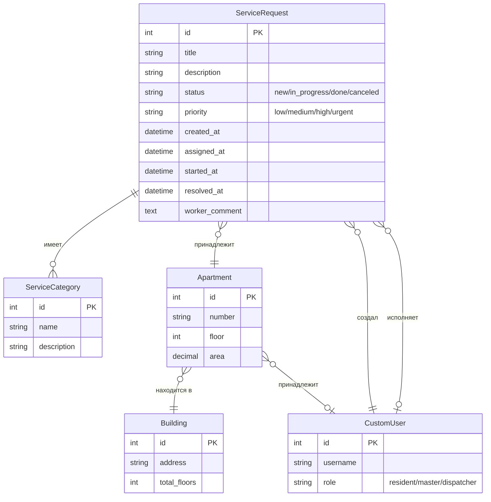

## Приоритеты заявок

### Обработка по приоритетам

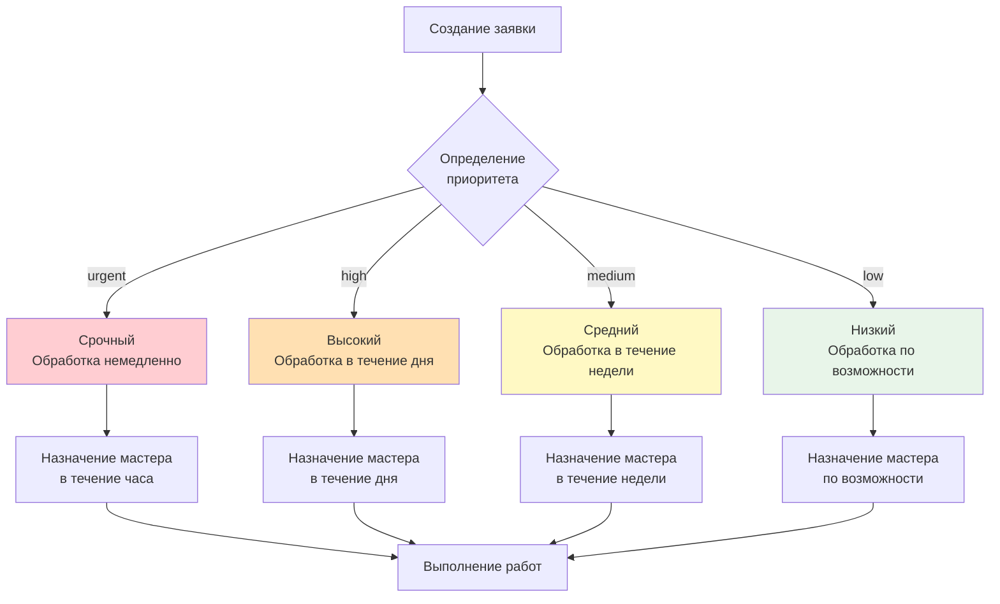

## API Endpoints для работы с заявками

### Какие endpoints использовать на каждом этапе

```mermaid
graph TD
    Start[Работа с заявками] --> Create[Создание заявки]
    Create --> A1["POST /api/service-requests/"]
    
    Start --> View[Просмотр заявок]
    View --> B1["GET /api/service-requests/"]
    View --> B2["GET /api/requests-with-apartment/"]
    View --> B3["GET /api/requests-with-category/"]
    View --> B4["GET /api/request-detail/id/"]
    
    Start --> Manage[Управление заявками]
    Manage --> C1["POST /api/service-requests/id/assign_worker/"]
    Manage --> C2["POST /api/service-requests/id/change_status/"]
    Manage --> C3["POST /api/service-requests/id/add_comment/"]
    Manage --> C4["PATCH /api/request-detail/id/"]
    
    Start --> Special[Специальные endpoints]
    Special --> D1["GET /api/service-requests/my_requests/"]
    Special --> D2["GET /api/service-requests/assigned_to_me/"]
    
    classDef createStyle fill:#e1f5ff
    classDef viewStyle fill:#fff4e1
    classDef manageStyle fill:#e8f5e9
    classDef specialStyle fill:#f3e5f5
    
    class A1 createStyle
    class B1,B2,B3,B4 viewStyle
    class C1,C2,C3,C4 manageStyle
    class D1,D2 specialStyle
```

## Права доступа по статусам

### Кто может что делать в зависимости от статуса

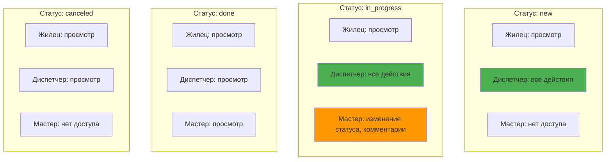

## Примеры использования

### Типичные сценарии

#### Сценарий 1: Жилец создает заявку

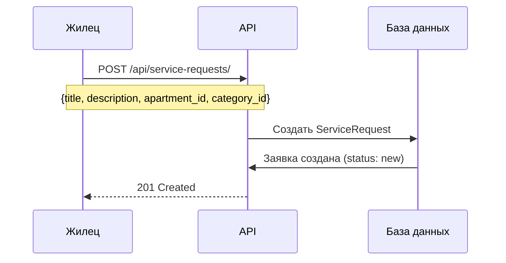

#### Сценарий 2: Диспетчер назначает мастера

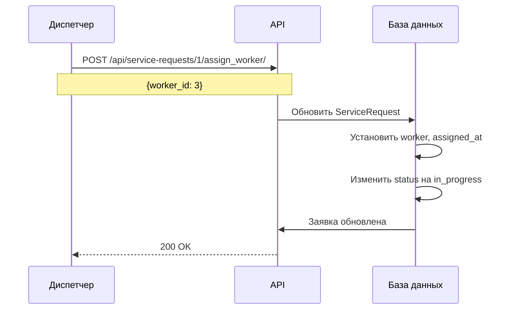

#### Сценарий 3: Мастер завершает работу

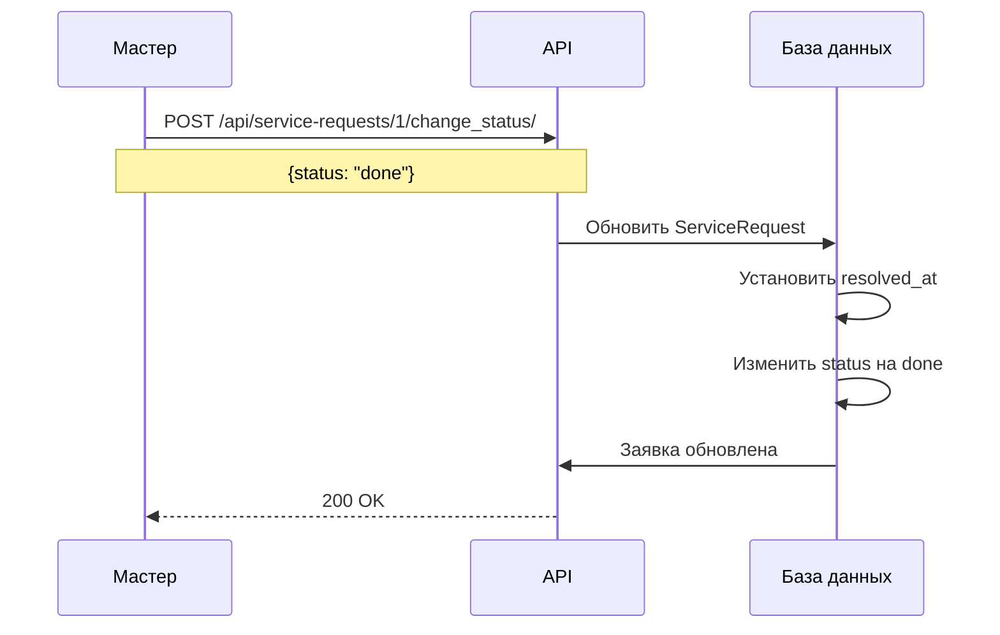

---

## Резюме

Все схемы выше показывают:

1. **Жизненный цикл заявки** - какие статусы существуют и как они меняются
2. **Процесс обработки** - полный workflow от создания до завершения
3. **Роли и действия** - кто что может делать
4. **Временная линия** - отслеживание дат событий
5. **Взаимодействие ролей** - последовательность действий
6. **Схема данных** - структура и связи
7. **Приоритеты** - обработка по важности
8. **API Endpoints** - какие endpoints использовать
9. **Права доступа** - кто может что делать по статусам
10. **Примеры** - типичные сценарии использования

Эти схемы помогут понять, как работает система обработки заявок в "ЖК Коннект".

