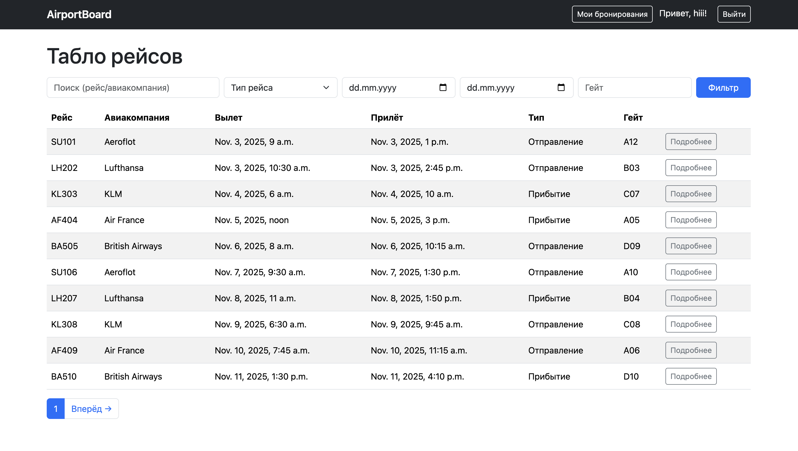
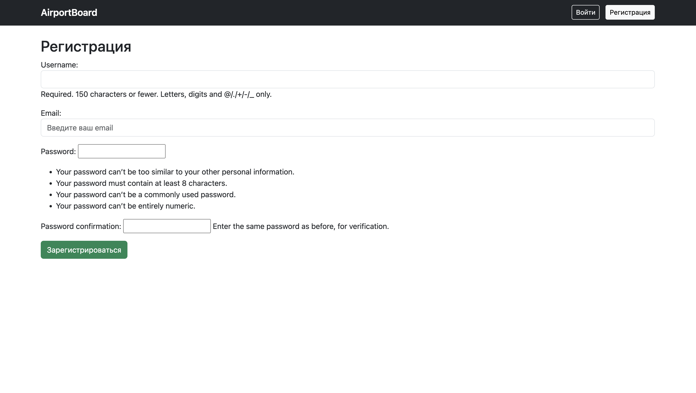
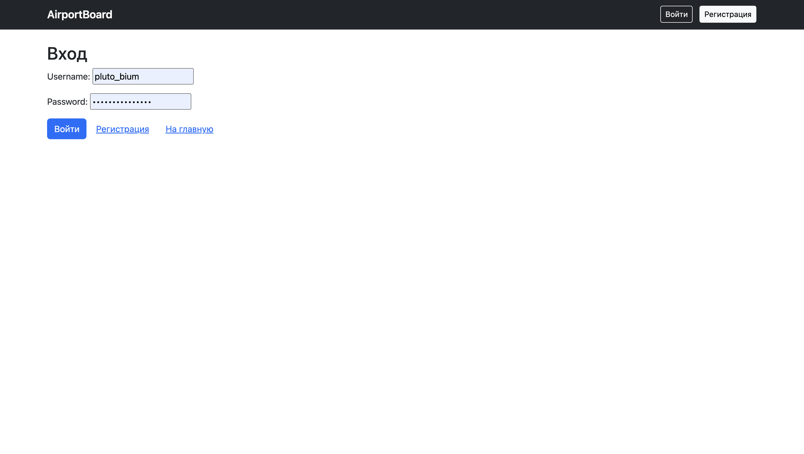
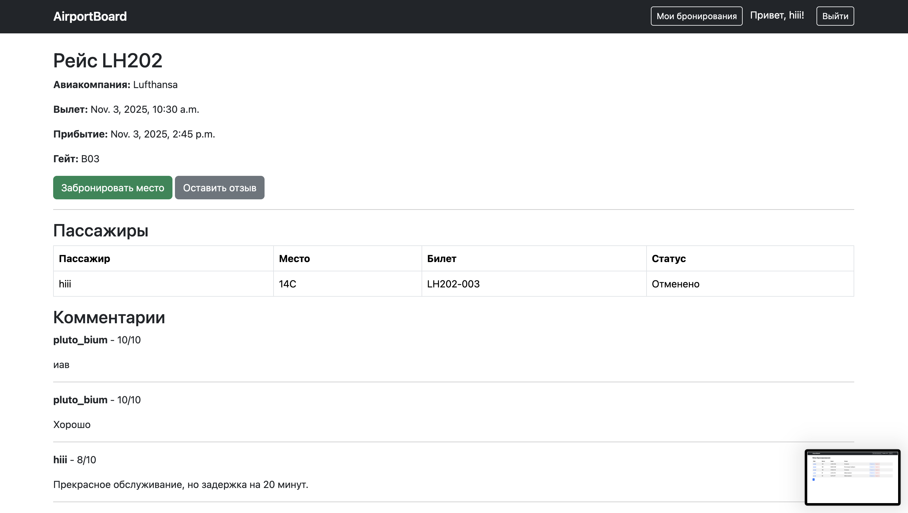
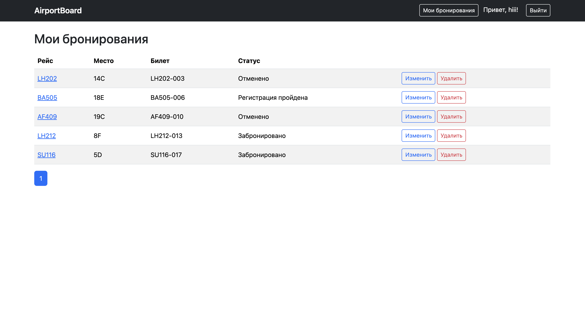
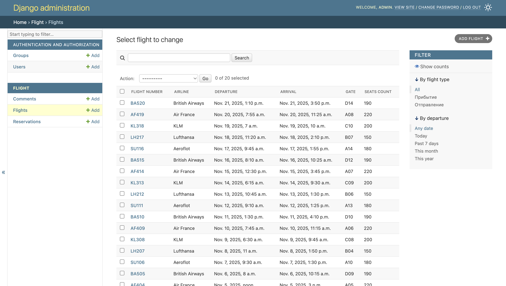
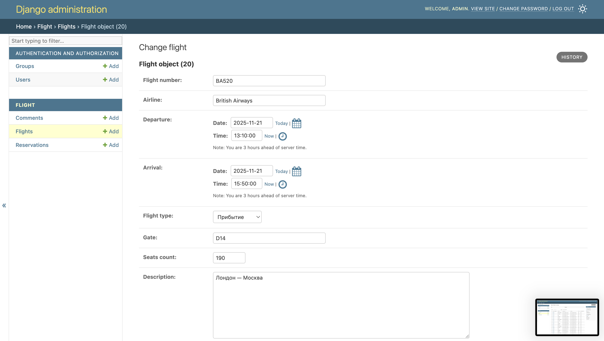

## Реализация простого сайта на Django

В рамках лабораторной работы реализовано табло отображения информации об авиаперелетах - приложение для отображения рейсов, регистрации пользователей, бронирования мест, управления бронированиями и оставления отзывов о рейсах.

### Фичи

- Регистрация и вход/выход пользователей
- Просмотр списка рейсов с фильтрами и поиском
- Пагинация списка рейсов и личных бронирований
- Детальная страница рейса с таблицей пассажиров
- Бронирование мест (пользователи), редактирование и удаление своих бронирований
- Разделение прав: пользователи управляют только своими бронями, админ видит и может редактировать любые
- Админ-часть: управление рейсами, бронированиями и билетами (номер билета)
- Отзывы к рейсам: текст, рейтинг (1-10), дата рейса, автор
- Навигация и UI на Bootstrap 5 + собственный CSS

### Подробный обзор

#### Сторона пользователей

У пользователей есть возможность зарегистрироваться либо войти. Все поля логина и реги валидируются.

Реализованы модели Flight, Reservation и Comment. Все данные хранятся в sqlite.

На главном экране виден весь список рейсов, есть фильтрация и пагинация (не настраивается, автоматически отображается 10 элементов на странице). Можно посмотреть подробнее карточку рейса, оставить отзыв о нём и забронировать место (если оно не занято).

У пользователей есть возможность посмотреть их бронирования.

#### Админка

Админ имеет возмонжость управлять аккаунтами пользователей, просматривать записи в БД и редактировать отдельные поля

