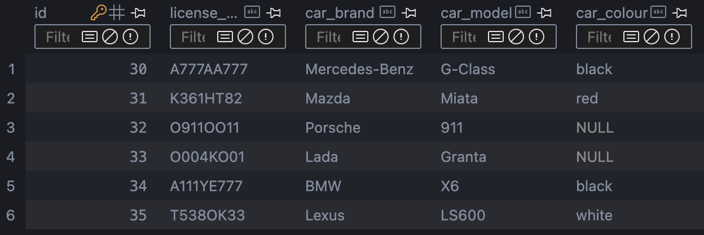
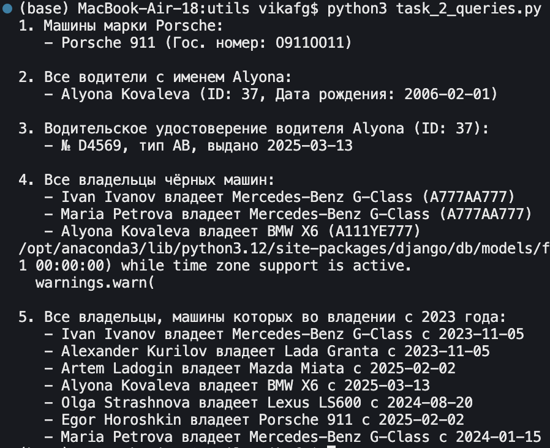
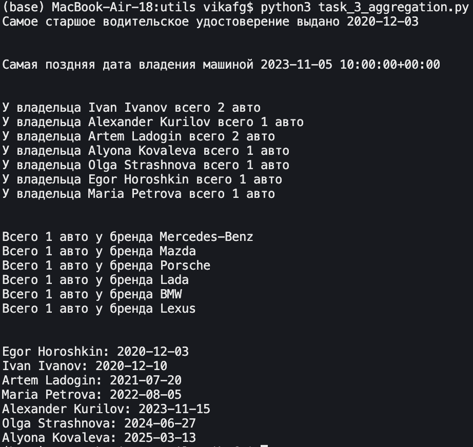

# Django Web Framework. Запросы и их выполнение

В этой практической работе рассматриваются темы создания объектов, простых запросов в БД и агрегации и аннотации запросов.

## Выполнение заданий

Я создала отдельную папку `utils`, где складываю все файлы для выполнения заданий из практической работы. Для каждого файла требуется настроить окружение, чтобы подтягивались настройки Django.

```python
import os
import django
from datetime import date

os.environ.setdefault('DJANGO_SETTINGS_MODULE', 'project_auto.settings')
django.setup()
```

## Создание объектов

Реализуем простой проект автовладельцев при помощи Django. Для выполнения заданий достаточно только определить модели `CarOwner`, `DriverLicense`, `Car` и `Ownership` и сделать миграции.

Далее в файле утилиты для наполнения БД пишу списки кортежей формата

```python
# Создаём 6 записей в таблицу CarOwner
car_owners = [
    ('Ivan', 'Ivanov', date(2003, 6, 11)),
    ('Alexander', 'Kurilov', date(1993, 2, 2)),
    ('Artem', 'Ladogin', date(1977, 1, 9)),
    ('Alyona', 'Kovaleva', date(2006, 2, 1)),
    ('Olga', 'Strashnova', date(1987, 10, 17)),
    ('Egor', 'Horoshkin', date(2000, 2, 28)),
]
```

и циклом добавляю их в БД:

```python
created_owners = []
for first_name, last_name, birth_date in car_owners:
    owner = CarOwner.objects.create(
        first_name=first_name,
        last_name=last_name,
        birth_date=birth_date,
    )
```

в итоге получается наполненная БД (пример для таблицы `car_owners_car`):



## Создание простых запросов

Для моделей `DriverLicense` и `Ownership` (где есть `ForeignKey`) создадим `related_name`.

Для выполнения задания пропишем фильтры:

```python
# 1. Вывести все машины марки "Porsche"
porsche_cars = Car.objects.filter(car_brand='Porsche')

# 2. Найти всех водителей с именем "Alyona"
alyona_drivers = CarOwner.objects.filter(first_name='Alyona')

# 3. Взяв любого случайного владельца получить его id, и по этому id получить экземпляр удостоверения
alyona_owner = CarOwner.objects.filter(first_name='Alyona').first()

# 4. Вывести всех владельцев чёрных машин
black_cars = Car.objects.filter(car_colour='black')

# 5. Найти всех владельцев, чей год владения машиной начинается с 2023
new_ownerships = Ownership.objects.filter(start_date__gte=datetime(2023, 1, 1))
```

Результат:



## Агрегация и аннотация запросов

Для агрегации и аннотации запросов в задании 3 использую следующие методы: `.aggregate`, `.filter`, `.annotate` и `.values`. Вот, что написано в коде:

```python
# 1.  Вывод даты выдачи самого старшего водительского удостоверения
oldest_license = DriverLicense.objects.aggregate(Min('issue_date'))

# 2. Самая поздняя дата владения машиной
oldest_ownership = Ownership.objects.filter(end_date=None).aggregate(Min('start_date'))

# 3. Количество машин для каждого водителя
owners_with_car_count = CarOwner.objects.annotate(num_cars=Count('ownership__id_car', distinct=True))

# 4. Количество машин каждой марки
count_car_brand = Car.objects.annotate(num_cars=Count('id'))

# 5. Отсортировать всех автовладельцев по дате выдачи удостоверения
owners = DriverLicense.objects.values(
    'id_car_owner__first_name',
    'id_car_owner__last_name',
    'issue_date'
).order_by('issue_date')
```

Результат:


