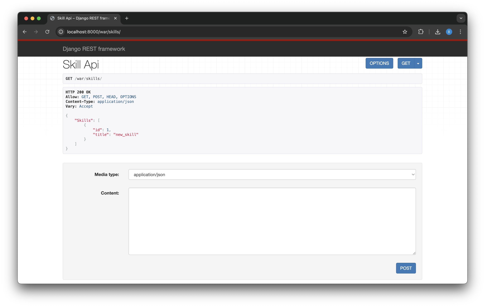

# Django REST Framework

## Задание 1

Реализация эндпоинтов для добавления и просмотра скиллов при помощи представления на основе APIView

### Реализация

Для начала напишем сериализатор для моделей `Skill` и `SkillOfWarrior`. Используем `ModelSerializer`, чтобы сразу описать готовые модели. Для класса `SkillOfWarriorSerializer` реализована функция проверки уровня (не ниже 0) `validate_level`

```Python
class SkillSerializer(serializers.ModelSerializer):

    class Meta:
        model = Skill
        fields = '__all__'


class SkillOfWarriorSerializer(serializers.ModelSerializer):

    class Meta:
        model = SkillOfWarrior
        fields = '__all__'

    def validate_level(self, level):
        if level < 0:
            raise serializers.ValidationError('Уровень не может быть меньше 0')
        return level
```

Далее в файле `views.py` опишем класс `SkillAPIView`, в котором реализованы HTTP-запросы `GET` и `POST` для скилла

```python
class SkillAPIView(APIView):

    def get(self, request):
        skills = Skill.objects.all()
        serializer = SkillSerializer(skills, many=True)
        return Response({"Skills": serializer.data})

    def post(self, request):
        serializer = SkillSerializer(data=request.data)
        if serializer.is_valid():
            serializer.save()
            return Response(serializer.data, status=status.HTTP_201_CREATED)
        return Response(serializer.errors, status=status.HTTP_400_BAD_REQUEST)
```

В `urls.py` добавим строку нового юрла:

```python
path('skills/', SkillAPIView.as_view())
```

Итого сейчас у нас доступны следующие юрлы:

```
admin/
war/ warriors/
war/ profession/create/
war/ skills/
```

Выглядит это так:



## Задание 2

Реализация эндпоинтов для работы с войнами: вывод полной информации, редактирование и удаление

### Реализация

Для начала создадим дополнительные сериализаторы для вывода полной информации о войнах. Используем вложенные сериализаторы для отображения связанных данных о профессиях и скилах

```Python
class ProfessionSerializer(serializers.ModelSerializer):

    class Meta:
        model = Profession
        fields = '__all__'


class WarriorProfessionSerializer(serializers.ModelSerializer):
    """
    Сериализатор для вывода война с информацией о профессии
    """
    profession = ProfessionSerializer(read_only=True)

    class Meta:
        model = Warrior
        fields = "__all__"


class WarriorSkillSerializer(serializers.ModelSerializer):
    """
    Сериализатор для вывода война с информацией о скилах
    """
    warrior_skills = SkillOfWarriorSerializer(many=True, read_only=True)

    class Meta:
        model = Warrior
        fields = "__all__"


class WarriorFullSerializer(serializers.ModelSerializer):
    """
    Сериализатор для вывода полной информации о войне: профессия и скилы
    """
    profession = ProfessionSerializer(read_only=True)
    warrior_skills = SkillOfWarriorSerializer(many=True, read_only=True)

    class Meta:
        model = Warrior
        fields = "__all__"
```

Для корректной работы сериализаторов необходимо добавить `related_name` в модель `SkillOfWarrior`:

```python
class SkillOfWarrior(models.Model):
    """
    Описание умений война
    """
    skill = models.ForeignKey('Skill', verbose_name='Умение', on_delete=models.CASCADE)
    warrior = models.ForeignKey('Warrior', verbose_name='Воин', on_delete=models.CASCADE, related_name='warrior_skills')
    level = models.IntegerField(verbose_name='Уровень освоения умения')
```

Далее в файле `views.py` опишем классы для работы с войнами:

1. `WarriorProfessionAPIView` - вывод всех войн с профессиями:

```python
class WarriorProfessionAPIView(APIView):
    """
    Вывод полной информации о всех войнах и их профессиях
    """

    def get(self, request):
        warriors = Warrior.objects.select_related('profession').all()
        serializer = WarriorProfessionSerializer(warriors, many=True)
        return Response({"Warriors": serializer.data})
```

2. `WarriorSkillAPIView` - вывод всех войн со скилами:

```python
class WarriorSkillAPIView(APIView):
    """
    Вывод полной информации о всех войнах и их скилах
    """

    def get(self, request):
        warriors = Warrior.objects.prefetch_related('warrior_skills__skill').all()
        serializer = WarriorSkillSerializer(warriors, many=True)
        return Response({"Warriors": serializer.data})
```

3. `WarriorDetailAPIView` - детальная информация, редактирование и удаление война:

```python
class WarriorDetailAPIView(APIView):
    """
    Вывод полной информации о войне (по id), его профессиях и скилах
    Удаление война по id
    Редактирование информации о войне
    """

    def get(self, request, pk):
        warrior = get_object_or_404(Warrior, pk=pk)
        serializer = WarriorFullSerializer(warrior)
        return Response({"Warrior": serializer.data})

    def post(self, request, pk):
        warrior = get_object_or_404(Warrior, pk=pk)
        serializer = WarriorSerializer(warrior, data=request.data)
        if serializer.is_valid():
            serializer.save()
            return Response(serializer.data, status=status.HTTP_200_OK)
        return Response(serializer.errors, status=status.HTTP_400_BAD_REQUEST)

    def patch(self, request, pk):
        warrior = get_object_or_404(Warrior, pk=pk)
        serializer = WarriorSerializer(warrior, data=request.data, partial=True)
        if serializer.is_valid():
            serializer.save()
            return Response(serializer.data, status=status.HTTP_200_OK)
        return Response(serializer.errors, status=status.HTTP_400_BAD_REQUEST)

    def delete(self, request, pk):
        warrior = get_object_or_404(Warrior, pk=pk)
        warrior.delete()
        return Response({"Success": f"Warrior '{warrior.name}' deleted successfully."}, status=status.HTTP_204_NO_CONTENT)
```

В `urls.py` добавим новые маршруты:

```python
urlpatterns = [
   path('warriors/', WarriorAPIView.as_view()),
   path('warriors/professions/', WarriorProfessionAPIView.as_view()),
   path('warriors/skills/', WarriorSkillAPIView.as_view()),
   path('warriors/<int:pk>/', WarriorDetailAPIView.as_view()),
   path('profession/create/', ProfessionCreateView.as_view()),
   path('skills/', SkillAPIView.as_view()),
]
```

Итого сейчас у нас доступны следующие юрлы:

```
admin/
war/warriors/
war/warriors/professions/
war/warriors/skills/
war/warriors/<id>/
war/profession/create/
war/skills/
```

## Описание всех эндпоинтов

- `GET /war/warriors` - вывод полной информации о всех воинах
- `GET /war/warriors/professions/` - вывод всех войн с информацией о профессиях
- `GET /war/warriors/skills/` - вывод всех войн с информацией о скилах
- `GET /war/warriors/<id>/` - вывод полной информации о войне (профессия и скилы)
- `PUT /war/warriors/<id>/` - полное обновление информации о войне
- `PATCH /war/warriors/<id>/` - частичное обновление информации о войне
- `DELETE /war/warriors/<id>/` - удаление война по id
- `GET war/skills/` - вывод полной информации о всех скиллах
- `POST war/skills/` - полное обновление информации о скилле
