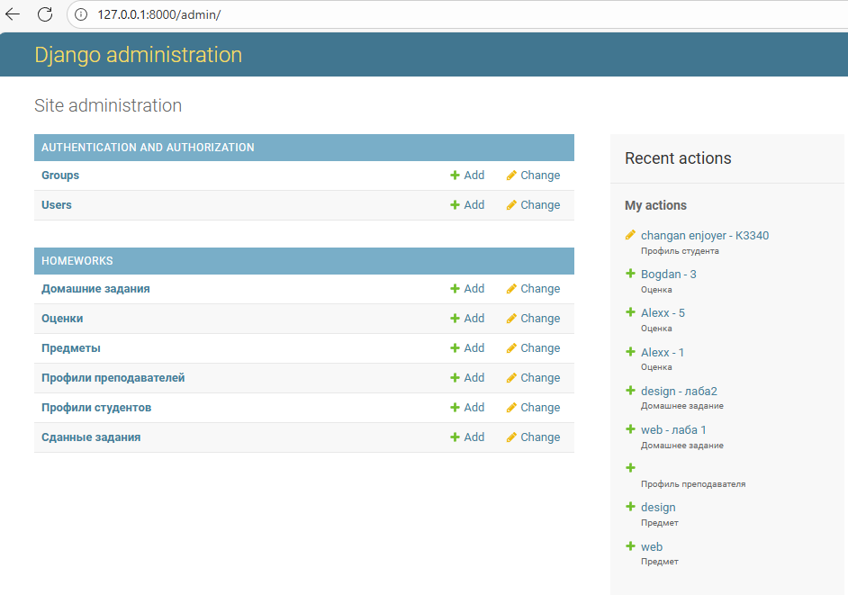
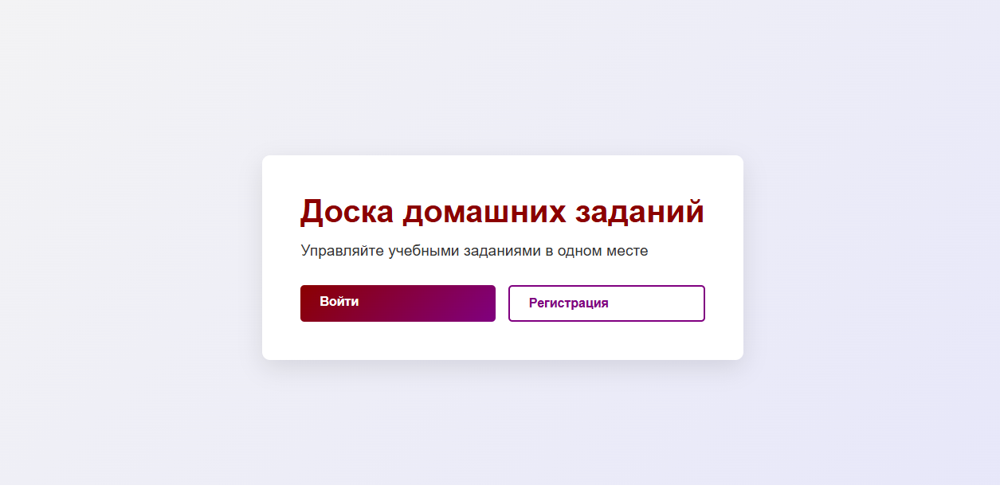
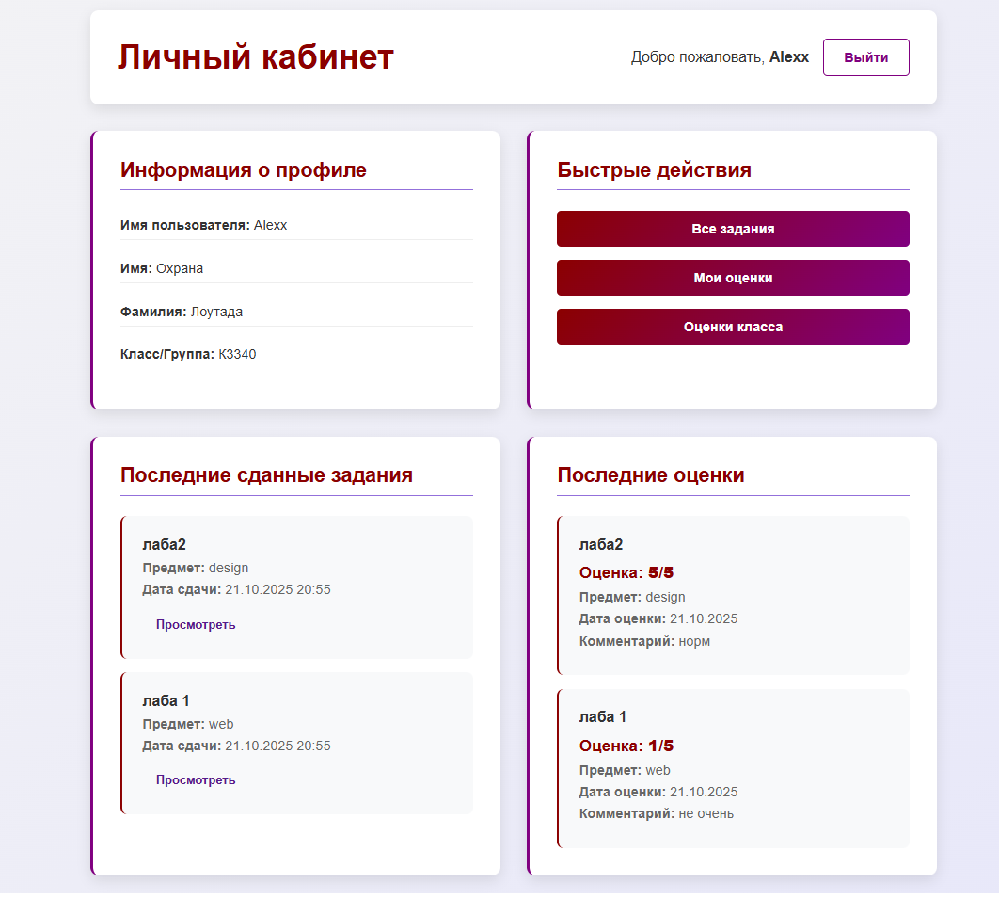
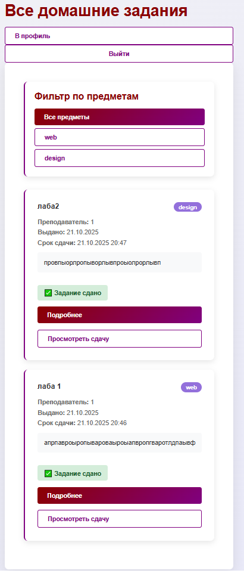
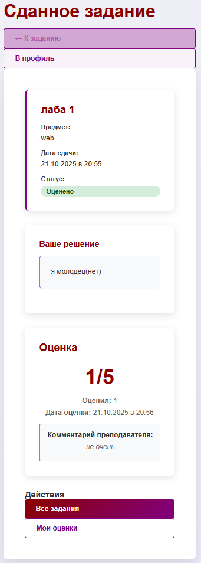
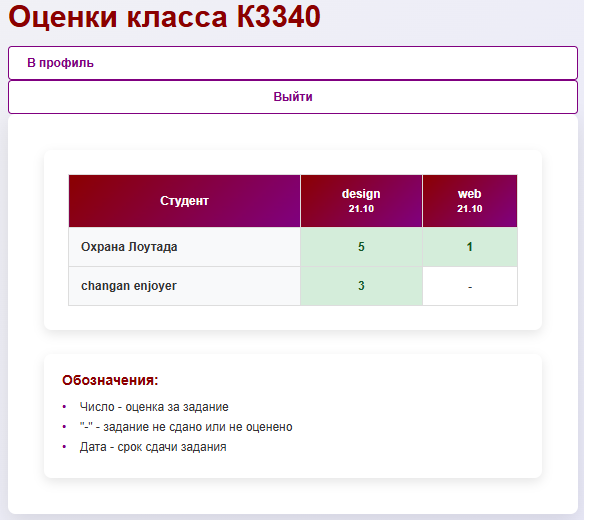

# Система управления домашними заданиями

## Задание:

Система должна отображать информацию о домашних заданиях: предмет, преподаватель, дата выдачи, срок выполнения, текст задания, информация о штрафах.
Необходимо реализовать следующий функционал:
- Регистрация новых пользователей с указанием класса/группы
- Просмотр домашних заданий по всем дисциплинам со сроками выполнения и описанием
- Сдача домашних заданий в текстовом виде с возможностью редактирования до момента оценки
- Администратор (учитель) должен иметь возможность поставить оценку за задание средствами Django-admin
- В клиентской части должна формироваться таблица, отображающая оценки всех учеников класса

## Ход выполнения

### Модели данных

Для начала была спроектирована основа приложения - модели данных, отражающие предметную область:

* Subject хранит информацию о предметах/дисциплинах
* Homework хранит информацию о домашнем задании: предмет, преподаватель, дата выдачи, срок выполнения, текст задания, информация о штрафах
* HomeworkSubmission хранит информацию о сданном задании студентом, включая текст решения и прикрепленные файлы
* Grade хранит информацию об оценке за сданное задание, включая баллы и комментарий преподавателя
* StudentProfile хранит дополнительную информацию о студенте (класс/группа)
* TeacherProfile хранит дополнительную информацию о преподавателе (преподаваемые предметы)

Для связей использовались соответствующие поля:
- ForeignKey для связей "многие-к-одному" (задание → предмет, сдача → задание)
- OneToOneField для профилей пользователей
- ManyToManyField для преподавателей и предметов

```
def __str__(self):
    return f"{self.subject} - {self.title}"

Для понятного отображения сущностей в админ-панели и интерфейсе.
```


### Формы

Были созданы кастомные формы на основе моделей:

* UserRegistrationForm - для регистрации новых пользователей с дополнительным полем "класс/группа"
* HomeworkSubmissionForm - для сдачи домашних заданий с текстовым полем и возможностью прикрепления файлов

```
class UserRegistrationForm(UserCreationForm):
    student_class = forms.CharField(
        max_length=20,
        required=True,
        label='Класс/Группа'
    )

    def __init__(self, *args, **kwargs):
        super().__init__(*args, **kwargs)
        for field in self.fields:
            self.fields[field].help_text = ''

    class Meta:
        model = User
        fields = ['username', 'first_name', 'last_name', 'email', 'password1', 'password2', 'student_class']

class HomeworkSubmissionForm(forms.ModelForm):
    class Meta:
        model = HomeworkSubmission
        fields = ['submission_text', 'file_attachment']
        widgets = {
            'submission_text': forms.Textarea(attrs={
                'rows': 10, 
                'placeholder': 'Введите ваше решение здесь...'
            }),
        }
```


### URL адреса и навигация

Для удобной навигации по сайту была настроена маршрутизация с использованием namespace:

```
app_name = 'homeworks'

urlpatterns = [
    path('', views.homepage, name='homepage'),
    path('register/', views.register, name='register'),
    path('login/', auth_views.LoginView.as_view(template_name='homeworks/login.html'), name='login'),
    path('logout/', auth_views.LogoutView.as_view(), name='logout'),
    path('profile/', views.profile, name='profile'),
    path('homeworks/', views.homework_list, name='homework_list'),
    path('homework/<int:homework_id>/', views.homework_detail, name='homework_detail'),
    path('homework/<int:homework_id>/submit/', views.submit_homework, name='submit_homework'),
    path('submission/<int:submission_id>/', views.submission_detail, name='submission_detail'),
    path('grades/', views.grade_list, name='grade_list'),
    path('grades/class/', views.class_grades_table, name='class_grades_table'),
    path('teacher/homework/create/', views.create_homework, name='create_homework'),
]
```
Была реализована логическая навигация между страницами с кнопками "Назад", "В профиль", "Все задания" для удобства пользователей.

### Представления
Логика работы приложения реализована с помощью Function Based Views с использованием декораторов для контроля доступа:

* **@login_required** - для ограничения доступа только авторизованным пользователям
* @user_passes_test - для ограничения функционала создания заданий только преподавателям (staff)

Основные views включают:
- homepage - главная страница с разным контентом для авторизованных и неавторизованных пользователей
- register - регистрация с автоматическим созданием профиля студента
- profile - личный кабинет с общей информацией и быстрыми действиями
- homework_list - список всех заданий с фильтрацией по предметам
- submit_homework - сдача задания с проверкой на повторную сдачу
- grade_list - просмотр оценок с пагинацией
- class_grades_table - таблица оценок всего класса
- create_homework - создание новых заданий (только для преподавателей)

```
@login_required
def grade_list(request):
    grades_list = Grade.objects.filter(
        submission__student=request.user
    ).select_related('submission', 'submission__homework').order_by('-graded_date')
    
    paginator = Paginator(grades_list, 10)
    page_number = request.GET.get('page')
    page_obj = paginator.get_page(page_number)
    
    context = {
        'page_obj': page_obj,
        'average_grade': calculate_average_grade(grades_list),
        'total_grades': grades_list.count(),
    }
    return render(request, 'homeworks/grade_list.html', context)
```


### Панель администратора

Все модели были зарегистрированы в админ-панели Django, что позволяет администраторам и преподавателям легко управлять учебным процессом:

- Создавать и редактировать предметы, задания
- Просматривать сданные работы
- Выставлять оценки с комментариями
- Управлять пользователями и их профилями



### Пользовательский интерфейс

Был разработан чистый и интуитивно понятный интерфейс с использованием темно-красной и фиолетовой цветовой схемы:

* Адаптивный дизайн - корректное отображение на разных устройствах
* Визуальные статусы - цветовые индикаторы статуса заданий (сдано/не сдано)
* Пагинация - разбивка списков на страницы для удобства просмотра
* Фильтрация - возможность фильтровать задания по предметам
* Формы с валидацией - понятные сообщения об ошибках и успешных операциях

### Ключевые функции

1. Система регистрации - регистрация с автоматическим определением роли (студент/преподаватель)
2. Управление заданиями - создание, просмотр, сдача заданий
3. Система оценивания - прозрачное выставление оценок через админ-панель
4. Таблица успеваемости - сравнительная таблица оценок всего класса
5. Контроль сроков - отображение дедлайнов и информации о штрафах за просрочку







### Вывод

В ходе лабораторной работы была успешно разработана полнофункциональная система управления домашними заданиями на Django. Были реализованы все требуемые функции: регистрация пользователей, просмотр и сдача заданий, система оценивания и визуализация успеваемости.

Особое внимание было уделено удобству интерфейса и логической связности всех страниц приложения. Система демонстрирует эффективное использование возможностей Django ORM, системы аутентификации и шаблонов для создания современного веб-приложения.

В процессе работы были освоены навыки проектирования моделей данных, создания кастомных форм, настройки прав доступа и разработки пользовательского интерфейса с учетом требований юзабилити.