# Отчёт по лабораторной работе 2. Реализация простого сайта на django.

## Задание: табло отображения информации об авиаперелетах
Хранится информация о номере рейса, авиакомпании, отлете, прилете, типе
(прилет, отлет), номере гейта.

Необходимо реализовать следующий функционал:
1. Регистрация новых пользователей.
2. Просмотр и резервирование мест на рейсах. Пользователь должен иметь  возможность редактирования и удаления своих резервирований.
3. Администратор должен иметь возможность зарегистрировать на рейс  пассажира и вписать в систему номер его билета средствами Django-admin.
4. В клиентской части должна формироваться таблица, отображающая всех  пассажиров рейса.
5. Написание отзывов к рейсам. При добавлении комментариев, должны сохраняться дата рейса, текст комментария, рейтинг (1-10), информация о  комментаторе.

## Реализация

Для начала я создал модели. Все модели наследовались от класса Model из Django. Я добавил ограничения на поля, читаемый вывод с помощью
метода `__str__`, а также добавил проверку на уникальность у некоторых моделей, которые этого требовали - это описывалось в классе Meta. Ниже
представлена реализация Airport, Airline, Reservation. Модель Airport отвечает за аэропорт, у которой есть поля: название, город, страна, дата создания записи и дата
последнего обновления записи. Airline - авиакомпания, Flight - рейс. Reservation - бронирование, Review - отзыв 

```python
class Airport(models.Model):
    name = models.CharField(max_length=100)
    city = models.CharField(max_length=100)
    country = models.CharField(max_length=100)
    created_at = models.DateTimeField(auto_now_add=True)
    updated_at = models.DateTimeField(auto_now=True)

    def __str__(self):
        return f"{self.name} ({self.city}, {self.country})"


class Airline(models.Model):
    name = models.CharField(max_length=100, unique=True)

    created_at = models.DateTimeField(auto_now_add=True)
    updated_at = models.DateTimeField(auto_now=True)

    def __str__(self):
        return self.name

class Reservation(models.Model):
    flight = models.ForeignKey(Flight, on_delete=models.CASCADE)
    passenger = models.ForeignKey(settings.AUTH_USER_MODEL, on_delete=models.CASCADE)
    seat_number = models.CharField(max_length=4)
    ticket_number = models.CharField(max_length=20)

    created_at = models.DateTimeField(auto_now_add=True)
    updated_at = models.DateTimeField(auto_now=True)

    class Meta:
        constraints = [
            models.UniqueConstraint(fields=["flight", "seat_number"], name="uniq_seat_per_flight"),
            models.UniqueConstraint(fields=["flight", "passenger"], name="uniq_passenger_per_flight"),
        ]

    def __str__(self):
        return f"{self.passenger} -> {self.flight.number}, seat {self.seat_number}"
```

Для модели рейса (Flight) я сделал проверку на статус рейса, тип, а также проверку на то, что прибытие должно быть позже вылета по времени

```python
class Flight(models.Model):
    STATUS_CHOICES = [
        ('scheduled', 'Запланирован'),
        ('in_flight', 'В полёте'),
        ('arrived', 'Прибыл'),
        ('delayed', 'Задержан'),
        ('cancelled', 'Отменён')
    ]
    TYPE_CHOICES = [("DEPARTURE", "Вылет"), ("ARRIVAL", "Прилёт")]
    status = models.CharField(max_length=20, choices=STATUS_CHOICES, default='scheduled')
    number = models.CharField(max_length=20)
    departure_time = models.DateTimeField()
    arrival_time = models.DateTimeField()
    gate = models.CharField(max_length=10, blank=True)
    type = models.CharField(max_length=9, choices=TYPE_CHOICES)
    capacity = models.PositiveIntegerField(
        validators=[MinValueValidator(1)]
    )

    airline = models.ForeignKey(Airline, on_delete=models.CASCADE)
    origin_airport = models.ForeignKey(Airport, on_delete=models.CASCADE, related_name="departures")
    destination_airport = models.ForeignKey(Airport, on_delete=models.CASCADE, related_name="arrivals")

    created_at = models.DateTimeField(auto_now_add=True)
    updated_at = models.DateTimeField(auto_now=True)

    class Meta:
        constraints = [
            models.CheckConstraint(
                name="arrival_after_departure",
                check=models.Q(arrival_time__gt=models.F("departure_time")),
            )
        ]

    def __str__(self):
        return f"{self.airline}: {self.number}"
```

Затем я создавал представления. Так, для представления о выводе всех рейсов, я наследовал класс от ListView из Django, чтобы вернуть список из всех рейсов.
В классе я указал модель, шаблон, который нужно вернуть, количество объектов на странице для пагинации. В методе get_queryset я добавил возможность фильтрации
по разным атрибутам. В методе get_context_data я добавил новые атрибуты, к которым можно будет в шаблоне обращаться, чтобы их вывести пользователю.
Также есть пагинация, за это отвечает переменная paginate_by, которая равна 7. На каждой странице будет отображаться не более 7 рейсов.

```python

class FlightListView(ListView):
    model = Flight
    template_name = "flights/flight_list.html"
    context_object_name = "flights"
    paginate_by = 7

    def get_queryset(self):
        # Загружаем все объекты Flight и подгружаем объекты airline, airport
        qs = (Flight.objects
              .select_related("airline", "origin_airport", "destination_airport")
              .order_by("departure_time"))

        # Если выбрана фильтрация, то получаем аргументы, по которым нужно фильтровать
        q = self.request.GET.get("q", "").strip()
        t = self.request.GET.get("type")
        airline = self.request.GET.get("airline")
        origin = self.request.GET.get("origin")
        dest = self.request.GET.get("dest")

        # Фильтруем по "ИЛИ"
        if q:
            qs = qs.filter(
                Q(number__icontains=q) |
                Q(airline__name__icontains=q) |
                Q(origin_airport__city__icontains=q) |
                Q(destination_airport__city__icontains=q)
            )
        if t in {"DEPARTURE", "ARRIVAL"}:
            qs = qs.filter(type=t)
        if airline:
            qs = qs.filter(airline__name=airline)
        if origin:
            qs = qs.filter(origin_airport__city=origin)
        if dest:
            qs = qs.filter(destination_airport__city=dest)

        return qs

    # Добавляем в шаблон дополнительные данные
    def get_context_data(self, **kwargs):
        ctx = super().get_context_data(**kwargs) # Получение базового контекста
        ctx["airlines"] = (Flight.objects
                           .select_related("airline")
                           .values_list("airline__name", flat=True)
                           .distinct().order_by("airline__name"))
        ctx["origins"] = (Flight.objects
                          .select_related("origin_airport")
                          .values_list("origin_airport__city", flat=True)
                          .distinct().order_by("origin_airport__city")) # Получаем одномерный список уникальных значений и добавляем в контекст
        ctx["destinations"] = (Flight.objects
                               .select_related("destination_airport")
                               .values_list("destination_airport__city", flat=True)
                               .distinct().order_by("destination_airport__city"))
        
        # Копируем параметры из запроса и удаляем page и преобразовываем в url строку, чтобы в случае пагинации сохранялись фильтры
        params = self.request.GET.copy()
        params.pop("page", None)
        ctx["querystring"] = urlencode(params, doseq=True)
        return ctx
```

Для представления конкретного рейса я наследовался от DetailView. В методе get_context_data я добавил новые атрибуты, к которым можно будет в шаблоне обращаться, чтобы их вывести пользователю

```python
class FlightDetailView(DetailView):
    model = Flight
    template_name = "flights/flight_detail.html"
    context_object_name = "flight"

    def get_context_data(self, **kwargs):
        ctx = super().get_context_data(**kwargs)
        ctx["my_reservations"] = (
            Reservation.objects.filter(passenger=self.request.user, flight=self.object)
            if self.request.user.is_authenticated else []
        )
        ctx["reviews"] = Review.objects.select_related("author").filter(flight=self.object).order_by("-created_at")
        ctx["passengers"] = Reservation.objects.select_related("passenger").filter(flight=self.object).order_by("seat_number")
        ctx["occupied"] = ctx["passengers"].count()
        ctx["free"] = max(self.object.capacity - ctx["occupied"], 0)
        ctx["my_review_exists"] = (
                self.request.user.is_authenticated
                and Review.objects.filter(flight=self.object, author=self.request.user).exists()
        ) # Проверка, что пользователь авторизован, в таком случае фильтр срабатывает
        return ctx
```

Я использовал миксины LoginRequiredMixin, а также UserPassesTestMixin, чтобы проверять, что к представлению обращается администратор. 
Если обращается не администратор, тогда доступ запрещается и изменить статус рейса не получится.

```python
# Ставим миксины, что пользователь должен быть авторизован и пройден проверку, FormView - обработка post запроса
class FlightStatusUpdateView(LoginRequiredMixin, UserPassesTestMixin, FormView):
    template_name = 'flights/flight_detail.html'

    def post(self, request, *args, **kwargs):
        flight = Flight.objects.get(pk=kwargs['pk'])
        status = request.POST.get('status')
        if status in dict(Flight.STATUS_CHOICES):
            flight.status = status
            flight.save()
        return HttpResponseRedirect(reverse_lazy('flights:flight-detail', kwargs={'pk': flight.pk}))

    # Проверяем, что пользователь - администратор, для изменения статуса полета
    def test_func(self):
        return self.request.user.is_staff
```

Я создал 2 формы: изменить своё место и написать рейтинг. Я указал модель, к которой эта форма относится, а также поля, которые должны быть в форме. 
Пользователь имеет право поменять своё место, а также оставить отзыв

```python
class ReservationForm(forms.ModelForm):
    class Meta:
        model = Reservation
        fields = ["seat_number"]

class ReviewForm(forms.ModelForm):
    class Meta:
        model = Review
        fields = ["rating", "text"]
```

В urls я добавил все эндпоинты, по которым можно будет переходить и получать представления

```python

urlpatterns = [
    path("flights/", FlightListView.as_view(), name="flight-list"),
    path("flights/<int:pk>/", FlightDetailView.as_view(), name="flight-detail"),
    path("flights/<int:flight_pk>/reserve/", ReservationCreateView.as_view(), name="reservation-create"),
    path("reservations/<int:pk>/edit/", ReservationUpdateView.as_view(), name="reservation-update"),
    path("reservations/<int:pk>/delete/", ReservationDeleteView.as_view(), name="reservation-delete"),
    path("flights/<int:flight_pk>/reviews/new/", ReviewCreateView.as_view(), name="review-create"),
    path("flights/<int:pk>/update/", FlightUpdateView.as_view(), name="flight-update"),
    path("flights/<int:pk>/delete/", FlightDeleteView.as_view(), name="flight-delete"),
    path('flights/<int:pk>/status-update/', FlightStatusUpdateView.as_view(), name='flight-status-update'),
    path("accounts/signup/", SignUpView.as_view(), name="signup"),
    path('reviews/<int:pk>/delete/', ReviewDeleteView.as_view(), name='review-delete'),
]
```

Для создания пользователей я использовал встроенную в Django реализацию аккаунтов. 

```python
class SignUpView(CreateView):
    form_class = UserCreationForm # из Django
    success_url = reverse_lazy('flights:flight-list')
    template_name = 'registration/signup.html'
```

Админ-панель также была использована встроенная из Django. Через панель  администратора можно создать рейсы

```python
@admin.register(Airport)
class AirportAdmin(admin.ModelAdmin):
    list_display = ("name", "city", "country") # поля, которые будут отображаться в админ-панеле
    search_fields = ("name", "city", "country") # поля, по которым можно будет производить поиск

@admin.register(Airline)
class AirlineAdmin(admin.ModelAdmin):
    list_display = ("name",)
    search_fields = ("name",)

# Возможность редактировать бронирования пассажиров прямо на странице полета в админ-панели
class ReservationInline(admin.TabularInline):
    model = Reservation
    fields = ("passenger", "seat_number", "ticket_number")
    extra = 1

@admin.register(Flight)
class FlightAdmin(admin.ModelAdmin):
    list_display = ("number", "airline", "origin_airport", "destination_airport",
                    "departure_time", "arrival_time")
    list_filter = ("airline", "origin_airport", "destination_airport")
    inlines = [ReservationInline]

@admin.register(Reservation)
class ReservationAdmin(admin.ModelAdmin):
    list_display = ("flight", "passenger", "seat_number", "ticket_number", "created_at")
    search_fields = ("seat_number", "ticket_number", "passenger__username", "flight__number")

@admin.register(Review)
class ReviewAdmin(admin.ModelAdmin):
    list_display = ("flight", "author", "rating", "created_at")
    search_fields = ("author__username", "flight__number")
```

## Интерфейс

Если пользователь не авторизован, то страница с рейсами выглядит так:

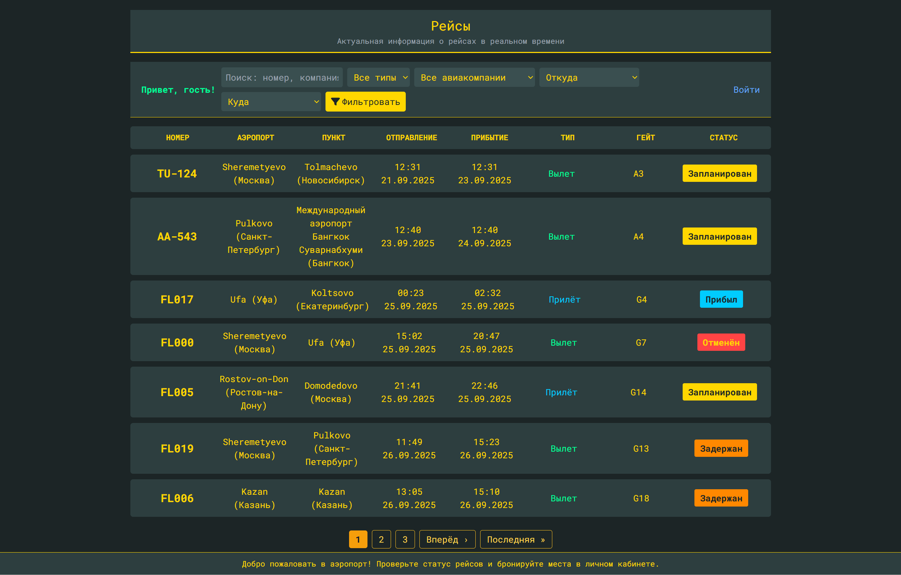

Страница с рейсом:

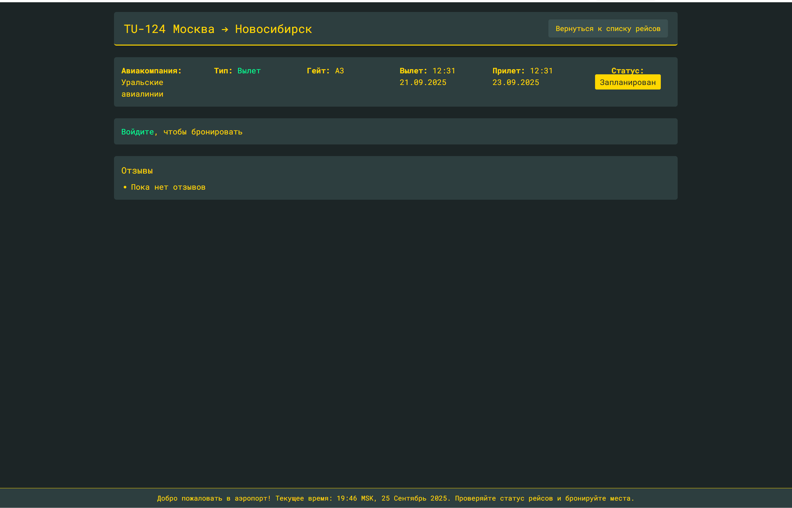

Для авторизованного пользователя:

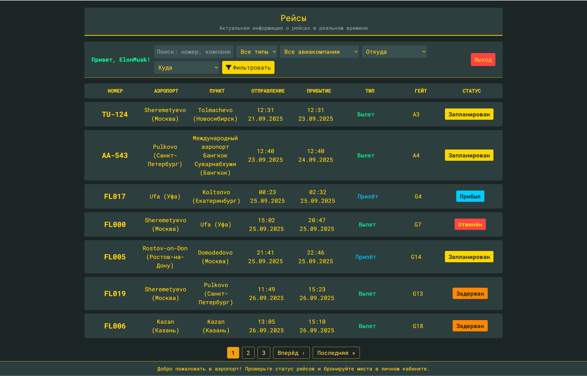

Страница с рейсом:

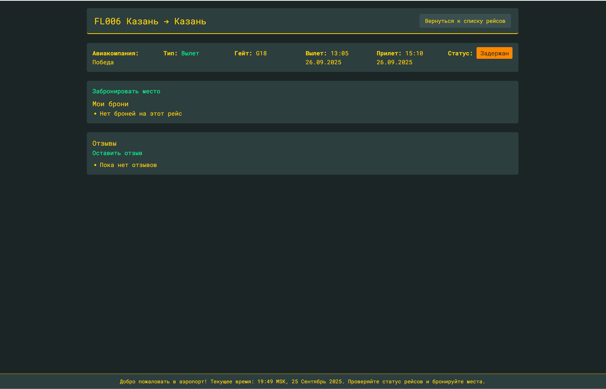

Возможность выбрать место:

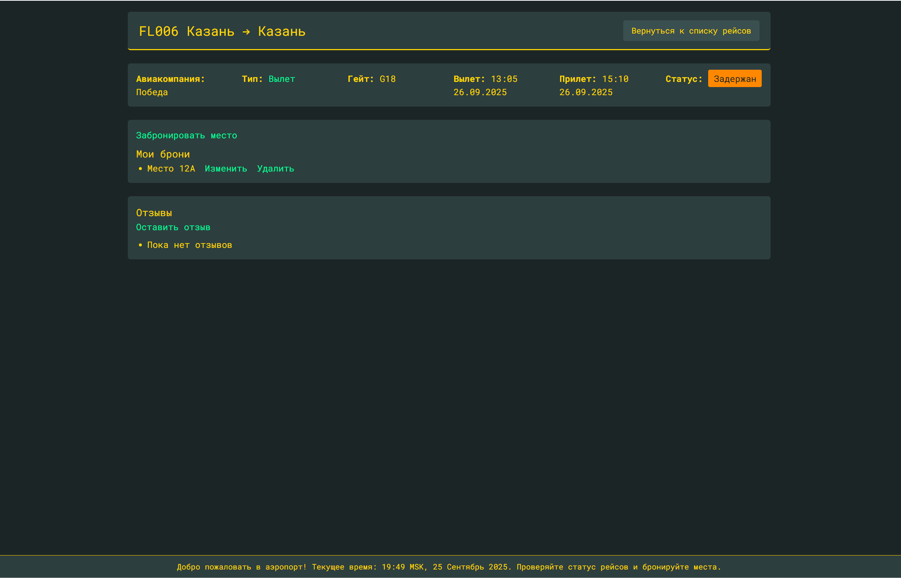

Страница регистрации:

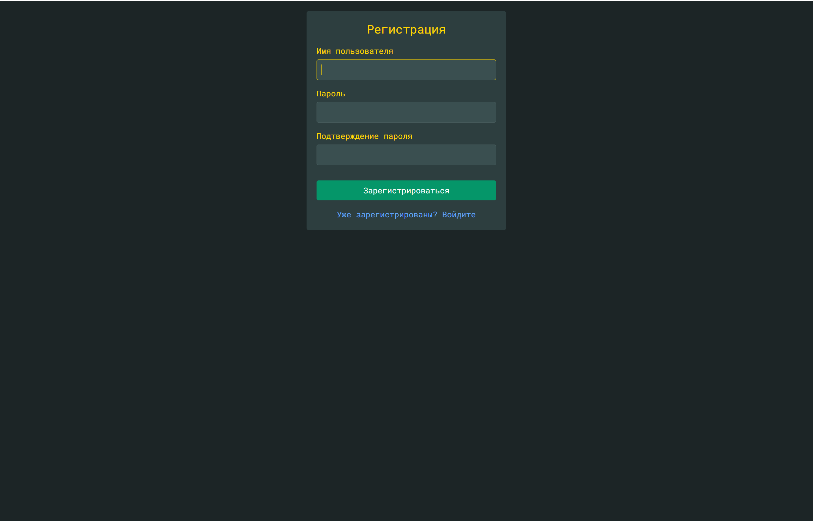

Страница авторизации:

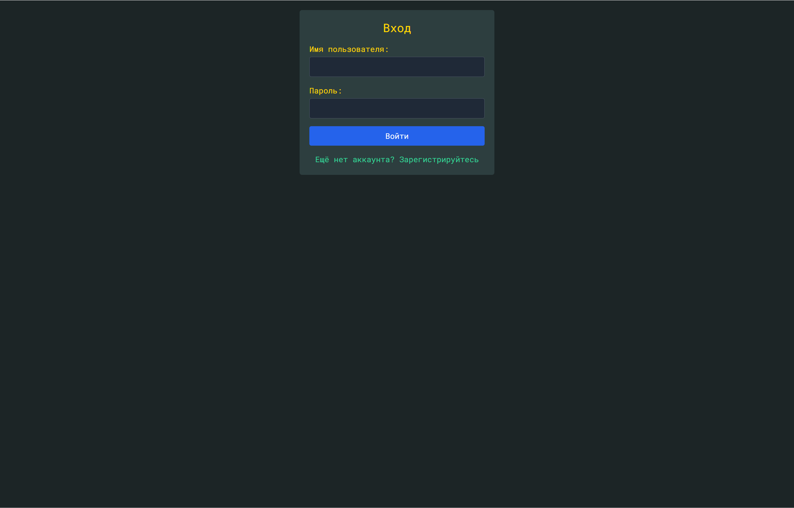

Для админа:

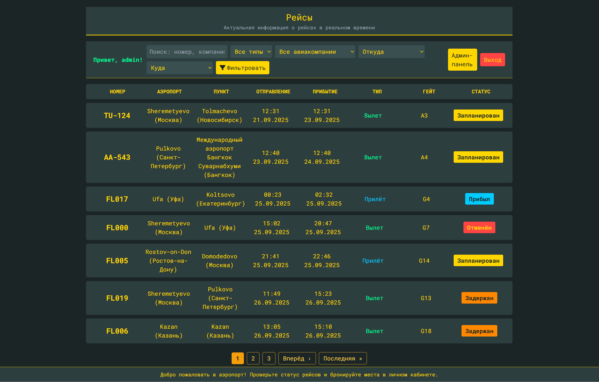

Страница с рейсом:

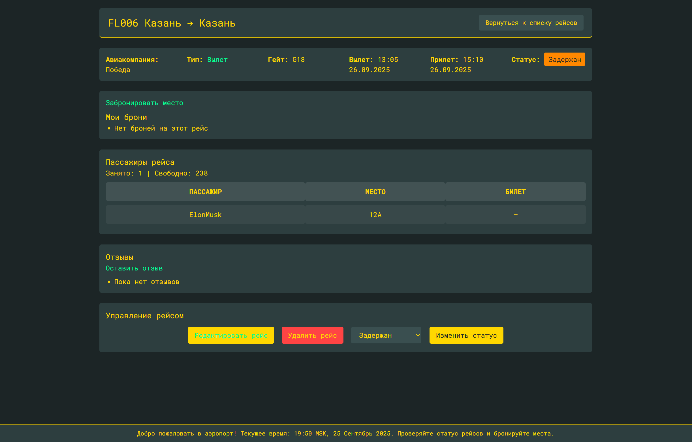

Админ может изменять данные о рейсе прямо на сайте:

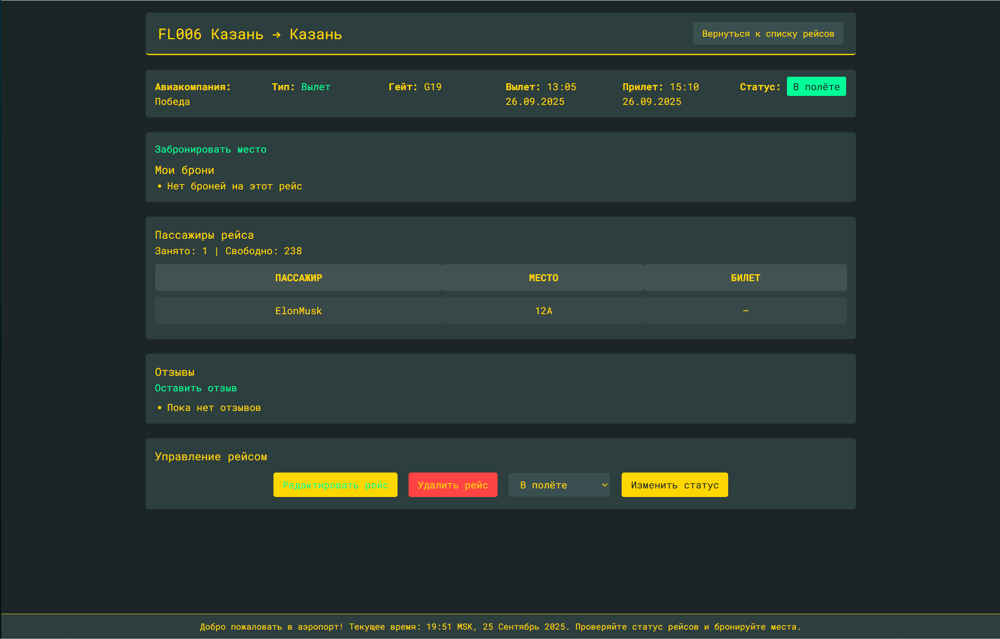

Админ-панель:

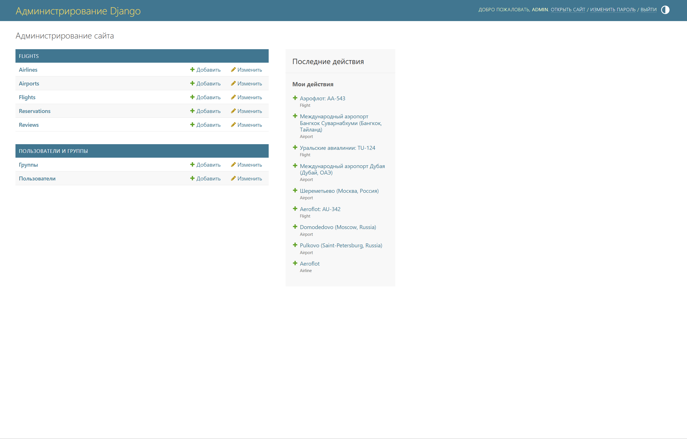