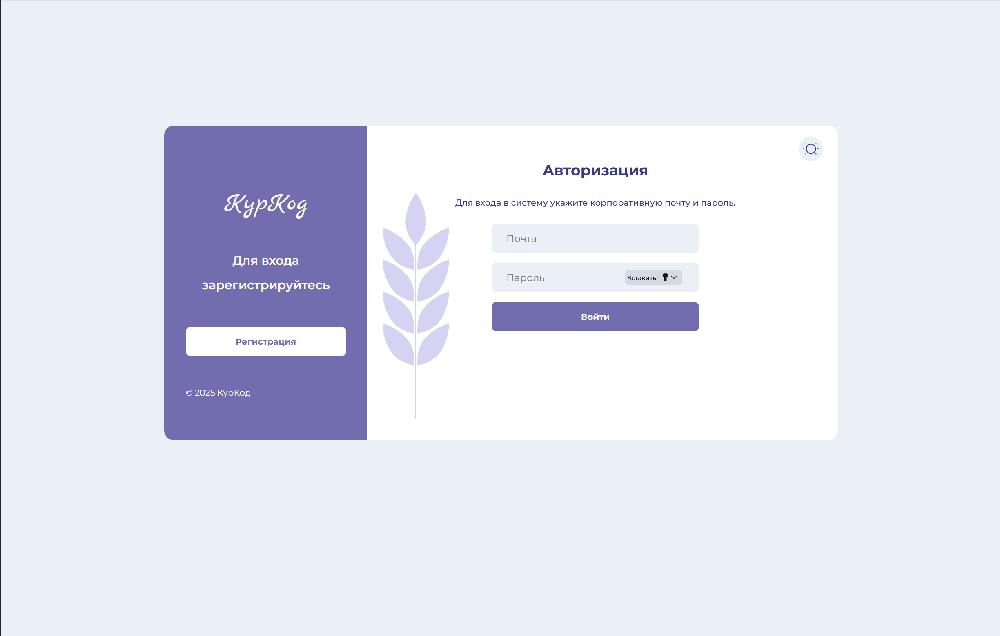
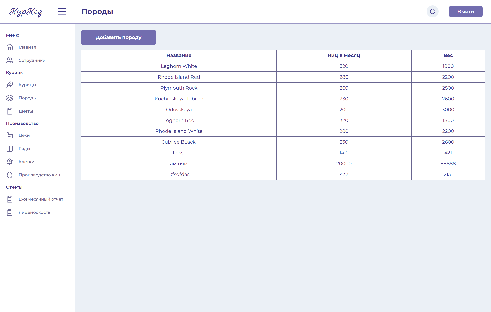
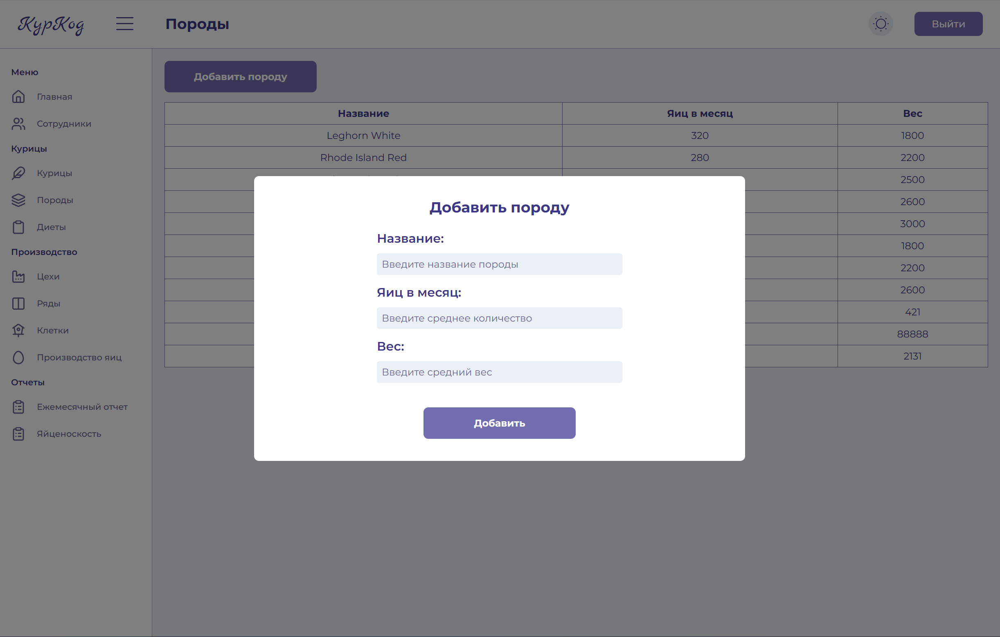
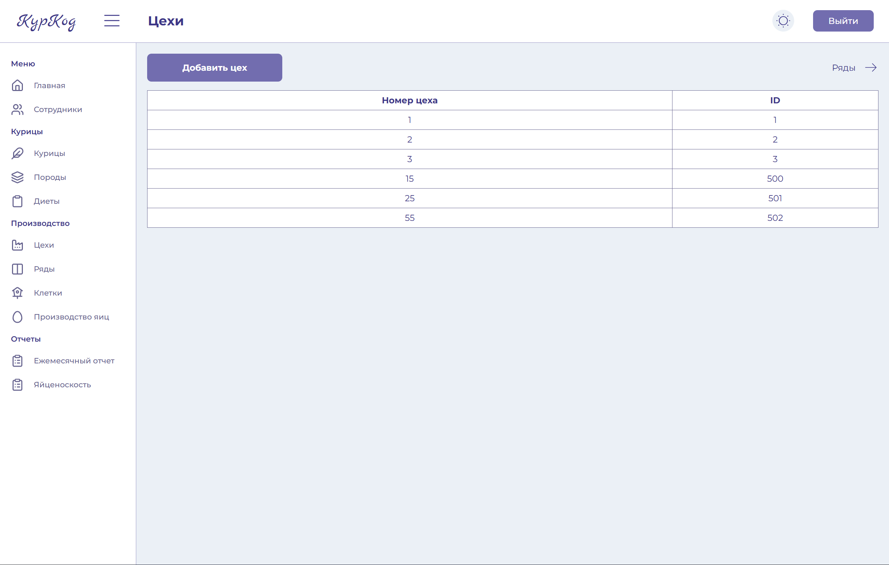

# Лабораторная работа 4

## Назначение

Клиентское приложение реализует веб-интерфейс для системы управления птицефабрикой. Через него администраторы и сотрудники могут просматривать статистику по птице, персоналу и инфраструктуре (цехи, ряды, клетки), работать с отчетами по производству яиц и управлять доступом к системе.

Интерфейс построен как одностраничное приложение (SPA) и взаимодействует с REST API бэкенда.

### Используемые технологии

- Vue.js - основной фреймворк
- Vue Router - навигация между страницами
- Pinia - управление состоянием (UI-настройки)
- Axios - HTTP-клиент

## Установка и запуск

Установка

```bash
npm install
```

Запуск

```bash
npm run dev
```

## Общая архитектура

Точка входа - main.js:

- создаётся приложение createApp(App)
- подключаются Pinia и Vue Router
- глобально регистрируется компонент Icon
- импортируется общий файл стилей styles/main.scss

Корневой компонент App.vue отвечает за общий layout:

- для обычных страниц отображаются:

  - Header (верхняя панель навигации и управления)
  - Sidebar (боковое меню разделов)
  - компонент-обёртка Content, в котором рендерится <RouterView />.

## Маршрутизация

Файл `router/index.js` описывает основные маршруты приложения:

- `/` - главная панель (дашборд статистики)
- `/employees` - список сотрудников
- `/employee/:id` - детальная карточка сотрудника
- `/chickens` - список кур
- `/chickens/:id` - подробная информация о конкретной курице
- `/breeds` - породы
- `/workshops` - цехи
- `/rows` - ряды
- `/cages` - клетки
- `/diets` - рационы
- `/egg-production` - данные по производству яиц
- `/report-factory-monthly` - ежемесячный отчёт директора по фабрике
- `/report-breed-egg-difference` - отчёт по яйценоскости пород
- `/account` - личный кабинет
- `/sign` - авторизация
- `/register` - регистрация.

## Работа с API

Все запросы выполняются через единый экземпляр axios (`api/http.js`):

- базовый URL берётся из `import.meta.env.VITE_API_URL`
- при старте приложения токен подхватывается из localStorage

Обновление токена

Реализована схема с refresh-токеном:

- Если сервер вернул 401 и запрос ещё не помечен как повторный - проверяется наличие refreshToken в localStorage
- Если refresh-токен есть и сейчас никто не обновляет токен: выполняется запрос `/auth/refresh/token?token=<refreshToken>`
- новые токены сохраняются через setTokens

При ошибке обновления:

- токены очищаются (clearTokens)
- при необходимости выполняется редирект на `/sign`

## Основные страницы и интерфейс

### Главная страница

Компонент `HomePage.vue`:

- получает общую статистику через useFarmStatistics():
- общее число кур, сотрудников, пород, цехов, рядов, клеток
- среднюю яйценоскость на одну курицу
- общее количество яиц за текущий месяц
- средний возраст птицы

### Детальная информация о курице

`ChickenPage.vue`:

- получает `id` курицы из параметров маршрута
- загружает данные через `getChicken(id)`

### Управление породами кур

Страница Породы отвечает за работу со справочником пород:

- данные подгружаются через `useBreeds()`, который возвращает список пород
- сами данные отображаются в таблице BreedsTable с колонками:
  - название породы
  - количество яиц в месяц
  - вес

### Управление сотрудниками

Страница Сотрудники показывает список работников птицефабрики:

- используется `useWorkers()`, который загружает массив сотрудников и признак загрузки

### Управление цехами

Страница Цехи предназначена для работы со структурой фабрики на уровне производственных помещений:

- данные загружаются через `useWorkshops()`, который возвращает список цехов

## Демонстрация работы



Фотография 1 - страница регистрации



Фотографи 2 - страница всех пород



Фотография 3 - добавление породы



Фотография 4 - цеха
