# Практическая работа по Django REST Framework

## Практическая работа №3.1

### Цель работы

Получить представление о работе с запросами в Django ORM

### Практическое задание 1

#### Постановка задания

Написать запрос на создание:

- 6-7 новых автовладельцев
- 5-6 автомобилей
- каждому автовладельцу назначить удостоверение и от 1 до 3 автомобилей

Задание можете выполнить либо в интерактивном режиме интерпретатора, либо в отдельном python-файле. Результатом должны стать запросы и отображение созданных объектов

#### Ход выполнения

Для начала создадим автовладельцев:

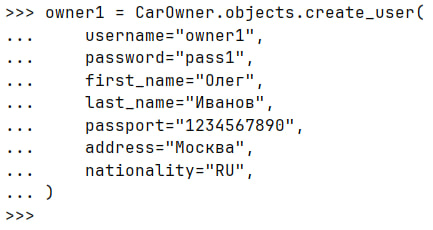
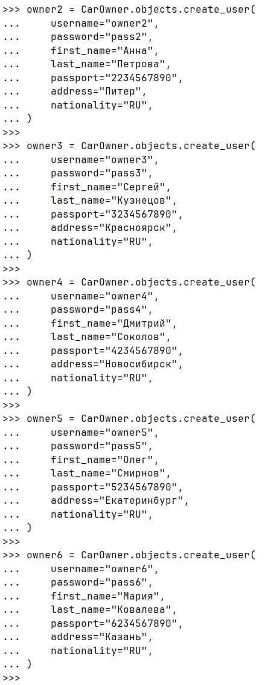

Затем создадим автомобили:

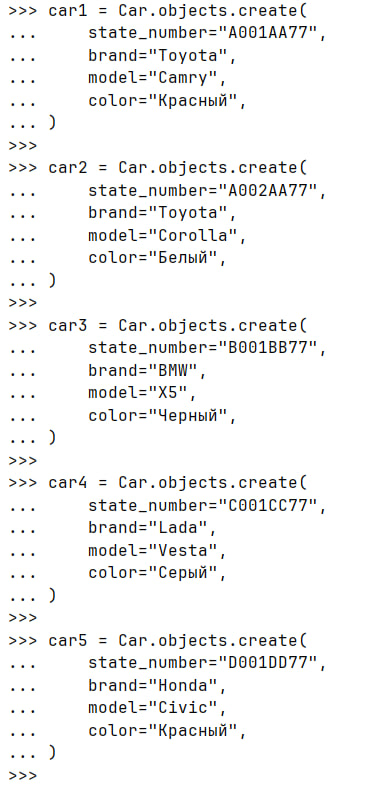

Создадим лицензии:

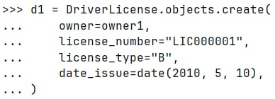
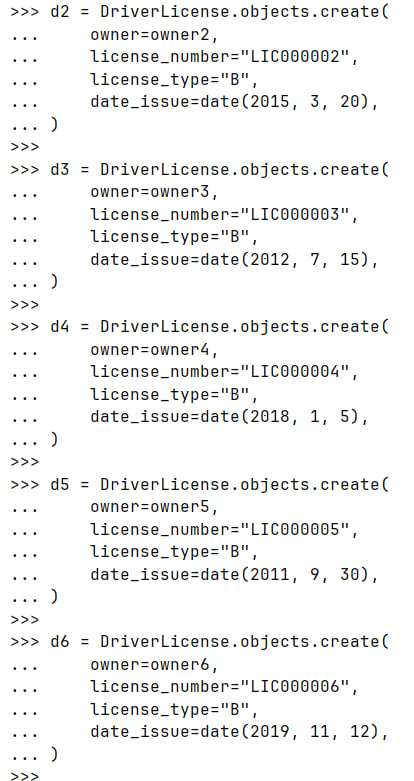

Создадим связь:

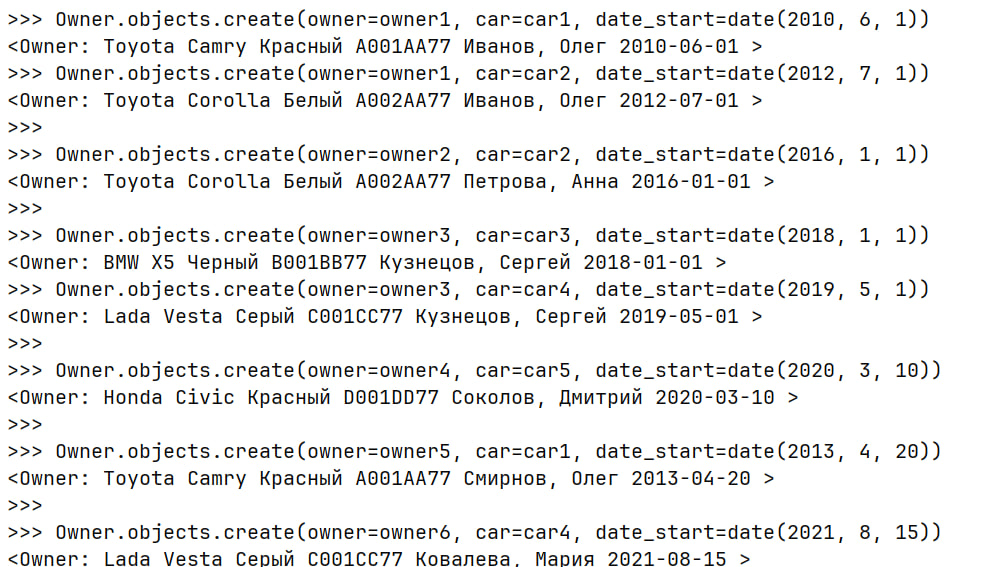

Выведем все созданные объекты:

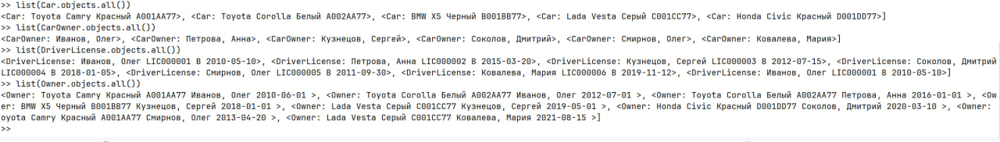

### Практическое задание 2

#### Постановка задания

По созданным в пр.1 данным написать следующие запросы на фильтрацию:

- Вывеcти все машины марки Toyota
- Найти всех водителей с именем Олег
- Взяв любого случайного владельца получить его id, и по этому id получить экземпляр удостоверения в виде объекта модели (можно в 2 запроса)
- Вывести всех владельцев красных машин
- Найти всех владельцев, чей год владения машиной начинается с 2010

#### Ход выполнения

Выведем все машины марки Тойота и найдем всех водителей с именем Олег:

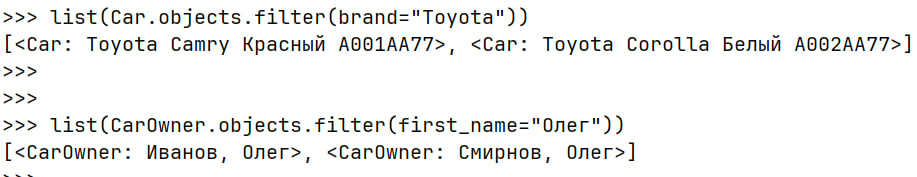

Взяв любого случайного владельца получить его id, и по этому id получить экземпляр удостоверения в виде объекта модели

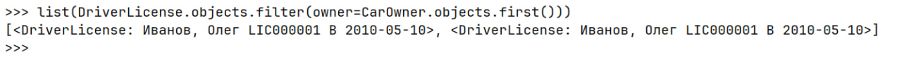

Вывести всех владельцев красных машин

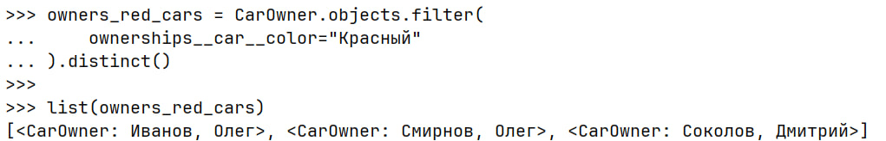

Найти всех владельцев, чей год владения машиной начинается с 2010

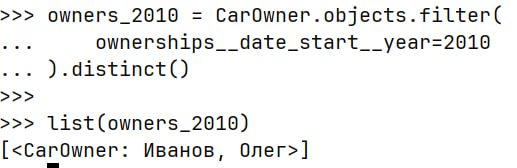

### Практическое задание 3

#### Постановка задания

Необходимо реализовать следующие запросы c применением описанных методов:

- Вывод даты выдачи самого старшего водительского удостоверения
- Укажите самую позднюю дату владения машиной, имеющую какую-то из существующих моделей в вашей базе
- Выведите количество машин для каждого водителя
- Подсчитайте количество машин каждой марки
- Отсортируйте всех автовладельцев по дате выдачи удостоверения

#### Ход выполнения

Выведем дату выдачи самого старшего водительского удостоверения

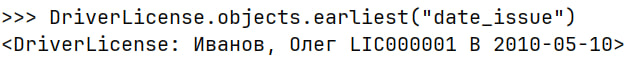

Укажем самую позднюю дату владения машиной, имеющую какую-то из существующих моделей в базе

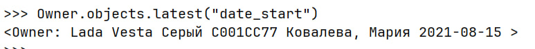

Выведем количество машин для каждого водителя

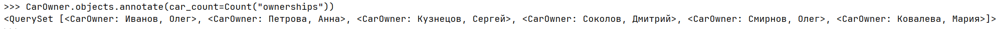

Подсчитаем количество машин каждой марки

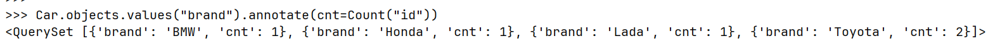

Отсортируем всех автовладельцев по дате выдачи удостоверения

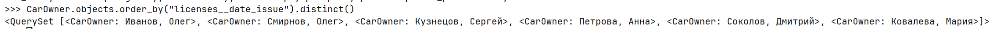

## Практическое задание №3.2

### Цель работы

Получить представление об использовании возмжностей работы контроллеров и серриализаторов в Django Rest Framework
Задания:

- Реализовать ендпоинты:
- Вывод полной информации о всех войнах и их профессиях (в одном запросе).
- Вывод полной информации о всех войнах и их скилах (в одном запросе).
- Вывод полной информации о войне (по id), его профессиях и скилах.
- Удаление война по id.
- Редактирование информации о войне.

### Реализация

Создание моделей:

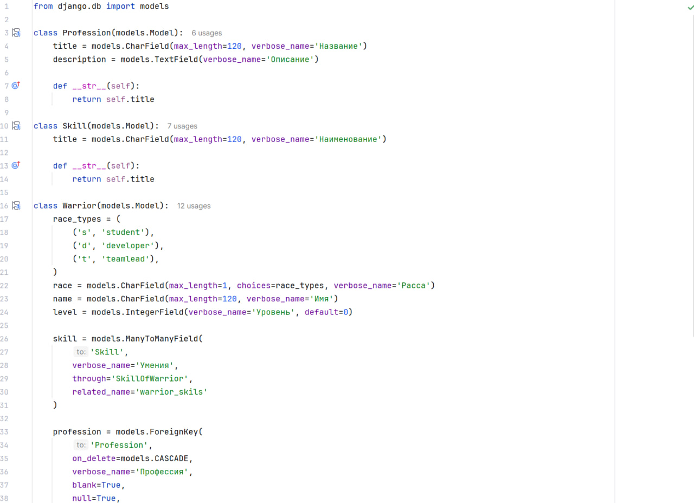

Создание view:

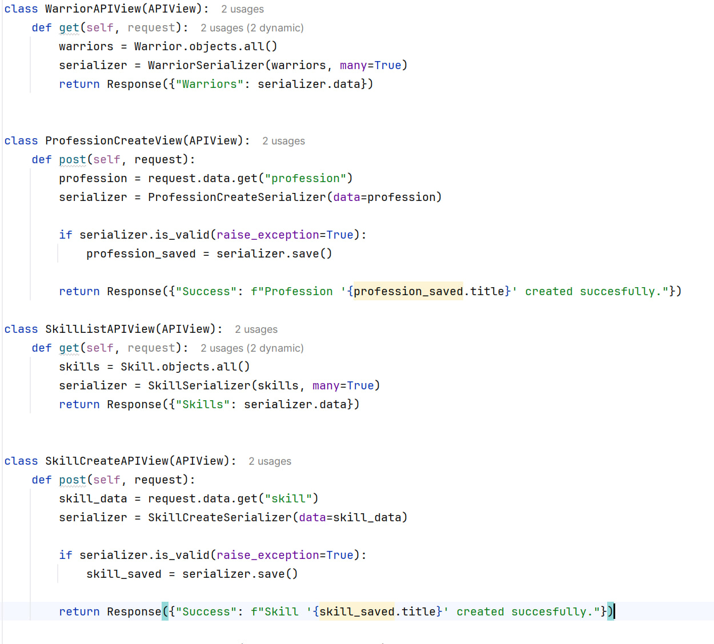
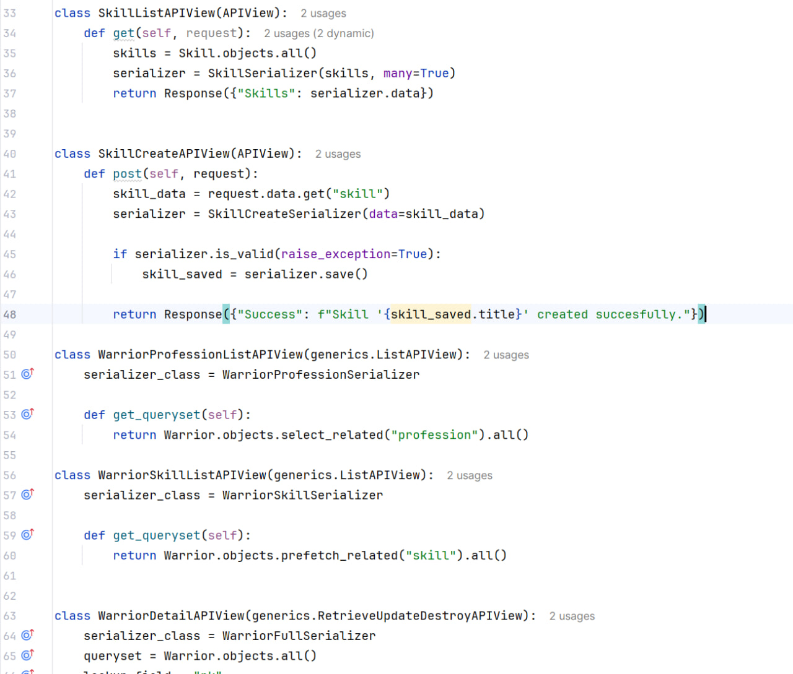

Создание serializors:

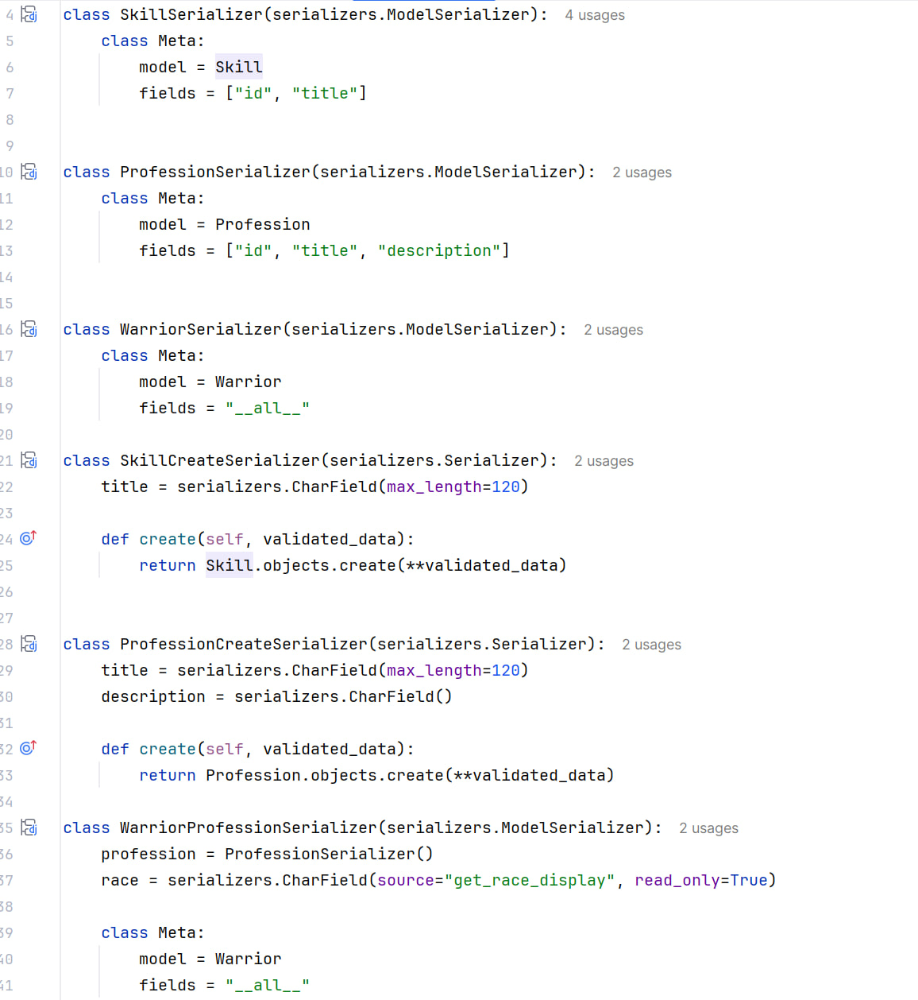
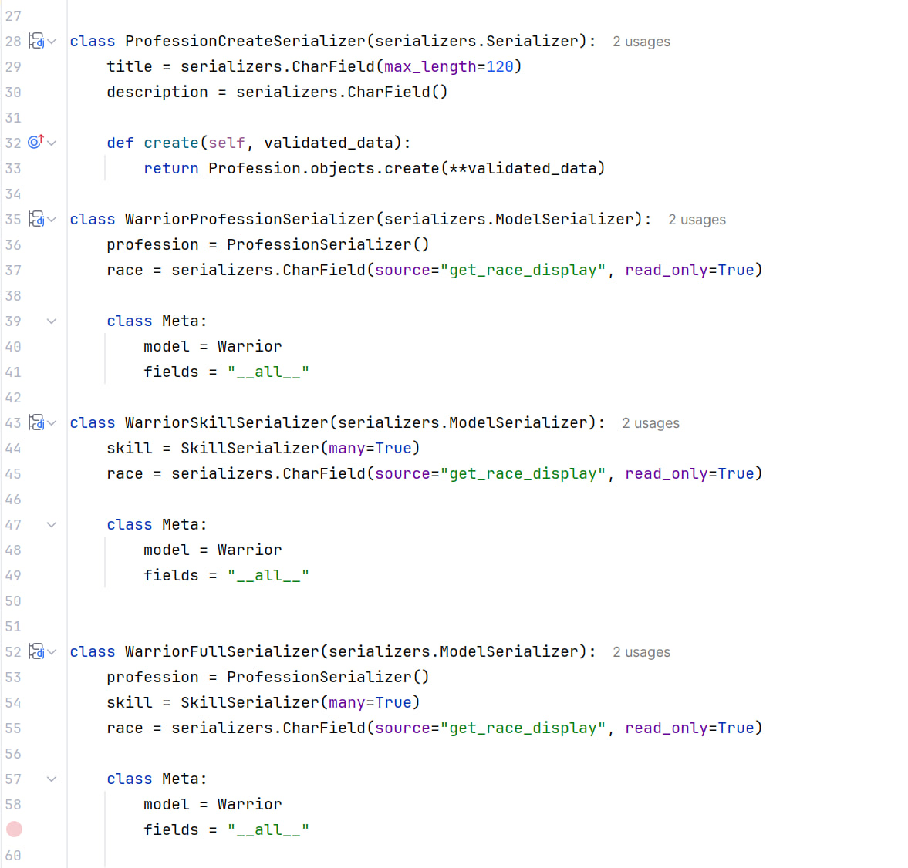

Вывод:

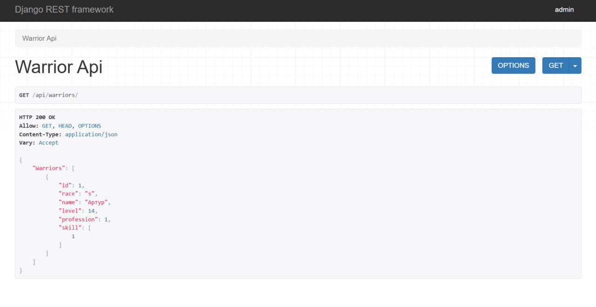
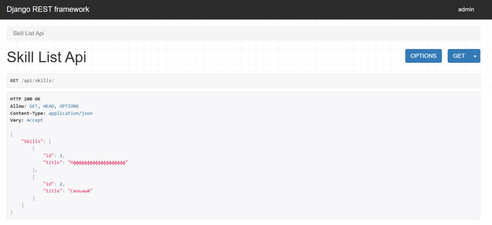
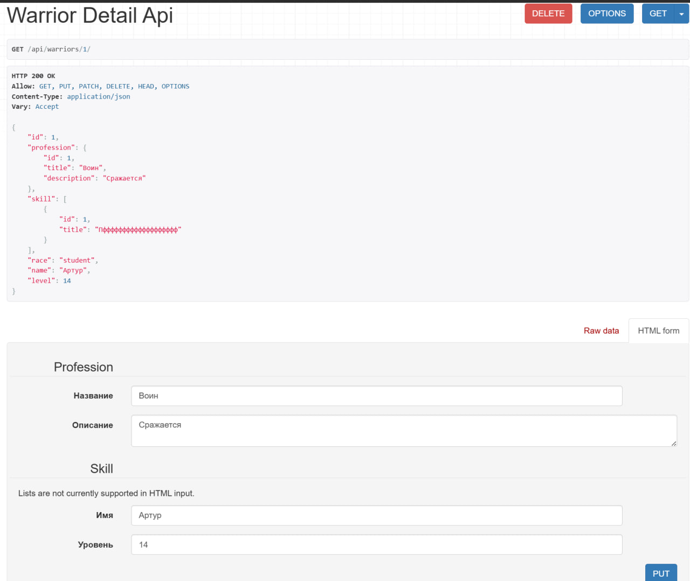
