Практическое задание №3.1
---

## Цель работы
1) Научиться создавать объекты в БД через Django ORM (не через админку).  
2) Освоить выполнение запросов фильтрации (`filter`, `exclude`, `get`) и работу со связями.  
3) Освоить агрегирование/аннотацию (`aggregate`, `annotate`, `values`, `order_by`, `distinct`).

---

## Ход работы

### Запуск Django shell

#### Команда

```bash
python manage.py shell
```

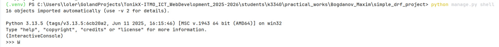

---

### Создание объектов

**Задача:** Создать 6–7 автовладельцев и 5–6 автомобилей. Каждому владельцу назначить удостоверение и 1–3 автомобиля.
**Примечание:** Если авто добавляются владельцу, должна заполняться ассоциативная сущность владения (`Ownership`).

```python
from datetime import date
from autos.models import Owner, Car, DriverLicense, Ownership

car1 = Car.objects.create(brand="Toyota", model="Camry", color="Red")
car2 = Car.objects.create(brand="Toyota", model="Corolla", color="Black")
car3 = Car.objects.create(brand="BMW", model="X5", color="White")
car4 = Car.objects.create(brand="Audi", model="A4", color="Red")
car5 = Car.objects.create(brand="Kia", model="Rio", color="Blue")
car6 = Car.objects.create(brand="Lada", model="Vesta", color="Gray")
```

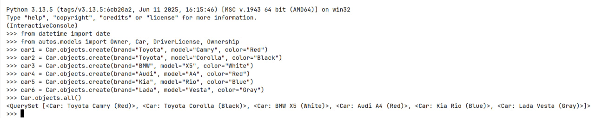

---

### Создание удостоверений и создание владельцев

```python
lic1 = DriverLicense.objects.create(number="77-11-123456", issue_date=date(2011, 5, 10))
lic2 = DriverLicense.objects.create(number="77-11-223456", issue_date=date(2013, 7, 21))
lic3 = DriverLicense.objects.create(number="77-11-323456", issue_date=date(2009, 3, 2))
lic4 = DriverLicense.objects.create(number="77-11-423456", issue_date=date(2018, 11, 30))
lic5 = DriverLicense.objects.create(number="77-11-523456", issue_date=date(2010, 1, 15))
lic6 = DriverLicense.objects.create(number="77-11-623456", issue_date=date(2016, 6, 6))
lic7 = DriverLicense.objects.create(number="77-11-723456", issue_date=date(2012, 9, 9))
```
```python
own1 = Owner.objects.create(first_name="Олег", last_name="Иванов", license=lic1)
own2 = Owner.objects.create(first_name="Ирина", last_name="Петрова", license=lic2)
own3 = Owner.objects.create(first_name="Олег", last_name="Сидоров", license=lic3)
own4 = Owner.objects.create(first_name="Анна", last_name="Кузнецова", license=lic4)
own5 = Owner.objects.create(first_name="Максим", last_name="Смирнов", license=lic5)
own6 = Owner.objects.create(first_name="Денис", last_name="Орлов", license=lic6)
own7 = Owner.objects.create(first_name="Елена", last_name="Волкова", license=lic7)
```

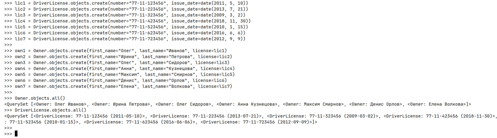

---

### Заполнение ассоциативной сущности владения

```python
Ownership.objects.create(owner=own1, car=car1, start_date=date(2015, 6, 1))
Ownership.objects.create(owner=own1, car=car5, start_date=date(2019, 4, 12))

Ownership.objects.create(owner=own2, car=car2, start_date=date(2017, 1, 20))
Ownership.objects.create(owner=own2, car=car4, start_date=date(2020, 2, 2))

Ownership.objects.create(owner=own3, car=car3, start_date=date(2010, 8, 8))

Ownership.objects.create(owner=own4, car=car6, start_date=date(2012, 12, 12))
Ownership.objects.create(owner=own4, car=car1, start_date=date(2021, 7, 7))

Ownership.objects.create(owner=own5, car=car4, start_date=date(2010, 5, 5))
Ownership.objects.create(owner=own6, car=car5, start_date=date(2014, 3, 3))
Ownership.objects.create(owner=own7, car=car2, start_date=date(2018, 8, 18))
```

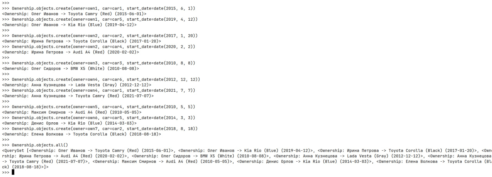

---

### Вывести все машины марки “Toyota”

```python
Car.objects.filter(brand="Toyota")
```

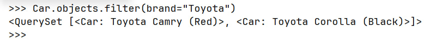

---

### Найти всех водителей с именем “Олег”

```python
Owner.objects.filter(first_name="Олег")
```

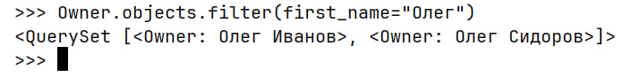

---

### Взять случайного владельца → получить его id → по id получить удостоверение (2 запроса)

```python
rnd = Owner.objects.order_by("?").first()
rnd.id
```
```python
lic = DriverLicense.objects.get(id=rnd.license_id)
lic
```

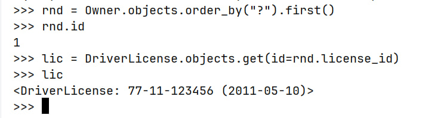

---

### Вывести всех владельцев красных машин

```python
Owner.objects.filter(cars__color="Red").distinct()
```

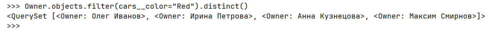

---

### Найти всех владельцев, чей год владения машиной начинается с 2010

```python
Owner.objects.filter(ownerships__start_date__year=2010).distinct()
```

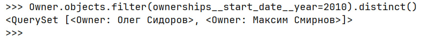

---

### Вывод даты выдачи самого старшего водительского удостоверения

```python
DriverLicense.objects.aggregate(oldest_issue_date=Min("issue_date"))
```


---

### Самая поздняя дата владения машиной (по существующим записям владения)

```python
Ownership.objects.aggregate(latest_ownership_date=Max("start_date"))
```

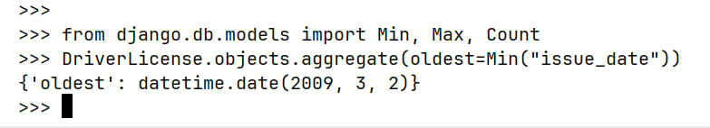

---

### Количество машин для каждого водителя

```python
Owner.objects.annotate(cars_count=Count("cars", distinct=True))\
    .values("id", "first_name", "last_name", "cars_count")
```

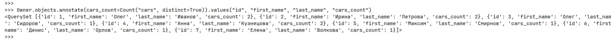

---

### Подсчитать количество машин каждой марки

```python
Car.objects.values("brand").annotate(cnt=Count("id")).order_by("brand")
```

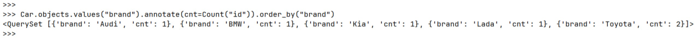

---

### Отсортировать всех автовладельцев по дате выдачи удостоверения (+ distinct)

```python
Owner.objects.order_by("license__issue_date").distinct()
```

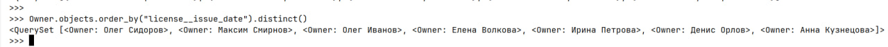

---

## Вывод

В ходе работы были:

* созданы модели и применены миграции;
* заполнена база данными через Django ORM в интерактивном режиме;
* выполнены запросы фильтрации по полям и по связям;
* выполнены запросы агрегации, аннотации и группировки, а также сортировка с устранением дублей через `distinct()`.