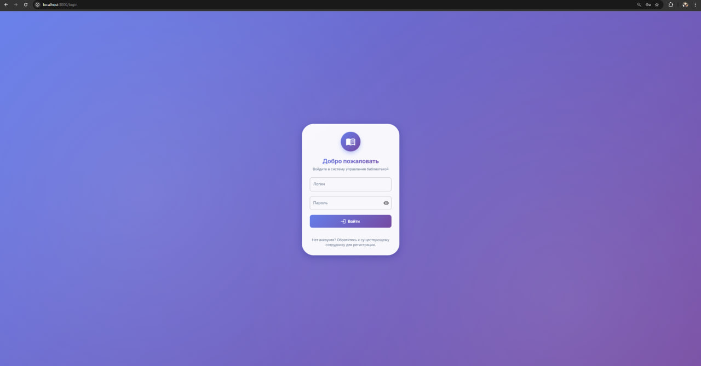
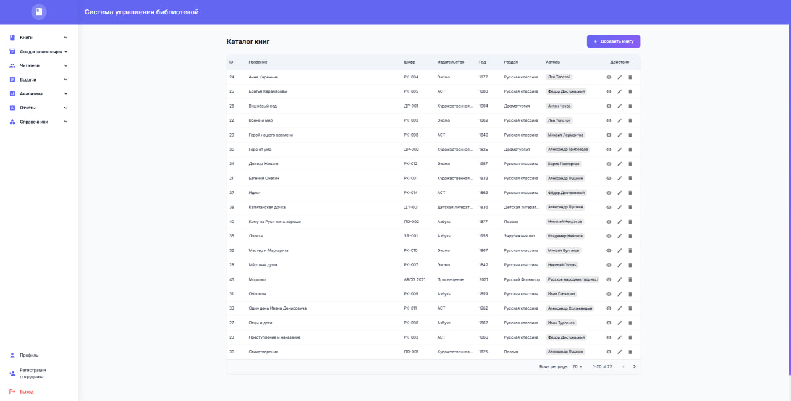
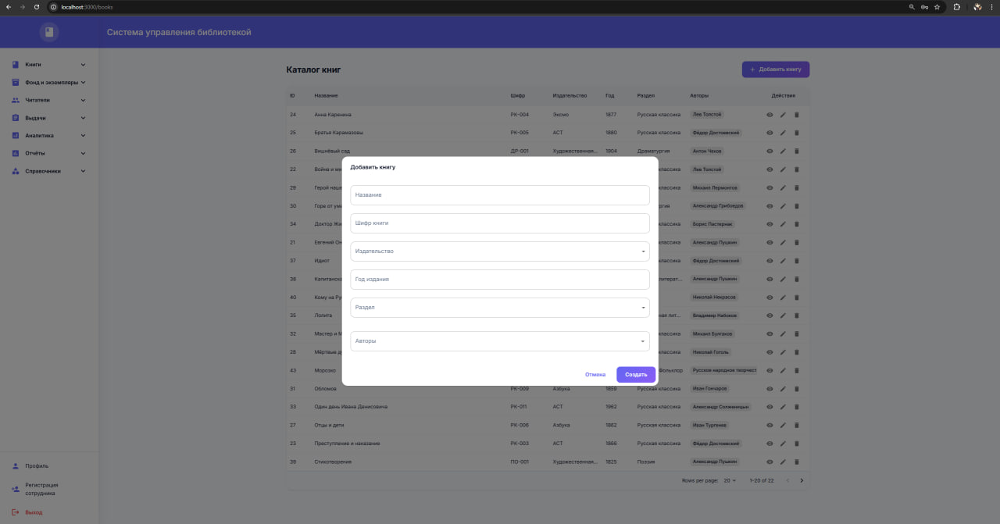
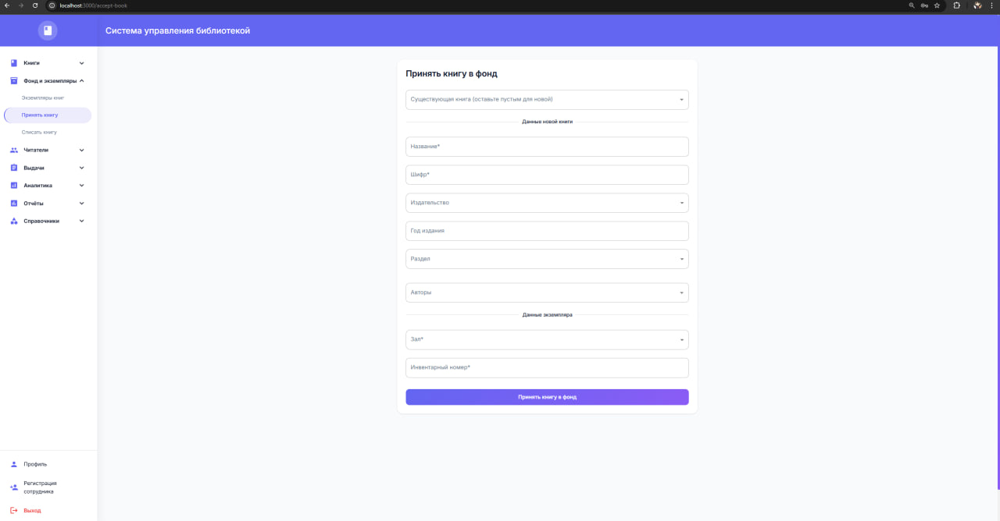

# Система управления библиотекой - Frontend

Фронтенд для системы управления библиотекой, построенный на React + TypeScript + Material-UI.

## Структура проекта

- **src/api**: API-клиенты для работы с бэкендом (книги, читатели, выдачи и т.д.).
- **src/auth**: логика аутентификации (`AuthContext`, `RequireAuth` и вспомогательный код).
- **src/components**: переиспользуемые UI-компоненты (уведомления, диалоги, лоадеры, error boundary и др.).
- **src/layouts**: макеты страниц, основной из них — `AppLayout` с боковым меню и верхней панелью.
- **src/pages**: страницы приложения (`*Page.tsx`), каждая отвечает за отдельный раздел системы.
- **src/routes**: конфигурация маршрутов для React Router.
- **src/theme**: настройка темы MUI (цвета, типографика, общие стили).
- **src/types**: общие TypeScript-типы для сущностей и API.
- **src/utils**: вспомогательные функции (форматирование, обработка ошибок и т.п.).

## Доступные страницы

### Справочники
- Авторы
- Издательства
- Разделы книг
- Залы

### Управление книгами
- Каталог книг
- Экземпляры книг
- Принятие книг в фонд
- Списание книг
- Остатки по залам

### Управление читателями
- Список читателей
- Регистрация читателей
- Деактивация читателей

### Выдачи книг
- Список выдач
- Выдача книг
- Возврат книг

### Аналитика
- Просроченные выдачи
- Редкие книги
- Статистика по возрасту
- Статистика по образованию

### Отчеты
- Ежемесячный отчёт

## Основные зависимости

- `@mui/material` - компоненты UI
- `@mui/x-data-grid` - таблицы данных
- `react-router-dom` - маршрутизация
- `axios` - HTTP запросы
- `react-hook-form` - формы
- `yup` - валидация

## Аутентификация

Используется JWT аутентификация:
- Access токен (время жизни: 15 минут)
- Refresh токен (время жизни: 7 дней)
- Автоматическое обновление токенов

## Архитектура и основные модули

- **Технологии**: React 18, TypeScript, React Router v6, MUI, React Hook Form + Yup, Vite.
- **Назначение**: административная панель для управления библиотекой (книги, экземпляры, читатели, выдачи, отчёты).
- **Основные директории**:
  - `src/layouts` — общий макет (`AppLayout`) с боковым меню, верхней панелью и областями для контента (`Outlet`).
  - `src/auth` — аутентификация: `AuthContext` (контекст авторизации) и `RequireAuth` (обёртка для защищённых маршрутов).
  - `src/pages` — отдельный компонент страницы на каждую функцию системы (каталог книг, читатели, выдачи и т.д.).
  - `src/api` — HTTP-клиенты для сущностей (`books.api.ts`, `readers.api.ts`, `issues.api.ts` и др.), базовый клиент в `http.ts`.
  - `src/hooks` — кастомные хуки: `useNotification` (уведомления), `useDeleteConfirm` (подтверждение удаления).
  - `src/components` — переиспользуемые компоненты (`ErrorBoundary`, `Notification`, `ConfirmDialog`, `Loading` и др.).

## Маршрутизация и защита

- Все рабочие страницы рендерятся внутри `AppLayout` и оборачиваются в `RequireAuth`.
- Неавторизованный пользователь перенаправляется на `/login`.
- После успешного логина (через `AuthContext`) выполняется переход, например, на `/books`.

## Формы и валидация

- Формы построены на **React Hook Form** (`useForm`, `Controller`) с **Yup** для схем валидации там, где нужно.
- Примеры: `LoginPage` (форма входа), `BooksPage` (создание/редактирование книги), `AcceptBookPage` (приём книги в фонд).

## Работа с API

- Вся логика запросов вынесена в `src/api/*.api.ts`, где используются функции из `http.ts`.
- Базовый клиент добавляет базовый URL, токен авторизации и обрабатывает стандартные ошибки.

## Таблицы и списки

- Для списков (книги, читатели, выдачи) используется `DataGrid` из `@mui/x-data-grid`:
  - колонки описываются через `GridColDef[]`,
  - действия в строках реализованы через `GridActionsCellItem` (просмотр, редактирование, удаление, активация и т.п.).

## Демонстрация проекта

Страница авторизации пользователя:

Каталог книг:

Добавление новой книги напрямую через каталог:

Принятие новой книги в фонд:

