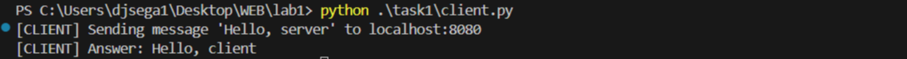
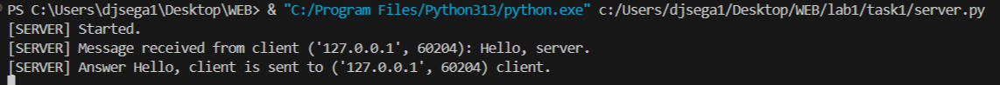

### Задание 1 (Клиент-серверное приложение UDP)

Сервер:

```python
def udp_server():
    sock = socket.socket(socket.AF_INET, socket.SOCK_DGRAM)
    sock.bind((SERVER_ADDRESS, SERVER_PORT))
    print("[SERVER] Started.")

    try:
        while True:
            data, address = sock.recvfrom(BUF_SIZE)
            print(f"[SERVER] Message received from client {address}: {data.decode()}.")
            reply = "Hello, client"
            sock.sendto(reply.encode(), address)
            print(f"[SERVER] Answer {reply} is sent to {address} client.")
    except KeyboardInterrupt:
        print('[SERVER] Stopped.')
    finally:
        sock.close()
```
Запуск:
```bash
cd task1
python server.py
```
---
Клиент:
```python
def udp_client():
    sock = socket.socket(socket.AF_INET, socket.SOCK_DGRAM)
    try:
        message = "Hello, server"
        print(f"[CLIENT] Sending message '{message}' to {SERVER_ADDRESS}:{SERVER_PORT}")
        sock.sendto(message.encode(), (SERVER_ADDRESS, SERVER_PORT))
        data, _ = sock.recvfrom(BUF_SIZE)
        print(f"[CLIENT] Answer: {data.decode()}")
    finally:
        sock.close()
```
Запуск:
```bash
cd task1
python client.py
```
---
Пример работы:


