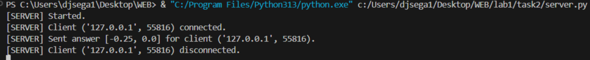

### Задание 2 (Решение квадратного уравнения TCP)
Сервер:
```python
def quadratic_solver(a, b, c):
    """
    Solves quadratic equation (ax^2 + bx + c = 0).
    """
    result = set()
    d = b**2 - 4*a*c
    if d >= 0:
        x1 = round((-b + d**0.5) / (2*a), 2)
        x2 = round((-b - d**0.5) / (2*a), 2)
        result.add(x1)
        result.add(x2)
    return sorted(list(result))


def quadratic_solver_server():
    sock = socket.socket(socket.AF_INET, socket.SOCK_STREAM)
    sock.bind((SERVER_ADDRESS, SERVER_PORT))
    sock.listen(MAX_CONN)
    print("[SERVER] Started.")
    while True:
        conn, address = sock.accept()
        conn.settimeout(10)
        print(f"[SERVER] Client {address} connected.")
        try:
            data = conn.recv(BUF_SIZE)
            if data:
                a, b, c = map(float, data.decode().split())
                reply = str(quadratic_solver(a, b, c))
                conn.sendall(reply.encode())
                print(f"[SERVER] Sent answer {reply} for client {address}.")
        except Exception as e:
            reply = 'Wrong a, b, c or timeout.'
            conn.sendall(reply.encode())
            print(f"[SERVER] Exception: {e}.")
        finally:
            conn.close()
            print(f"[SERVER] Client {address} disconnected.")
```
Запуск:
```bash
cd task2
python server.py
```
---
Клиент:
```python
def quadratic_solver_client():
    sock = socket.socket(socket.AF_INET, socket.SOCK_STREAM)
    try:
        print("[CLIENT] Enter a, b, c for equation (ax^2 + bx + c = 0) separated by space: ", end="")
        message = input()
        sock.connect((SERVER_ADDRESS, SERVER_PORT))
        sock.sendall(message.encode())
        print("[CLIENT] Waiting for answer...")
        data = sock.recv(BUF_SIZE)
        print(f"[CLIENT] Answer from server: {data.decode()}")
    except Exception as e:
        print(f"[CLIENT] Error: {e}")
    finally:
        sock.close()
```
Запуск:
```bash
cd task2
python client.py
```
---
Пример работы:


