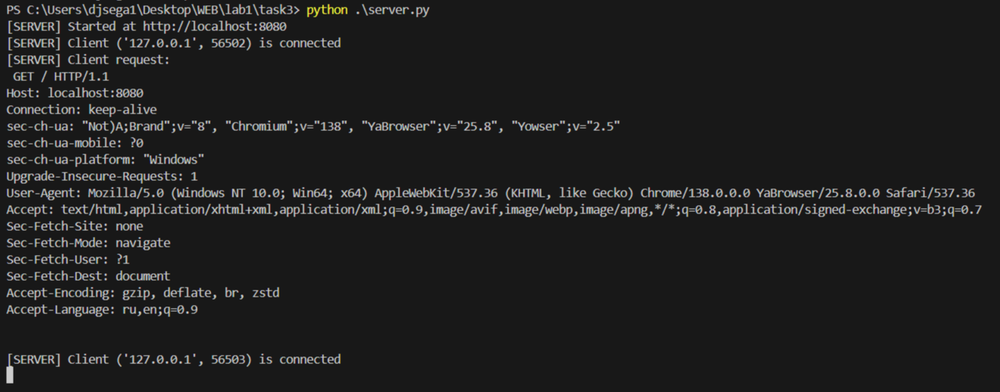
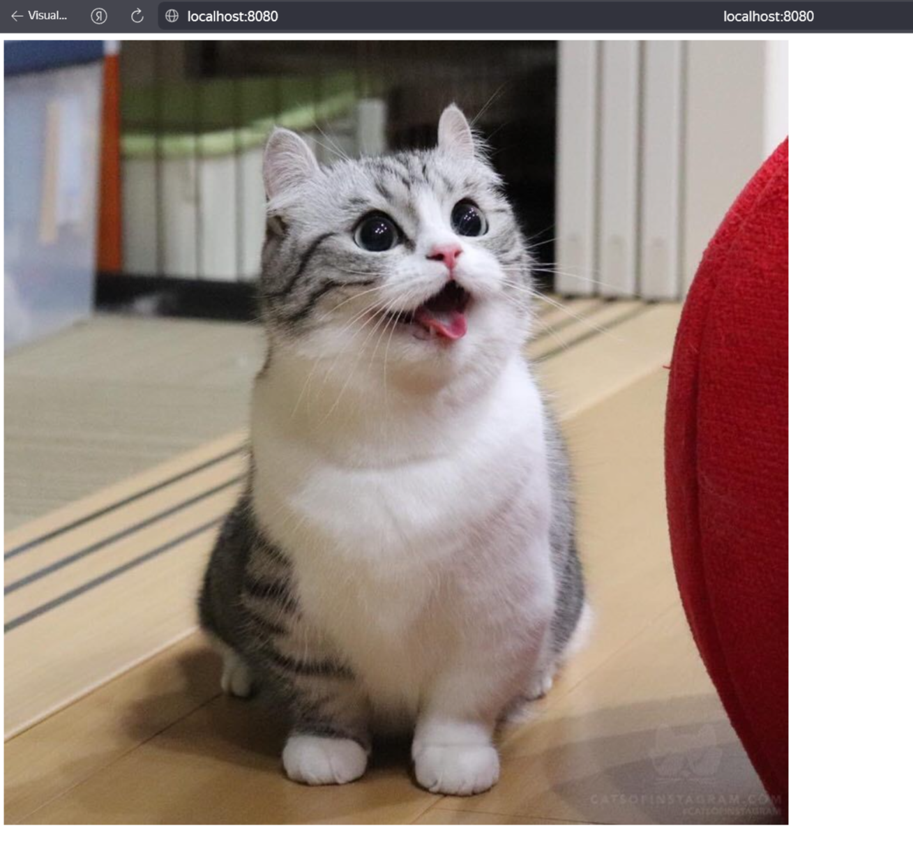

### Задание 3 (HTTP ответ с HTML страницей)
HTML Разметка: 
```html 
<!DOCTYPE html>
<html lang="ru">
<head>
    <meta charset="UTF-8">
</head>
<body>
    
</body>
</html>
```

Сервер:
```python
def http_server():
    server_socket = socket.socket(socket.AF_INET, socket.SOCK_STREAM)
    server_socket.bind((SERVER_ADDRESS, SERVER_PORT))
    server_socket.listen(MAX_CONN)

    print(f"[SERVER] Started at http://{SERVER_ADDRESS}:{SERVER_PORT}")

    while True:
        client_socket, client_address = server_socket.accept()
        print(f"[SERVER] Client {client_address} is connected")
        request = client_socket.recv(BUF_SIZE).decode()
        print("[SERVER] Client request:\n", request)
        try:
            with open("index.html", "r", encoding="utf-8") as f:
                body = f.read()
            response = (
                "HTTP/1.1 200 OK\r\n"
                "Content-Type: text/html; charset=utf-8\r\n"
                f"Content-Length: {len(body.encode())}\r\n"
                "Connection: close\r\n"
                "\r\n"
                f"{body}"
            )
        except Exception as e:
            print("[SERVER] Exception:", e)
            response = (
                "HTTP/1.1 500 Internal Server Error\r\n"
                "Content-Type: text/html; charset=utf-8\r\n"
                "Connection: close\r\n"
                "\r\n"
                "<h1>500 - Internal Server Error</h1>"
            )
        client_socket.sendall(response.encode())
        client_socket.close()
```
Запуск:
```bash
cd task3
python server.py
```
---
Открыть в браузере: [\*тык\*](http://localhost:8080/)

Пример работы:


