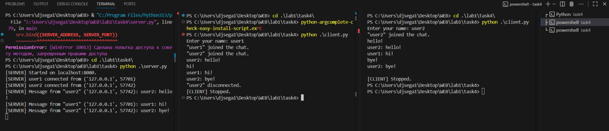

### Задание 4 (Многопользовательский TCP+threading чат)
Сервер:
```python
import socket
import threading

SERVER_ADDRESS = "localhost"
SERVER_PORT = 8080
BUF_SIZE = 4096
MAX_CONN = 10

mutex = threading.Lock()
clients: dict[socket.socket, str] = {}


def broadcast(message: bytes):
    with mutex:
        for sock in list(clients.keys()):
            try:
                sock.sendall(message)
            except:
                disconnect(sock)


def disconnect(sock: socket.socket):
    with mutex:
        name = clients.pop(sock, None)
    try:
        sock.close()
    except:
        pass
    if name:
        broadcast(f'"{name}" disconnected.'.encode())


def connect(sock: socket.socket, addr):
    try:
        name_bytes = receive_message(sock)
        if not name_bytes:
            disconnect(sock)
            return
        username = name_bytes.decode().strip()
        if not username:
            username = f'{addr[0]}:{addr[1]}'
        with mutex:
            clients[sock] = username
        print(f'[SERVER] {username} connected from {addr}')
        broadcast(f'"{username}" joined the chat.\r\n'.encode())
        while True:
            data = receive_message(sock)
            if not data:
                break
            text = data.decode(errors='replace').rstrip('\n')
            message = f'{username}: {text}\n'
            print(f'[SERVER] Message from "{username}" {addr}: {message.strip()}')
            broadcast(message.encode())
    except Exception as e:
        print(f'[SERVER] Exception: {e}')
    finally:
        disconnect(sock)


def receive_message(sock):
    buf = bytearray()
    try:
        while True:
            chunk = sock.recv(BUF_SIZE)
            if not chunk:
                return b''
            buf.extend(chunk)
            if b'\n' in chunk:
                break
    except:
        return b''
    idx = buf.find(b'\n') + 1
    return bytes(buf[:idx])


def main():
    srv = socket.socket(socket.AF_INET, socket.SOCK_STREAM)
    srv.setsockopt(socket.SOL_SOCKET, socket.SO_REUSEADDR, 1)
    srv.bind((SERVER_ADDRESS, SERVER_PORT))
    srv.listen(MAX_CONN)
    print(f'[SERVER] Started on {SERVER_ADDRESS}:{SERVER_PORT}.')
    try:
        while True:
            sock, addr = srv.accept()
            thread = threading.Thread(target=connect, args=(sock, addr), daemon=True)
            thread.start()
    except KeyboardInterrupt:
        print('[SERVER] Stopping...')
    finally:
        with mutex:
            for sock in list(clients.keys()):
                try:
                    sock.shutdown(socket.SHUT_RDWR)
                    sock.close()
                except:
                    pass
        srv.close()
        print('[SERVER] Stopped.')


if __name__ == '__main__':
    main()
```
Запуск
```bash
cd task4
python server.py
```
---
Клиент (один терминал - один клиент):
```python 
import socket
import threading
import sys

SERVER_ADDRESS = "localhost"
SERVER_PORT = 8080
BUF_SIZE = 4096


def listen_for_messages(sock: socket.socket):
    while True:
        try:
            data = sock.recv(BUF_SIZE)
            if not data:
                print("[CLIENT] Server connection closed.")
                break
            sys.stdout.write(data.decode())
            sys.stdout.flush()
        except:
            break


def main():
    sock = socket.socket(socket.AF_INET, socket.SOCK_STREAM)
    sock.connect((SERVER_ADDRESS, SERVER_PORT))

    name = input("Enter your name: ")
    if not name:
        name = "userAnon"
    sock.sendall((name + "\n").encode("utf-8"))

    threading.Thread(target=listen_for_messages, args=(sock,), daemon=True).start()

    try:
        while True:
            line = input()
            sock.sendall((line + "\n").encode())
    except (KeyboardInterrupt, EOFError):
        print("\n[CLIENT] Stopped.")
    finally:
        sock.close()


if __name__ == "__main__":
    main()
```
Запуск:
```bash
cd task4
python client.py
```
---
Пример работы:

