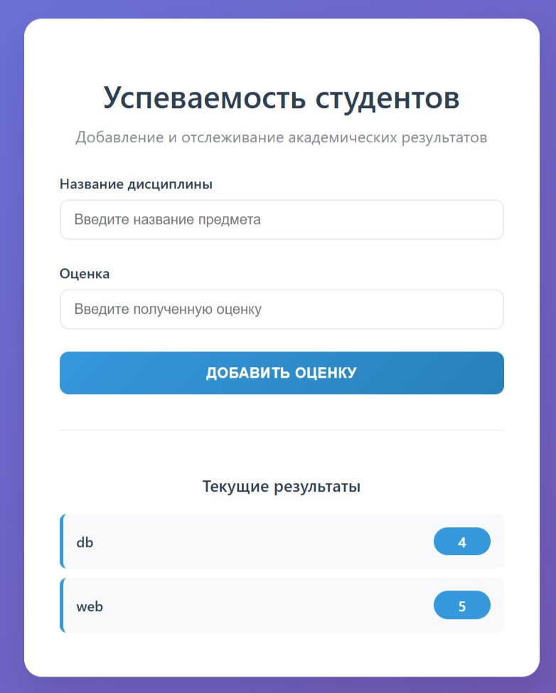

### Задание 5 (GET/POST Веб-сервер)
Сервер:
```python
def generate_html():
    with open("index.html", "r", encoding="utf-8") as f:
        html = f.read()
    for item in sorted(GRADES):
        html += (
            "<li>"
            f'<span class="subject">{item}</span>'
            f'<span class="grade">{", ".join(GRADES[item])}</span>'
            "</li>"
        )
    html += """
            </ul>
            </div>
        </div>
    </body>
    </html>
    """
    return html


def main():
    with socket.socket(socket.AF_INET, socket.SOCK_STREAM) as s:
        s.bind((SERVER_ADDRESS, SERVER_PORT))
        s.listen(MAX_CONN)
        print(f'[SERVER] Started on {SERVER_ADDRESS}:{SERVER_PORT}.')
        while True:
            conn, _ = s.accept()
            with conn:
                request = conn.recv(BUF_SIZE).decode()
                if not request:
                    continue
                try:
                    headers = request.split('\r\n')
                    method, _, _ = headers[0].split()
                except ValueError:
                    continue
                if method == "POST":
                    body = request.split('\r\n\r\n')[1]
                    data = parse_qs(body)
                    subject = data.get('subject', [''])[0]
                    grade = data.get('grade', [''])[0]
                    if subject not in GRADES:
                        GRADES[subject] = [grade]
                    else:
                        GRADES[subject].append(grade)
                response_body = generate_html()
                response = (
                        "HTTP/1.1 200 OK\r\n"
                        "Content-Type: text/html; charset=utf-8\r\n"
                        f"Content-Length: {len(response_body.encode())}\r\n"
                        "Connection: close\r\n"
                        "\r\n" +
                        response_body
                )
                conn.sendall(response.encode())
```
Запуск:
```bash
cd task5
python server.py
```
Открыть в браузере ([\*тык\*](http://localhost:8080/)) и добавлять записи через форму.

Пример работы:

