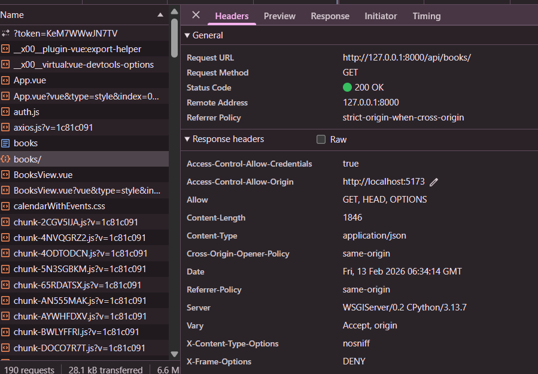
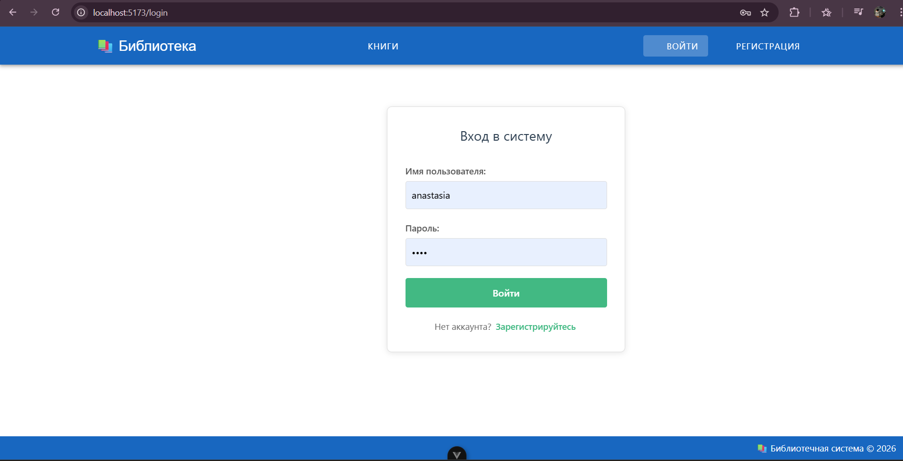
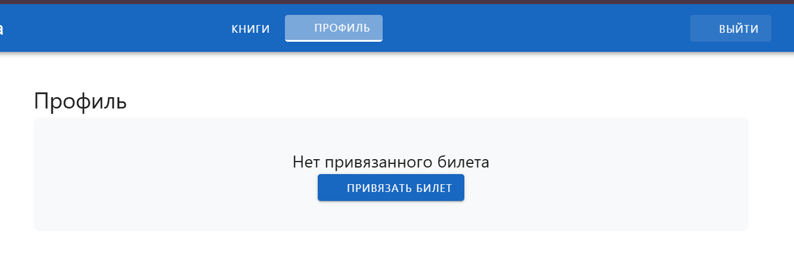
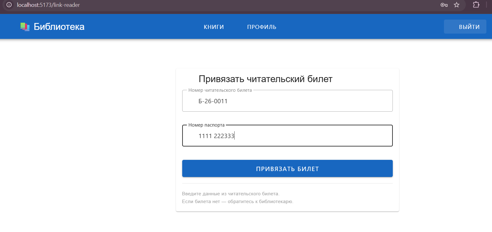
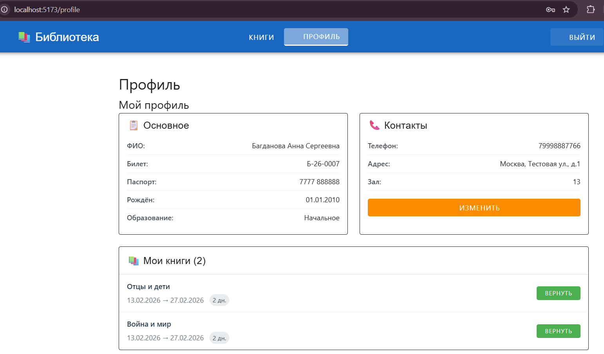
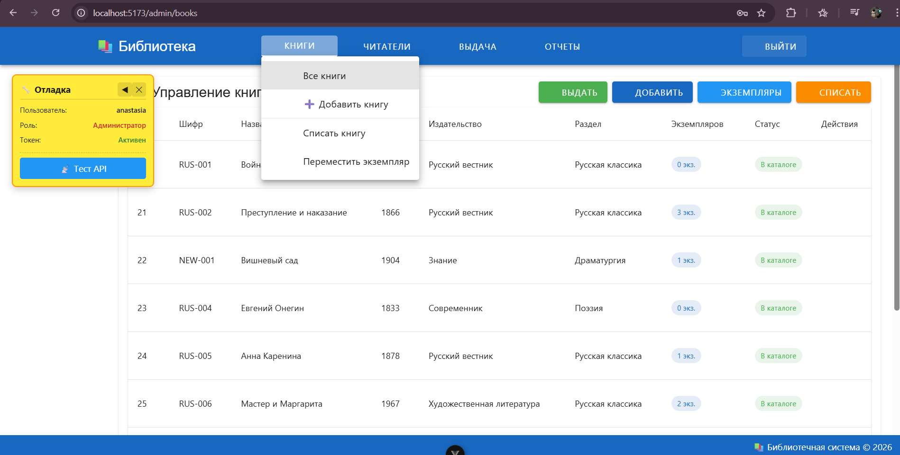
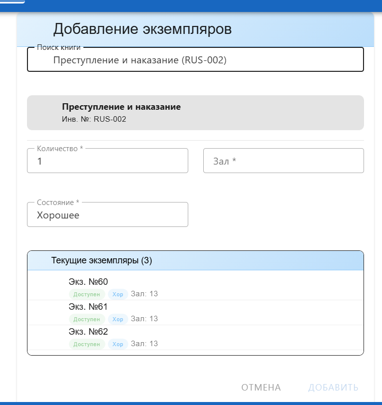
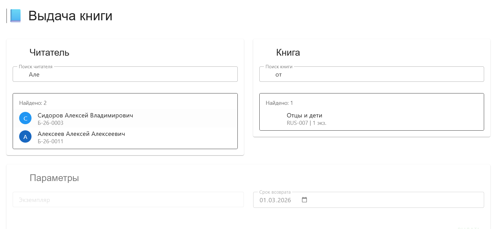
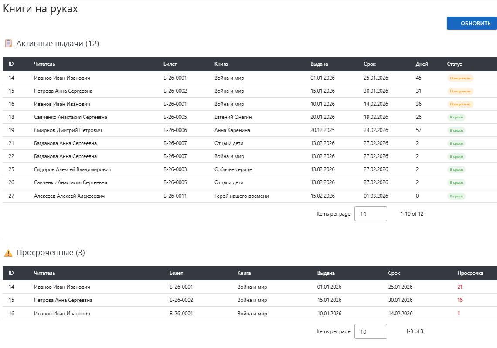
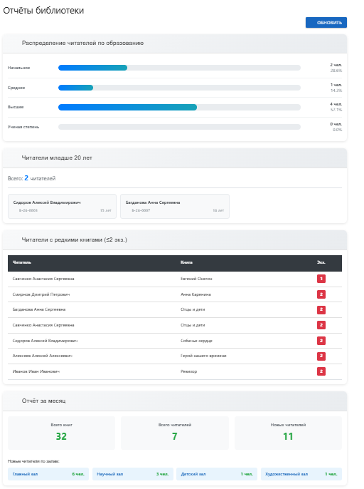

# Лабораторная работа 4. Реализация клиентской части средствами Vue.js.

## Цель работы
Реализация клиентской части приложения средствами Vue.js.

## Задание
1. Реализовать интерфейсы авторизации, регистрации и изменения учётных данных и настроить взаимодействие с серверной частью средствами Vue.js и Django REST framework
2. Реализовать клиентские интерфейсы и настроить взаимодействие с серверной частью. Полезные материалы: Пункты 4.2, 4.3, 4.5 в Практической работе 4.2
3. Подключить vuetify или аналогичную библиотеку
4. Реализовать документацию, описывающую работу разработанных интерфейсов средствами MkDocs.

---
> **Практические работы:**
> - Практическая работа №4.1 - не доступна по ссылке  
>   *Цель работы: Ознакомится с базовыми конструкциями JavaScript.*
> - Практическая работа №4.2 - Выполнено (practical_works\practical_work_4_2)  
>   *Цель работы: получить представление о работе Vue.js.*
> - Практическая работа №4.3 - Настроено  
>   *Цель работы: получить практические навыки настройки CORS (Cross-origin resource sharing).*

---

## Необходимые инструменты

```bash
# Создать новый Vue проект
npm create vue@latest
cd vue-project
npm install

# Axios для запросов к API
npm install axios

# Vuetify для UI компонентов 
npm install vuetify @mdi/font

# Pinia-persistedstate для сохранения состояния
npm install pinia-plugin-persistedstate
```

## Запуск проекта

```bash
# Терминал 1 (бэкенд):
cd lab4/library_project
python manage.py runserver

# Терминал 2 (фронтенд):
cd lab4/vue-project
npm run dev
```

---

## Настройка CORS (Cross-origin resource sharing)

Для обеспечения взаимодействия между фронтенд-сервером Vue.js (порт 5173) и бэкенд-сервером Django (порт 8000) была выполнена настройка CORS.

### Установка пакета django-cors-headers

```bash
pip install django-cors-headers
```

### Настройка settings.py

В файле `library_project/settings.py` выполнены следующие изменения:

```python
INSTALLED_APPS = [
    'corsheaders', 
]

MIDDLEWARE = [
    'corsheaders.middleware.CorsMiddleware',  
]

# lab 4
CORS_ALLOWED_ORIGINS = [
    "http://localhost:5173",  # Адрес Vue dev сервера
    "http://127.0.0.1:5173",
]

# Разреши отправку куки и авторизационных заголовков
CORS_ALLOW_CREDENTIALS = True
```

### Проверка работоспособности CORS

После настройки CORS:
- ✅ Браузер успешно отправляет **preflight запросы** (OPTIONS) к API
- ✅ API отвечает с заголовком `Access-Control-Allow-Origin: http://localhost:5173`



- ✅ Фронтенд может авторизоваться и получать данные с бэкенда
- ✅ Кросс-доменные запросы обрабатываются без ошибок

### Доказательства настройки CORS

В логах сервера видны успешные запросы:
```
# PREFLIGHT ЗАПРОСЫ (OPTIONS) - ДОКАЗАТЕЛЬСТВО РАБОТЫ CORS
"OPTIONS /auth/users/me/ HTTP/1.1" 200 0
"OPTIONS /api/books/ HTTP/1.1" 200 0
"OPTIONS /api/loans/overdue/ HTTP/1.1" 200 0
```

---

## Структура проекта

```
laboratory_work_4/
│
├── library_project/                           # БЭКЕНД (Django)
│   ├── library_app/                            # Основное приложение
│   │   ├── models.py                            # Модели данных (книги, читатели, выдачи)
│   │   ├── views.py                              # Логика обработки запросов
│   │   ├── urls.py                               # Маршруты API (все эндпоинты)
│   │   ├── serializers.py                        # Сериализаторы для API
│   │   ├── admin.py                              # Настройки админ-панели Django
│   │   └── migrations/                           # Миграции БД
│   │
│   ├── library_project/                         # Настройки проекта Django
│   ├── db.sqlite3                                # База данных SQLite
│   ├── manage.py                                 # Управление Django
│   │
│   └── vue-project/                              # ФРОНТЕНД (Vue.js)
│       ├── src/
│       │   ├── router/
│       │   │   └── index.js                       # Все маршруты приложения
│       │   │
│       │   ├── views/
│       │   │   ├── Admin/                          # Все админ-страницы
│       │   │   │   ├── AdminBookAdd.vue              # ➕ Добавление новой книги
│       │   │   │   ├── AdminBookAddCopies.vue        # 📦 Добавление экземпляров к книге
│       │   │   │   ├── AdminBookDecommission.vue     # 🗑️ Списание экземпляра
│       │   │   │   ├── AdminBooks.vue                 # 📚 Управление книгами
│       │   │   │   ├── AdminCopyTransfer.vue         # 🔄 Перемещение экземпляра
│       │   │   │   ├── AdminDashboard.vue             # 📊 Панель администратора
│       │   │   │   ├── AdminIssueBookView.vue        # 📕 Выдача книги
│       │   │   │   ├── AdminManageLoansView.vue      # 📋 Управление выдачами
│       │   │   │   ├── AdminOnLoanView.vue           # 👀 Книги на руках
│       │   │   │   ├── AdminReaders.vue               # 👥 Управление читателями
│       │   │   │   └── AdminReaderRegister.vue        # 📝 Регистрация читателя
│       │   │   │
│       │   │   ├── BooksView.vue                  # 📖 Публичный каталог книг
│       │   │   ├── LinkReaderView.vue              # 🔗 Привязка читательского билета
│       │   │   ├── LoginView.vue                   # 🔐 Вход в систему
│       │   │   ├── ProfileView.vue                 # 👤 Профиль читателя
│       │   │   ├── RegisterView.vue                # ✍️ Регистрация пользователя
│       │   │   └── ReportsView.vue                 # 📊 Отчёты и статистика
│       │   │
│       │   ├── App.vue                            # Главный компонент (шапка, меню)
│       │   └── main.js                            # Точка входа Vue
```

*Примечание: В лабораторной работе №4 основное внимание уделялось разработке фронтенда, бэкенд был перенесён из лабораторной работы №3 с небольшими дополнениями эндпойнтов для удобства работы.*

---

## Реализация интерфейсов

### Интерфейс авторизации (`LoginView.vue`)

Страница входа в систему. Позволяет пользователю ввести логин и пароль для получения доступа к функциям приложения.

**Функционал:**
- Валидация полей
- Обработка ошибок авторизации
- Перенаправление на каталог книг после успешного входа
- Отключение кнопки во время загрузки



---

### Интерфейс регистрации (`RegisterView.vue`)

Страница создания нового аккаунта. После успешной регистрации пользователь перенаправляется на страницу привязки читательского билета.

**Функционал:**
- Проверка совпадения паролей
- Проверка длины пароля (минимум 8 символов)
- Опциональное поле email
- Автоматический редирект через 2 секунды после успеха

---

### Интерфейс привязки читательского билета (`LinkReaderView.vue`)

Страница для связи созданного аккаунта с существующим читательским билетом.

**Функционал:**
- Ввод номера билета и паспорта
- Поиск читателя в базе
- Привязка к текущему пользователю
- Перенаправление в профиль после успеха

| | |
|:---:|:---:|
|  |  |

---

### Интерфейс профиля читателя (`ProfileView.vue`)

Страница просмотра и редактирования данных читателя.

**Функционал:**
- Просмотр основной информации (ФИО, билет, паспорт, дата рождения, образование)
- Редактирование контактных данных (телефон, адрес)
- Просмотр текущих выдач книг
- Кнопка возврата книги
- Сообщение, если билет не привязан



---

## Интерфейсы администратора

### Панель администратора (`AdminDashboard.vue`)

Главная страница с навигацией по всем разделам админ-панели и быстрыми действиями.

**Секции:**
- Карточки разделов (Читатели, Выдача книг, Книги, Отчеты)
- Быстрые действия (Выдать книгу, Регистрация читателя, Добавить книгу, Списать книгу)

---

### Управление читателями (`AdminReaders.vue`)

Раздел для работы с читателями библиотеки.

**Функционал:**
- Поиск читателей по ФИО, номеру билета
- Просмотр всех читателей (включая неактивных)
- Редактирование контактных данных
- Исключение неактивных читателей (не проходивших перерегистрацию более года)
- Переход на страницу регистрации нового читателя

---

### Регистрация читателя (`AdminReaderRegister.vue`)

Форма создания нового читателя в системе.

**Поля:**
- ФИО, паспорт, дата рождения, образование
- Телефон, адрес, зал
- Автоматическая генерация номера читательского билета

---

### Управление книгами (`AdminBooks.vue`)

Раздел для работы с книгами и экземплярами.

**Функционал:**
- Просмотр всех книг с их шифрами, годами, издательствами
- Изменение шифра книги
- Перемещение экземпляра между залами
- Отображение количества экземпляров
- Кнопки быстрых действий (Выдать, Добавить, Экземпляры, Списать)



---

### Добавление книги (`AdminBookAdd.vue`)

Форма добавления новой книги в фонд.

**Этапы:**
1. Создание библиографического описания (название, автор, издательство, год, раздел, инв. номер)
2. Добавление автора (выбор из списка или создание нового)
3. Создание экземпляров (количество, зал, состояние)

---

### Добавление экземпляров к книге (`AdminBookAddCopies.vue`)

Форма пополнения фонда для существующей книги.

**Функционал:**
- Поиск книги по названию или инв. номеру
- Просмотр текущих экземпляров
- Выбор количества, зала и состояния для новых экземпляров



---

### Списание экземпляра (`AdminBookDecommission.vue`)

Форма списания поврежденных или устаревших экземпляров.

**Функционал:**
- Секция "Требуют внимания" (экземпляры с состоянием "плохое" или "поврежден")
- Поиск по книге
- Проверка, не выдан ли экземпляр
- Смена статуса на "decommissioned"

---

### Перемещение экземпляра (`AdminCopyTransfer.vue`)

Форма перемещения экземпляра между читальными залами.

**Функционал:**
- Поиск экземпляра по книге
- Отображение текущего зала
- Выбор нового зала из списка
- Проверка, что экземпляр не выдан

---

### Выдача книги (`AdminIssueBookView.vue`)

Форма выдачи книги читателю.

**Этапы:**
- Поиск и выбор читателя
- Поиск и выбор книги
- Выбор доступного экземпляра
- Установка срока возврата
- Создание записи о выдаче и изменение статуса экземпляра



---

### Книги на руках (`AdminOnLoanView.vue`)

Просмотр всех активных выдач и просроченных книг.

**Две секции:**
- Все активные выдачи (статусы "в сроке"/"просрочена")
- Просроченные книги с указанием дней просрочки



---

### Управление выдачами (`AdminManageLoansView.vue`)

Страница со статистикой и информацией об API.

**Содержит:**
- Статистику (количество читателей, книг, доступных экземпляров)
- Справочную информацию по всем доступным API эндпоинтам (GET и POST)

---

### Отчёты (`ReportsView.vue`)

Страница с аналитическими данными из текста задания варианта. Использованы эндпоинты из лабораторной работы №3.

**Разделы:**
- Распределение читателей по образованию (в процентах)
- Читатели младше 20 лет (список с возрастом)
- Читатели с редкими книгами (≤2 экземпляров)
- Месячный отчёт (книги, читатели, новые читатели по залам)



---

### Публичный каталог книг (`BooksView.vue`)

Страница, доступная всем пользователям (даже без авторизации).

**Функционал:**
- Отображение всех книг в библиотеке
- Информация о количестве доступных экземпляров
- Кнопка обновления списка
- Цветовая индикация: зелёный - есть экземпляры, красный - нет

---

## Заключение

### Выполненные задачи

1. ✅ Настроено взаимодействие фронтенда и бэкенда через CORS
2. ✅ Реализованы интерфейсы авторизации и регистрации
3. ✅ Реализован механизм привязки аккаунта к читательскому билету
4. ✅ Реализован интерфейс профиля с возможностью изменения контактных данных и возврата книг
5. ✅ Создана полноценная админ-панель с разделами:
   - Управление читателями (поиск, регистрация, исключение)
   - Управление книгами (добавление, списание, перемещение, добавление экземпляров)
   - Управление выдачами (выдача книг, просмотр на руках, управление)
   - Отчёты и статистика
6. ✅ Реализован публичный каталог книг с отображением доступных экземпляров
7. ✅ Подключена библиотека Vuetify для современного UI

### Использованные технологии Vue.js

- **Композиционный API** (script setup)
- **Реактивность** (ref, reactive, computed)
- **Маршрутизация** (Vue Router)
- **Управление состоянием** (Pinia)
- **HTTP-клиент** (Axios)
- **UI-библиотека** (Vuetify)

### Дополнительные улучшения

- Отладочная панель с информацией о пользователе (админ/читатель) и токене
- Сворачиваемая отладочная панель для удобства