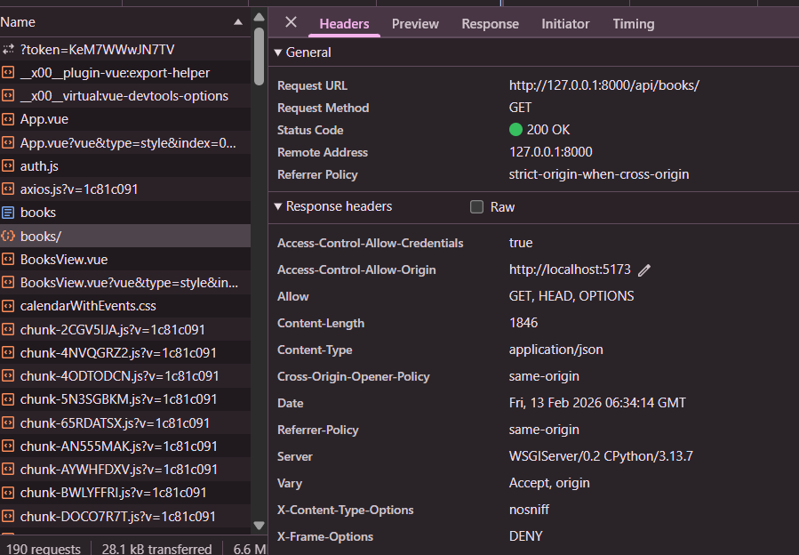

# Лабораторная работа 4. Реализация клиентской части средствами Vue.js.
## Цель: Реализация клиентской части приложения средствами vue.js.

??? note "Практические работы"

    ```
    Практическая работа №4.1 - не доступна по ссылке 
    Цель работы: Ознакомится с базовыми конструкциями JavaScript.
    
    Практическая работа №4.2 Выполнено (practical_works\practical_work_4_2)
    Цель работы: получить представление о работе Vue.js. 
    
    Практическая работа №4.3 Настроено
    Цель работы: получить практические навыки настройки CORS (Cross-origin resource sharing). 
    ```


Что понадобится 
``` python
# Создать новый Vue проект
npm create vue@latest
cd vue-project
npm install
# Axios для запросов к API
npm install axios
# Vuetify для UI компонентов 
npm install vuetify @mdi/font
# Pinia-persistedstate для сохранения состояния
npm install pinia-plugin-persistedstate
```


Для запуска:
``` python
# Терминал 1 (бэкенд):
cd lab4/library_project
python manage.py runserver

# Терминал 2 (фронтенд):
cd lab4/vue-project
npm run dev
```
# Отчет по настройке CORS в лабораторной работе №4

## Настройка CORS (Cross-origin resource sharing)

Для обеспечения взаимодействия между фронтенд-сервером Vue.js (порт 5173) и бэкенд-сервером Django (порт 8000) была выполнена настройка CORS.

### 1. Установка пакета django-cors-headers

```bash
pip install django-cors-headers
```

### 2. Настройка settings.py

В файле `library_project/settings.py` выполнены следующие изменения:

``` python

INSTALLED_APPS = [
    'corsheaders', 
]

MIDDLEWARE = [
    'corsheaders.middleware.CorsMiddleware',  

# lab 4
CORS_ALLOWED_ORIGINS = [
    "http://localhost:5173",  # Адрес Vue dev сервера
    "http://127.0.0.1:5173",
]

# Разреши отправку куки и авторизационных заголовков
CORS_ALLOW_CREDENTIALS = True
```
### 3. Проверка работоспособности CORS

После настройки CORS:
- ✅ Браузер успешно отправляет **preflight запросы** (OPTIONS) к API
- ✅ API отвечает с заголовком `Access-Control-Allow-Origin: http://localhost:5173`



- ✅ Фронтенд может авторизоваться и получать данные с бэкенда
- ✅ Кросс-доменные запросы обрабатываются без ошибок

### 4. Доказательства настройки CORS

В логах сервера видны успешные запросы:
```
# PREFLIGHT ЗАПРОСЫ (OPTIONS) - ДОКАЗАТЕЛЬСТВО РАБОТЫ CORS
"OPTIONS /auth/users/me/ HTTP/1.1" 200 0
"OPTIONS /api/books/ HTTP/1.1" 200 0
"OPTIONS /api/loans/overdue/ HTTP/1.1" 200 0
```