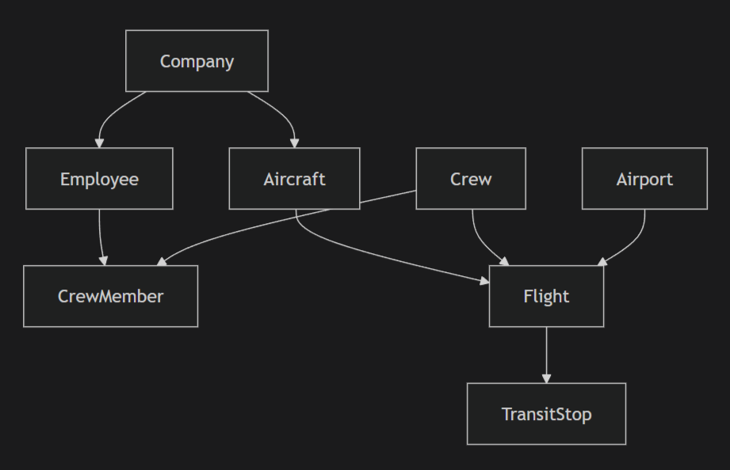

# Отчет по лабораторной работе #3

## Общая информация
- **Проект**: Система управления авиакомпанией
- **Технологии**: Django 4.x, Django REST Framework, Djoser, Django-filter
- **База данных**: SQLite (по умолчанию)

## Установка и запуск

### Требования
```bash
Django>=4.0
djangorestframework>=3.14
djoser>=2.1
django-filter>=23.0
django-cors-headers>=3.14
```

### Запуск
```
python manage.py makemigrations
python manage.py migrate

python manage.py loaddata initial_data.json

python manage.py createsuperuser

python manage.py runserver
```

## Архитектура проекта

### Модели данных
```
airport_app/
├── models.py          # Все модели данных
├── serializers.py     # Сериализаторы DRF
├── views.py           # ViewSets и Views
├── urls.py            # Маршруты API
├── admin.py           # Админ-панель Django
└── initial_data.json  # Тестовые данные
```

### Структура данных


## Модели базы данных

### Company (Компания)
- `name` - Название компании
- `code` - Код компании (уникальный)

### Aircraft (Самолет)
- `tail_number` - Бортовой номер (уникальный)
- `aircraft_type` - Тип самолета
- `capacity` - Вместимость
- `speed` - Скорость полета
- `company` - ForeignKey к Company
- `status` - Статус (active/repair)

### Airport (Аэропорт)
- `code` - Код аэропорта (уникальный)
- `name` - Название
- `city` - Город

### Employee (Сотрудник)
- `company` - ForeignKey к Company
- `first_name`, `last_name` - ФИО
- `age` - Возраст
- `education` - Образование
- `experience` - Стаж работы
- `passport` - Паспортные данные
- `position` - Должность
- `is_active` - Активен ли сотрудник

### Crew (Экипаж)
- `name` - Название экипажа
- `company` - ForeignKey к Company
- `is_active` - Активен ли экипаж
- `created_at` - Дата создания

### CrewMember (Член экипажа)
- `crew` - ForeignKey к Crew
- `employee` - ForeignKey к Employee
- `is_approved` - Допуск к рейсу

### Flight (Рейс)
- `flight_number` - Номер рейса
- `distance` - Расстояние
- `departure_airport`, `arrival_airport` - Аэропорты
- `departure_datetime`, `arrival_datetime` - Время вылета/прилета
- `aircraft` - ForeignKey к Aircraft
- `tickets_sold` - Проданные билеты
- `crew` - ForeignKey к Crew

### TransitStop (Транзитная остановка)
- `flight` - ForeignKey к Flight
- `airport` - ForeignKey к Airport
- `arrival_datetime`, `departure_datetime` - Время

## API Endpoints

### Аутентификация (Djoser)
| Метод | Endpoint | Описание |
|-------|----------|----------|
| POST | `/api/auth/users/` | Регистрация пользователя |
| POST | `/api/auth/token/login/` | Получение токена |
| POST | `/api/auth/token/logout/` | Выход из системы |
| GET | `/api/auth/users/me/` | Информация о пользователе |
| GET | `/api/current-user/` | Альтернативная информация |

### CRUD операции
| Ресурс | Endpoints |
|--------|-----------|
| Companies | `GET/POST /api/companies/`, `GET/PUT/DELETE /api/companies/{id}/` |
| Aircrafts | `GET/POST /api/aircrafts/`, `GET/PUT/DELETE /api/aircrafts/{id}/` |
| Airports | `GET/POST /api/airports/`, `GET/PUT/DELETE /api/airports/{id}/` |
| Employees | `GET/POST /api/employees/`, `GET/PUT/DELETE /api/employees/{id}/` |
| Crews | `GET/POST /api/crews/`, `GET/PUT/DELETE /api/crews/{id}/` |
| Flights | `GET/POST /api/flights/`, `GET/PUT/DELETE /api/flights/{id}/` |

## Требования

### 1. Популярная марка на маршруте
```http
GET /api/flights/popular_aircraft_on_route/?departure=SVO&arrival=LED
```
**Ответ:**
```json
{
  "route": "SVO → LED",
  "total_flights": 5,
  "most_popular_aircraft": {
    "aircraft_type": "Boeing 737-800",
    "flights_count": 4,
    "percentage": 80.0
  }
}
```

### 2. Маршруты с низкой загрузкой
```http
GET /api/flights/low_load_routes/?threshold=50
```
**Ответ:** Список маршрутов с загрузкой менее 50%

### 3. Свободные места на рейсе
```http
GET /api/flights/{id}/available_seats/
```
**Ответ:**
```json
{
  "flight_id": 1,
  "flight_number": "SU-1001",
  "available_seats": 39,
  "load_percentage": 79.4,
  "has_available_seats": true
}
```

### 4. Самолеты в ремонте
```http
GET /api/aircrafts/in_repair_count/
```
**Ответ:** `{"in_repair_count": 1}`

### 5. Количество работников компании
```http
GET /api/employees/company_employees_count/?company_id=1
```
**Ответ:**
```json
{
  "company_id": 1,
  "company_name": "Аэрофлот",
  "total_employees": 5,
  "active_employees": 5,
  "inactive_employees": 0
}
```

### 6. Отчет о бортах компании
```http
GET /api/aircrafts/company_aircrafts_report/?company_id=1
```
**Ответ:** Подробный отчет по типам самолетов с характеристиками

## Фильтрация и поиск

### Примеры фильтрации:
```bash
# Фильтрация самолетов
GET /api/aircrafts/?company=1&status=active&aircraft_type=Boeing

# Фильтрация сотрудников
GET /api/employees/?company=1&position=captain&is_active=true

# Поиск
GET /api/aircrafts/?search=737

# Сортировка
GET /api/flights/?ordering=departure_datetime
```

### Поддерживаемые фильтры:
| Модель | Поля для фильтрации |
|--------|---------------------|
| Aircraft | `company`, `status`, `aircraft_type` |
| Employee | `company`, `position`, `is_active` |
| Flight | `departure_airport`, `arrival_airport`, `aircraft`, `crew` |

## Админ-панель Django

### Доступ:
- URL: `http://localhost:8000/admin/`

### Функции админки:
- Управление всеми моделями
- Поиск и фильтрация
- Inline-редактирование (экипажи, транзитные остановки)
- Цветная индикация загрузки рейсов
- Автодополнение ForeignKey полей
- Расчетные поля (статистика)

### Особенности:
- **Рейсы**: Отображение загрузки с цветовой индикацией
- **Сотрудники**: Статус в экипаже
- **Самолеты**: Количество выполненных рейсов
- **Аэропорты**: Статистика вылетов/прилетов

## Тестовые данные

### Созданные объекты:
- **3 компании**: Аэрофлот, S7 Airlines, Победа
- **5 самолетов**: Boeing 737-800, Airbus A320, Boeing 777
- **4 аэропорта**: Шереметьево, Домодедово, Пулково, JFK
- **6 сотрудников**: Пилоты, штурманы, стюардессы
- **3 экипажа** с разным составом
- **8 рейсов** с различной загрузкой
- **1 транзитная остановка**

### Пользователи для тестирования:
| Логин | Пароль | Роль | Токен |
|-------|--------|------|-------|
| admin | admin123 | Суперпользователь | - |
| testuser | testpass123 | Обычный пользователь | 9944b09199c62bcf9418ad846dd0e4bbdfc6ee4b |

## Примеры использования

### Сценарий 1: Поиск рейсов с низкой загрузкой
```bash
# 1. Авторизация
curl -X POST http://localhost:8000/api/auth/token/login/ \
  -H "Content-Type: application/json" \
  -d '{"username": "testuser", "password": "testpass123"}'

# 2. Получение токена (сохранить)
# 3. Поиск рейсов с загрузкой < 60%
curl -X GET "http://localhost:8000/api/flights/low_load_routes/?threshold=60" \
  -H "Authorization: Token ваш_токен"
```

### Сценарий 2: Работа с самолетами
```bash
# Получить все активные самолеты Аэрофлота
curl -X GET "http://localhost:8000/api/aircrafts/?company=1&status=active" \
  -H "Authorization: Token ваш_токен"

# Получить отчет по самолетам компании
curl -X GET "http://localhost:8000/api/aircrafts/company_aircrafts_report/?company_id=1" \
  -H "Authorization: Token ваш_токен"
```