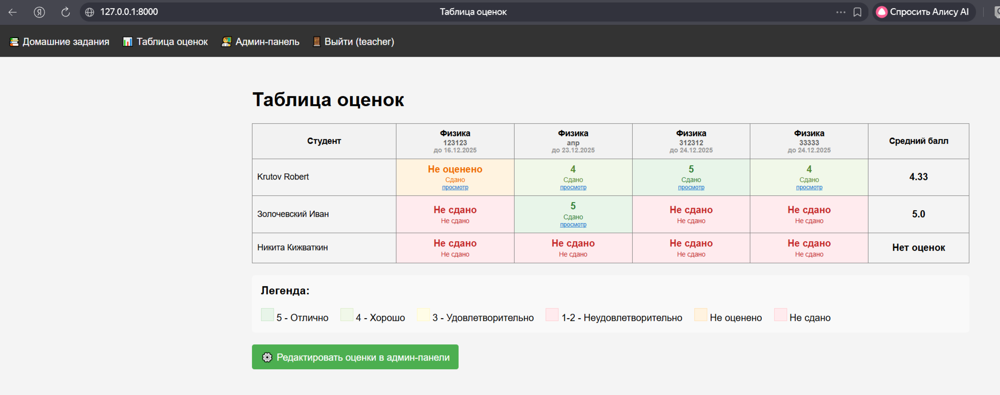
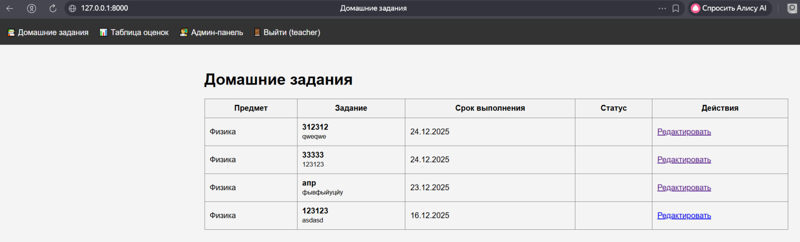
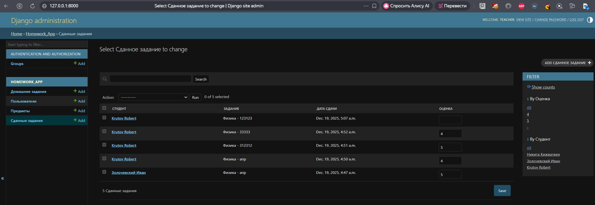
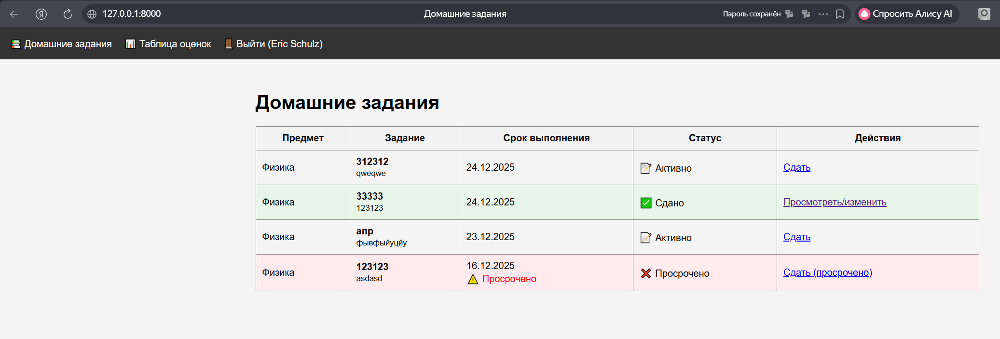
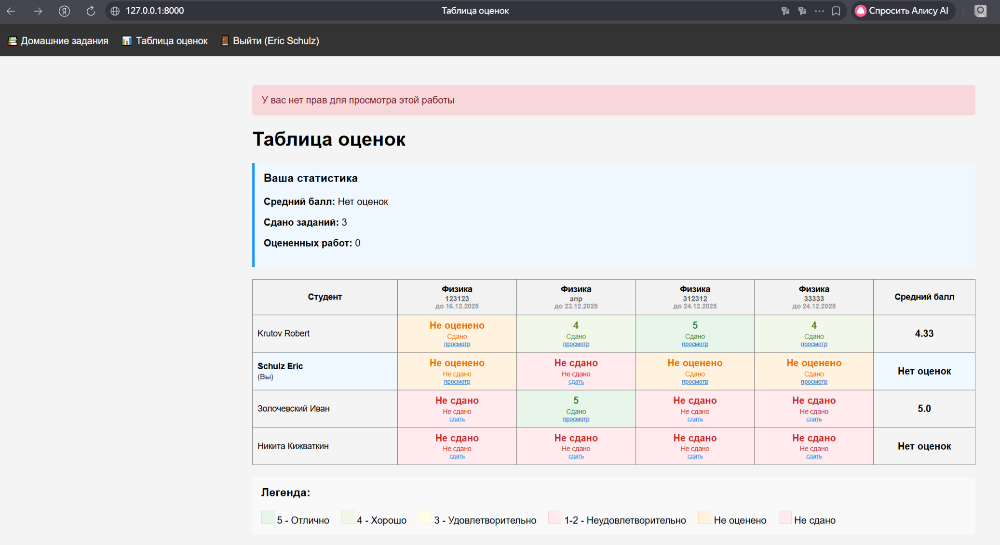

# Лабораторная работа №2: Система управления домашними заданиями

## 1. Цель работы

Разработать веб-приложение для управления домашними заданиями с использованием Django Framework, реализующее функционал регистрации пользователей, просмотра заданий, сдачи решений и выставления оценок.

## 2. Задание

Создать систему управления домашними заданиями со следующим функционалом:

1. Регистрация новых пользователей
2. Просмотр домашних заданий по всем дисциплинам
3. Сдача домашних заданий в текстовом виде
4. Возможность для администратора (учителя) выставлять оценки через Django-admin
5. Таблица оценок всех учеников класса в клиентской части

## 3. Реализация

### 3.1 Модели данных

В приложении реализованы следующие модели:

1. **Subject** - предметы обучения
2. **Homework** - домашние задания с полями:
      - subject (предмет)
      - teacher (преподаватель)
      - title (название задания)
      - description (текст задания)
      - issued_date (дата выдачи)
      - due_date (срок выполнения)
      - penalty_info (информация о штрафах)

3. **HomeworkSubmission** - сданные задания:
      - homework (ссылка на задание)
      - student (студент)
      - submission_text (текст решения)
      - submission_date (дата сдачи)
      - grade (оценка)
      - feedback (комментарий преподавателя)

### 3.2 Функционал системы

#### 3.2.1 Аутентификация и авторизация
- Регистрация новых пользователей
- Вход в систему
- Разделение ролей: преподаватели (is_staff=True) и студенты

#### 3.2.2 Просмотр заданий
- Для преподавателей: все задания
- Для студентов: все задания с цветовой индикацией статуса:
  - Зеленый - сдано
  - Красный - просрочено
  - Белый - активно

#### 3.2.3 Сдача заданий
- Текстовый редактор для написания решений
- Возможность редактирования уже сданных работ
- Индикация просроченных заданий

#### 3.2.4 Административная панель
- Управление предметами, заданиями и пользователями
- Выставление оценок за сданные работы
- Добавление комментариев к работам

#### 3.2.5 Таблица оценок
- Для преподавателей: оценки всех студентов
- Для студентов: только свои оценки
- Цветовая индикация оценок (зеленый - отлично, красный - неуд)
- Средний балл для каждого студента
- Ссылки на просмотр деталей сданных работ

## 4. Технические особенности

### 4.1 Используемые технологии
- Django 6.0
- SQLite3
- HTML/CSS для клиентской части
- Python 3.13

### 4.2 Основные модули Django
- django.contrib.auth - аутентификация пользователей
- django.contrib.admin - административная панель
- django.forms - формы для регистрации и сдачи заданий
- django.db.models - модели данных
- django.utils.timezone - работа с датами

### 4.3 Безопасность
- CSRF-защита всех форм
- Проверка прав доступа (@login_required, @user_passes_test)
- Разделение ролей пользователей
- Валидация входных данных


## 5. Инструкция по запуску

### 5.1 Установка зависимостей
```bash
pip install django
```

### 5.2 Инициализация проекта
```bash
python manage.py migrate
python manage.py createsuperuser
```

### 5.3 Запуск сервера
```bash
python manage.py runserver
```

### 5.4 Доступ к приложению
- Админ-панель: http://127.0.0.1:8000/admin/
- Таблица оценок: http://127.0.0.1:8000/grades/
- Домашние работы: http://127.0.0.1:8000/homework/
- Вход: http://127.0.0.1:8000/login/

## 6. Вывод

В ходе выполнения лабораторной работы было разработано полнофункциональное веб-приложение для управления домашними заданиями.

1. Реализована регистрация и аутентификация пользователей
2. Создан интерфейс для просмотра домашних заданий
3. Реализована возможность сдачи заданий в текстовом виде
4. Преподаватели могут выставлять оценки через Django-admin
5. Реализована таблица оценок для всего класса

Приложение демонстрирует практическое применение основных концепций Django: модели, представления, шаблоны, формы и система аутентификации.

## 7. Пример работы:

### 7.1. Интерфейс учителя




### 7.2. Интерфейс ученика

