# Лабораторная работа №3

**Студент:** Москалец Данила Алексеевич  
**Университет:** ИТМО  
**Группа:** К3341  

---

## Содержание

1. [Предметная область](#предметная_область)
2. [Схема базы данных](#схема)
3. [Структура_проекта](#структура)
4. [Права доступа](#права)
5. [Основные возможности](#возможности)
6. [Коды ответов](#коды-ответы)
7. [Эндпоинты API (CRUD)](#эндпоинты)

---
## Предметная область
Создать программную систему, предназначенную для работы маркетплейса охранных услуг.
Система должна обеспечивать хранение сведений об охранных компаниях, об услугах, которые они предоставляют, о пользователях, формирующих заявки на услуги, а также о владельцах компаний, управляющих своей организацией на платформе.
В системе могут регистрироваться пользователи, которые получают возможность либо использовать платформу для поиска охранных услуг, либо создать собственную охранную компанию. Пользователь, создавший компанию, становится её администратором.
Охранная компания характеризуется названием, описанием и перечнем оказываемых услуг. Каждая услуга имеет название, описание и стоимость. У разных компаний стоимость одинаковых по содержанию услуг может различаться. Также система позволяет компаниям создавать скидки и акции на свои услуги, которые могут действовать в определённые даты и применяться к конкретным услугам.
Обычный пользователь имеет возможность просматривать каталог компаний, фильтровать их по оказываемым услугам, знакомиться с информацией о компании и её стоимости услуг. Пользователь может отправить запрос на оказание услуги выбранной компании. Такая заявка фиксируется в системе и поступает администратору компании. Администратор может просматривать поступившие заявки и изменять их состояние (новая, принята, отклонена).
Также пользователи могут оставлять отзывы об охранных компаниях, включающие числовую оценку и текстовый комментарий. На основании отзывов можно определить средний рейтинг компании.
Кроме того, пользователи имеют возможность добавлять услуги в избранное.

Работа с системой предполагает получение следующей информации:
- список компаний, оказывающих заданный вид услуги;
- перечень услуг выбранной компании с указанием стоимости;
- список заявок, отправленных пользователем;
- список заявок, полученных конкретной компанией;
- отзывы о выбранной компании и её средний рейтинг.
- список избранных услуг пользователя

Пользователи должны иметь возможность выполнять следующие операции:
- зарегистрироваться на платформе;
- создать охранную компанию и управлять её данными (для администраторов);
- управлять стоимостью услуг, назначать скидки и акции;
- отправить заявку на оказание услуги;
- изменить статус полученной заявки (для администраторов компании);
- оставить отзыв о компании.
- добавление и удаление услуг из избранного.

Необходимо предусмотреть возможность получения отчёта о деятельности охранных компаний на платформе для администраторов.
## Схема базы данных
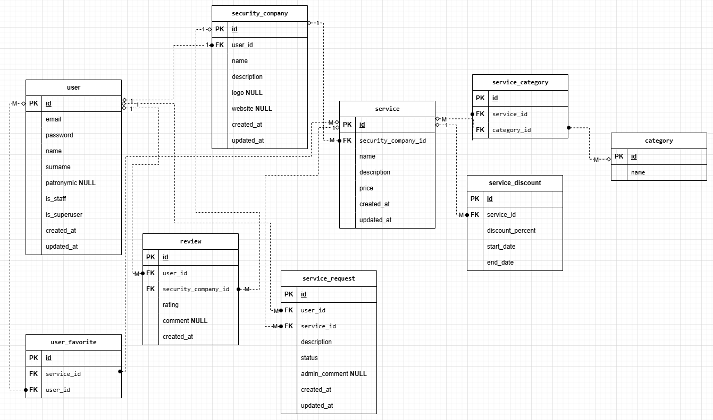
## Структура_проекта
security_marketplace/ 
├── core/ # Основное приложение (ранее migrations в вашей структуре) 
│ ├── migrations/ # Миграции базы данных 
│ │ └── init.py 
│ ├── models.py # Модели данных 
│ ├── views.py # Представления (ViewSets и API views) 
│ ├── urls.py # Маршрутизация API endpoints 
│ ├── serializers.py # Сериализаторы DRF 
│ ├── permissions.py # Кастомные permissions 
│ ├── admin.py # Настройки админ-панели Django 
│ ├── apps.py # Конфигурация приложения 
│ └── init.py 
├── security_marketplace/ # Настройки проекта 
│ ├── init.py 
│ ├── settings.py # Основные настройки 
│ ├── urls.py # Корневые URL маршруты 
│ ├── asgi.py # ASGI конфигурация 
│ └── wsgi.py # WSGI конфигурация 

## Права доступа
- **Анонимные пользователи**: только чтение
- **Авторизованные пользователи**: создание заявок, отзывов, избранного
- **Владельцы компаний**: управление своими компаниями и услугами
- **Администраторы**: полный доступ

## Основные возможности
- Аутентификация через JWT
- CRUD операции для всех сущностей
- Фильтрация и поиск
- Аналитика и отчеты
- Избранное и отзывы

## Коды ответов
| Код | Описание |
|-----|----------|
| 200 | Успешно |
| 201 | Создано |
| 400 | Ошибка валидации |
| 401 | Не авторизован |
| 403 | Доступ запрещен |
| 404 | Не найдено |
| 500 | Ошибка сервера |

## Эндпоинты API (CRUD)

### Основные CRUD операции
Каждый ViewSet даёт 5 методов:

- **GET /api/v1/'<'model'>'/** - список записей
- **POST /api/v1/'<'model'>'/** - создание
- **GET /api/v1/'<'model'>'/{id}/** - просмотр одной
- **PUT/PATCH /api/v1/'<'model'>'/{id}/** - обновление
- **DELETE /api/v1/'<'model'>'/{id}/** - удаление

### Аналитика
- **GET /api/analytics/** - общая статистика платформы (только админы)
- **GET /api/analytics/company/{company_id}/** - статистика по компании (владелец или админ)

### JWT Аутентификация (основное)
- **POST /auth/jwt/create/** - получить токен
- **POST /auth/jwt/refresh/** - обновить токен
- **POST /auth/jwt/verify/** - проверить токен

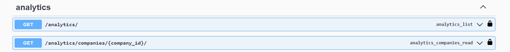 
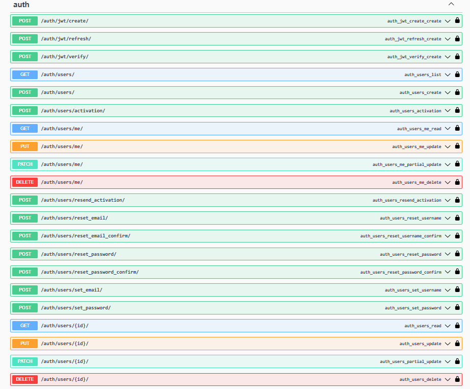 
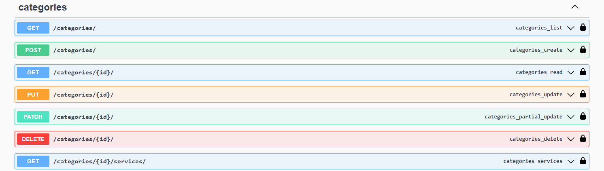 
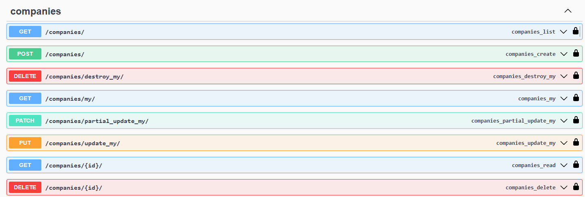 
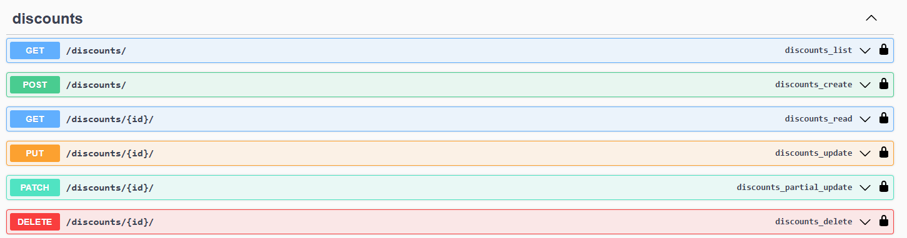 
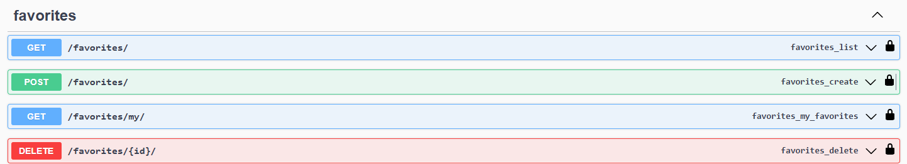 
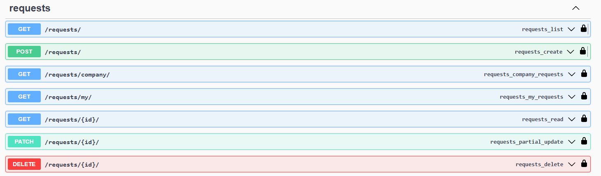 
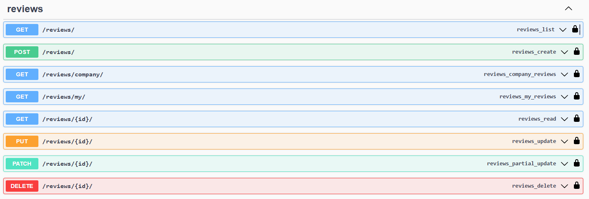 
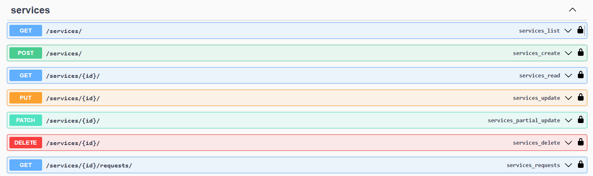 
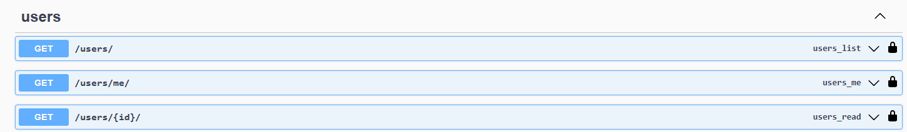
