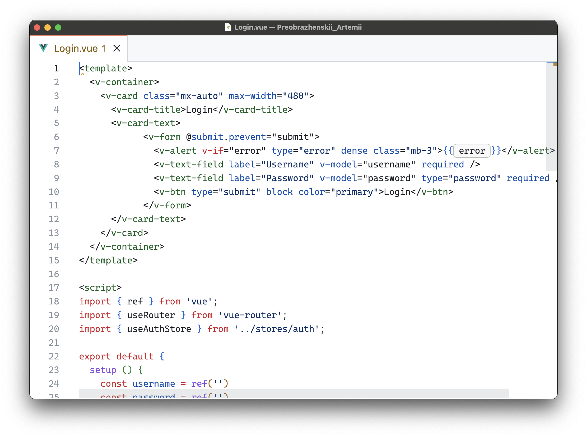
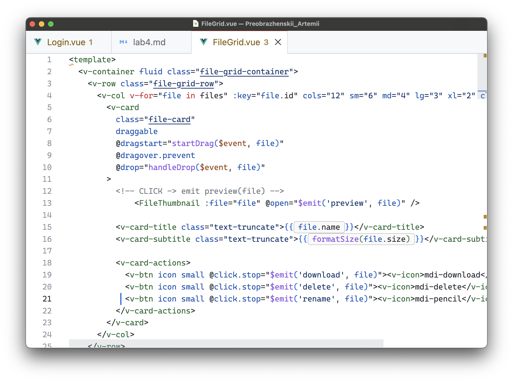
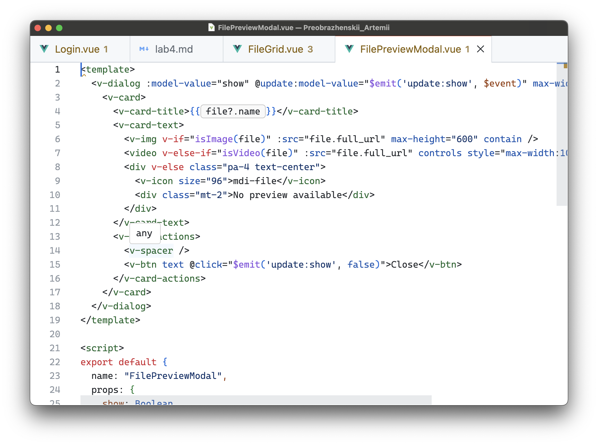
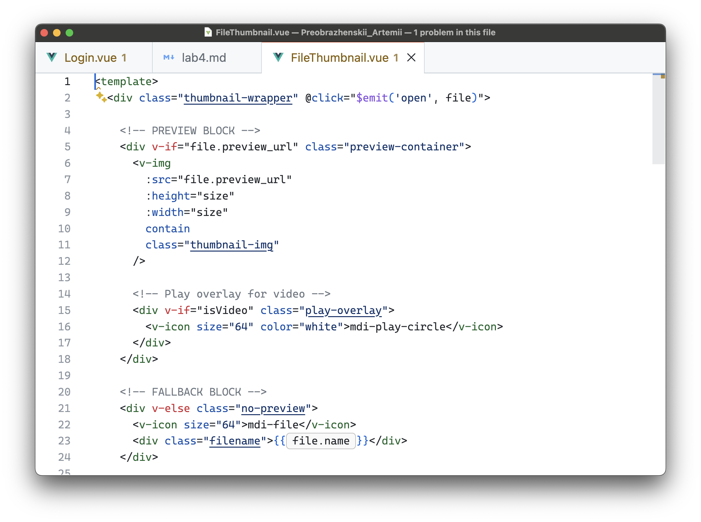
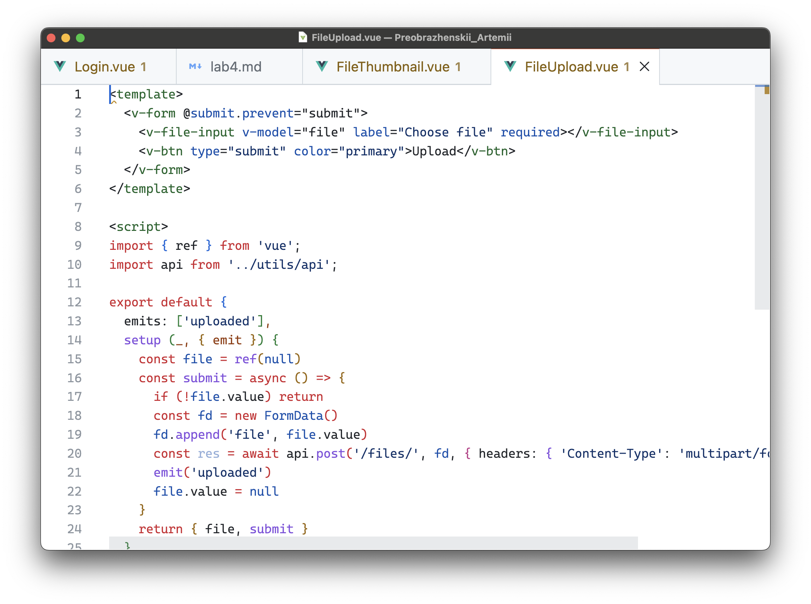
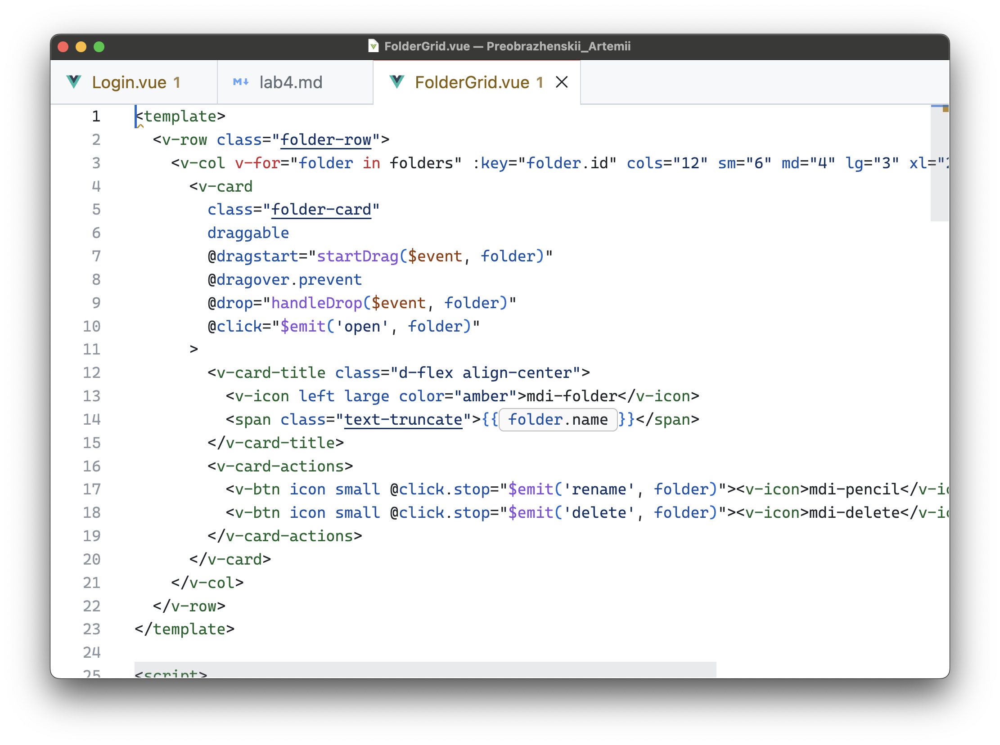
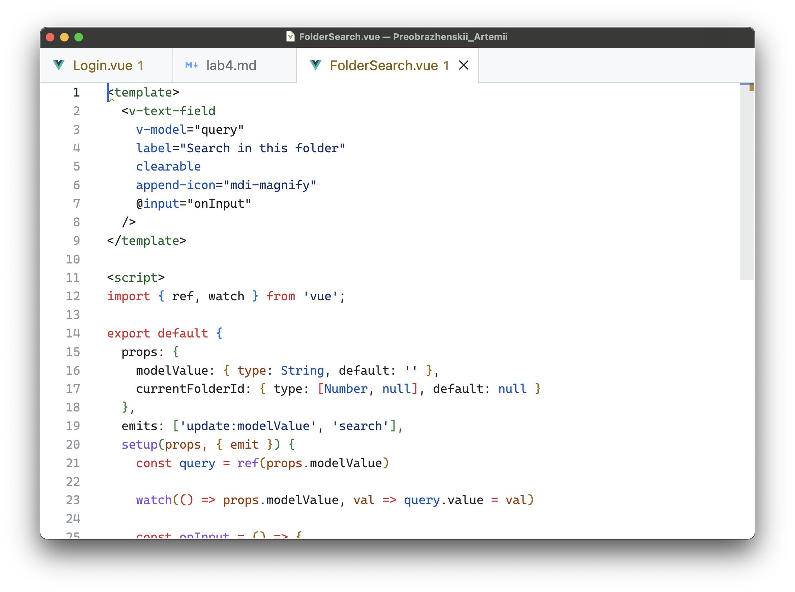
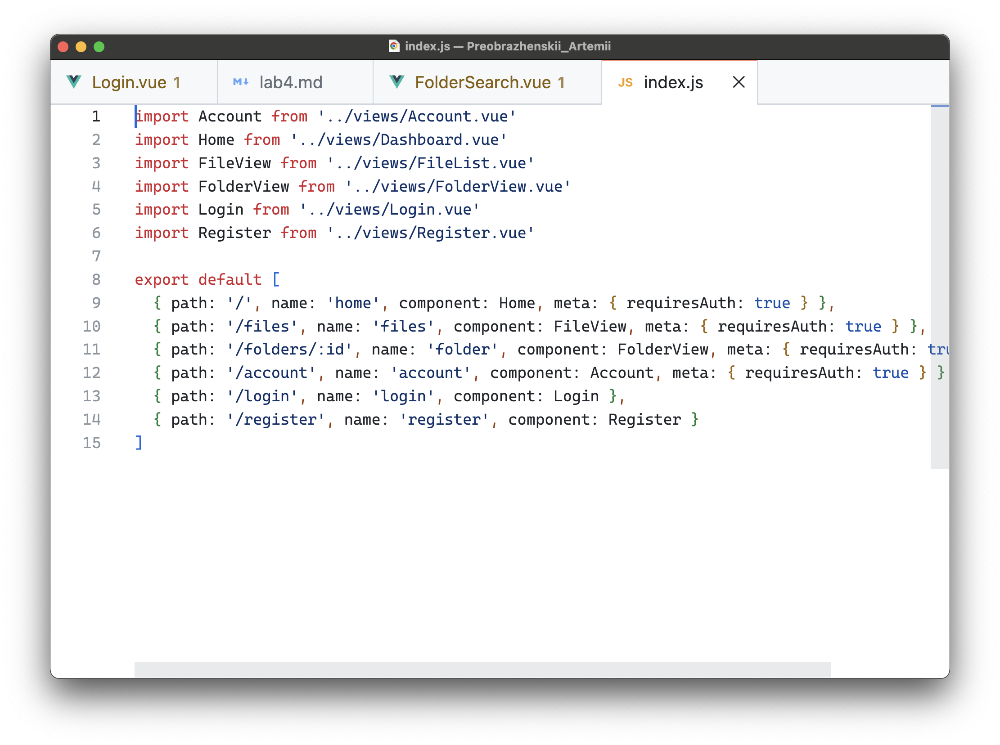

# Лабораторная работа: Реализация клиентских интерфейсов файлового хранилища

### **Цель работы**
Целью работы является получение практических навыков настройки CORS (Cross-Origin Resource Sharing) для серверной части, реализованной в лабораторной работе №3, а также интеграция клиентского приложения (Vue 3 + Vuetify) с сервером. В рамках задания также необходимо реализовать интерфейсы авторизации, регистрации, управления учётными данными и файловым хранилищем, а затем подготовить документацию средствами MkDocs.

---

# 1. Настройка CORS на серверной части

В рамках серверной части был выполнен следующий функционал:

- Проведён анализ используемых доменов и источников запросов (frontend на Vue 3 и backend на Django REST Framework).
- Установлена и подключена библиотека для работы с CORS.
- Настроено разрешение необходимых методов, заголовков и схем авторизации.
- Настроено разделение прав доступа для авторизованных и неавторизованных пользователей.
- Выполнена проверка работы CORS через разработанный фронтенд.

---

# 2. Список интерфейсов взаимодействия

1. Интерфейсы авторизации: вход через логин/пароль, выдача токена.
2. Интерфейс регистрации нового пользователя.
3. Раздел личного аккаунта (смена имени, электронной почты, пароля).
4. Интерфейсы работы с файлами:
   - загрузка файлов;
   - предпросмотр изображений и видео;
   - скачивание;
   - удаление;
   - переименование;
   - поиск;
   - работа с папками;
   - просмотр содержимого папки;
   - глобальный поиск по хранилищу.
5. Интерфейс  загрузки и очереди загрузок.
6. Интерфейс предпросмотра файлов.
7. Интерфейс просмотра дерева папок / файловой сетки.

---

# 3. Реализация интерфейсов авторизации, регистрации, управления профилем

На клиентской части были созданы страницы:

- **Login** — форма входа, отправляющая запрос к API.
- **Register** — регистрация нового аккаунта.
- **Account** — изменение данных профиля (имени, email, пароля).

Реализация выполнена с использованием:

- Vue 3 (Composition API);
- Pinia — хранение токена и статуса авторизации;
- перехватчиков запросов для автоматической отправки JWT-токена;
- защищённых маршрутов.

---

# 4. Реализация пользовательских интерфейсов файлового хранилища

В работе были разработаны следующие компоненты:

### **4.1. FileGrid**  
Отображает сетку файлов в виде карточек с поддержкой:
- предпросмотра;
- загрузки;
- удаления;
- переименования.

---

### **4.2. FilePreviewModal**  
Модальное окно предпросмотра:
- изображений (через `<v-img>`);
- видео (с элементом `<video>`).

---

### **4.3. FileThumbnail**  
Мини-превью:
- отображение миниатюр изображений;
- отображение иконки файла;
- отображение overlay-кнопки Play для видео.

---

### **4.4. UploadForm**  
Простой интерфейс загрузки файла через выбор файла.

---

### **4.5. FoldersGrid**  
Сетка папок с:
- кнопками переименования и удаления;
- визуальной адаптацией под разные размеры экрана.

---

### **4.6. SearchBar**  

# 5. Настройка маршрутизации (Vue Router)

Созданы маршруты:

- `/login` — форма входа  
- `/register` — регистрация  
- `/account` — профиль пользователя  
- `/files` — корневой каталог  
- `/folder/:id` — конкретная папка  
- `/` — dashboard  

Добавлены проверки доступа: авторизованные / неавторизованные пользователи.

---

# 8. Выводы

В ходе работы были достигнуты следующие результаты:

- Настроена политика CORS для корректного взаимодействия frontend ↔ backend.
- Реализованы все необходимые интерфейсы авторизации и профиля.
- Создано полноценное файловое хранилище с поддержкой предпросмотра, поиска и работы с папками.