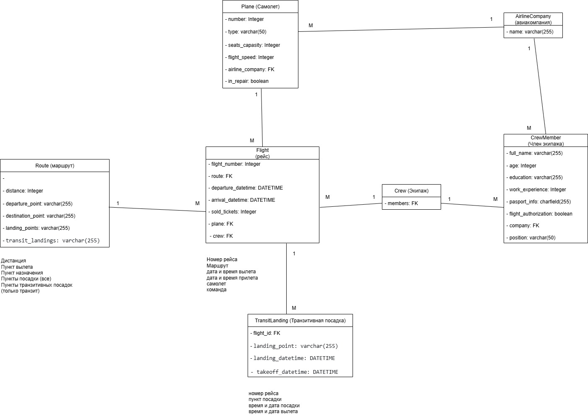

# Отчет по лабораторной работе №3

## Цель:

Овладеть практическими навыками и умениями реализации web-сервисов средствами Django.

## Практическое задание:

Реализовать сайт, используя фреймворк Django 3, Django REST Framework, Djoser и СУБД PostgreSQL, в соответствии с 
вариантом задания лабораторной работы.

## Выполнение практической работы № 3.1

Будем использовать модели из практической работы 2:

```python
from django.db import models
from django.contrib.auth.models import AbstractUser
from django.conf import settings


class Owner(AbstractUser):
    """Таблица Автовладелец"""

    # last_name = models.CharField(max_length=30)
    # first_name = models.CharField(max_length=30)
    # birth_date = models.DateField(null=True)

    passport_number = models.CharField(max_length=20)
    address = models.CharField(max_length=200)
    nationality = models.CharField(max_length=50)

    def __str__(self):
        return f"{self.last_name} {self.first_name}"

class Car(models.Model):
    """Таблица автомобиль"""

    state_num = models.CharField(max_length=15)
    brand = models.CharField(max_length=20)
    model = models.CharField(max_length=20)
    color = models.CharField(max_length=30)
    owners = models.ManyToManyField(settings.AUTH_USER_MODEL, through='Ownership', related_name='cars')

    def __str__(self):
        return self.state_num

class Ownership(models.Model):
    """Таблица владение"""

    owner = models.ForeignKey(settings.AUTH_USER_MODEL, on_delete=models.CASCADE, null=True, related_name='ownerships')
    car = models.ForeignKey(Car, on_delete=models.CASCADE, null=True, related_name='ownerships')
    start_date = models.DateTimeField()
    end_date = models.DateTimeField(null=True)

class License(models.Model):
    """Таблица Водительское удостоверение"""

    owner = models.ForeignKey(settings.AUTH_USER_MODEL, on_delete=models.CASCADE, related_name='licenses')
    license_number = models.CharField(max_length=10)
    type = models.CharField(max_length=10)
    date_issued = models.DateTimeField()
```

Для выполнения задания 1: Напишите запрос на создание 6-7 новых автовладельцев и 5-6 автомобилей, каждому автовладельцу 
назначьте удостоверение и от 1 до 3 автомобилей. Напишем следующий код в shell:

```python
python manage.py shell
from project_first_app.models import *
from datetime import datetime, timedelta

# Создаем 7 автовладельцев
owners = []
for i in range(7):
    owner = Owner.objects.create_user(
        username=f'user{i}',
        password='testpass123',
        last_name=f'Фамилия{i}',
        first_name=f'Имя{i}',
        passport_number=f'PN{i:06}',
        address=f'Город, улица {i}, дом {i+1}',
        nationality='Россия'
    )
    owners.append(owner)

# Создаем 6 автомобилей
cars = []
car_data = [
    ('A123BC77', 'Toyota', 'Camry', 'черный'),
    ('B234CD78', 'Honda', 'Accord', 'белый'),
    ('C345DE79', 'Ford', 'Focus', 'синий'),
    ('D456EF80', 'BMW', 'X5', 'серый'),
    ('E567FG81', 'Audi', 'A4', 'красный'),
    ('F678GH82', 'Lada', 'Vesta', 'зеленый')
]
for num, brand, model, color in car_data:
    car = Car.objects.create(state_num=num, brand=brand, model=model, color=color)
    cars.append(car)

# Каждому автовладельцу выдаем удостоверение
for i, owner in enumerate(owners):
    License.objects.create(
        owner=owner,
        license_number=f'L{i:06}',
        type='B',
        date_issued=datetime.now() - timedelta(days=365*i)
    )

# Для каждого автовладельца назначаем от 1 до 3 автомобилей через связь "владение"
import random
for owner in owners:
    n = random.randint(1, 3)
    owned_cars = random.sample(cars, n)
    for car in owned_cars:
        Ownership.objects.create(
            owner=owner,
            car=car,
            start_date=datetime.now() - timedelta(days=random.randint(0, 1000)),
            end_date=None
        )

# 5. Проверяем, что получилось:
print("Owners:")
for o in Owner.objects.all():
    print(o, o.license_set.all())

print("\nCars:")
for c in Car.objects.all():
    print(c, c.owners.all())

print("\nOwnerships:")
for own in Ownership.objects.all():
    print(f"{own.owner} владеет {own.car}, с {own.start_date}")
```

Для выполнения задания 2:

По созданным в пр.1 данным написать следующие запросы на фильтрацию:

* Где это необходимо, добавьте related_name к полям модели
* Выведете все машины марки “Toyota” (или любой другой марки, которая у вас есть)
* Найти всех водителей с именем “Олег” (или любым другим именем на ваше усмотрение)
* Взяв любого случайного владельца получить его id, и по этому id получить экземпляр удостоверения в виде объекта 
модели (можно в 2 запроса)
* Вывести всех владельцев красных машин (или любого другого цвета, который у вас присутствует)
* Найти всех владельцев, чей год владения машиной начинается с 2010 (или любой другой год, который присутствует у вас 
в базе)

Напишем следующий код в shell:

```
1 - В модели Car на owners добавляем related_name='cars'. В модель Ownership на owner и car добавляем 
related_name='ownerships'. В модель License на owner добавляем related_name='licenses'.
2 - Owner.objects.filter(first_name='Имя1')
3 - random_owner = Owner.objects.order_by('?').first()
     owner_id = random_owner.id
     licenses = License.objects.filter(owner_id=owner_id)
     print(licenses)
4 - owners_of_red_cars = Owner.objects.filter(cars__color='красный').distinct()
     print(owners_of_red_cars)
5 - from django.db.models.functions import ExtractYear
     owners_2025 =            Owner.objects.annotate(start_year=ExtractYear('ownerships__start_date'))
     .filter(start_year=2025).distinct()
     print(owners_2025)
```

Для выполнения задания 3:

Необходимо реализовать следующие запросы c применением описанных методов:

* Вывод даты выдачи самого старшего водительского удостоверения
* Укажите самую позднюю дату владения машиной, имеющую какую-то из существующих моделей в вашей базе
* Выведите количество машин для каждого водителя
* Подсчитайте количество машин каждой марки
* Отсортируйте всех автовладельцев по дате выдачи удостоверения (Примечание: чтобы не выводить несколько раз одни и те 
же записи воспользуйтесь методом .distinct()

Напишем следующий код в shell:

```
1 - from django.db.models import Min
min_date = License.objects.aggregate(Min('date_issued'))['date_issued__min']
print("Самое старое удостоверение выдано:", min_date)
2 - from django.db.models import Max
      latest_end =      Ownership.objects.filter(car__brand='Honda').aggregate(Max('end_date'))['end_date__max']
print("Самая поздняя дата окончания владения Honda:", latest_end)
3 - from django.db.models import Count
     owners_with_car_count = Owner.objects.annotate(car_count=Count('cars', distinct=True))
    for owner in owners_with_car_count:
    print(f"{owner.first_name} {owner.last_name}: {owner.car_count} машин(ы)")
4 - brand_counts = Car.objects.values('brand').annotate(count=Count('id')).order_by('brand')
     for entry in brand_counts:
         print(f"Марка {entry['brand']}: {entry['count']} машин(ы)")
5 - owners_by_license = Owner.objects.annotate(earliest_license=Min('licenses__date_issued')).order_by('earliest_license').distinct()
    for owner in owners_by_license:
        print(f"{owner.first_name} {owner.last_name} — {owner.earliest_license}")
```

## Реализация лабораторной работы (Вариант 14)

#### Модель базы данных:



Реализация моделей:

```python
from django.db import models

class AirlineCompany(models.Model):
    name = models.CharField(max_length=255, verbose_name='Название компании')

    def __str__(self):
        return self.name

class Plane(models.Model):
    number = models.CharField(max_length=20, verbose_name='Номер самолета')
    type = models.CharField(max_length=50, verbose_name='Тип самолета')
    seats_capacity = models.IntegerField(verbose_name='Число мест')
    flight_speed = models.IntegerField(verbose_name='Скорость полета')
    airline_company = models.ForeignKey(AirlineCompany, on_delete=models.CASCADE, verbose_name='Компания-авиаперевозчик')
    in_repair = models.BooleanField(default=False, verbose_name='В ремонте')

    def __str__(self):
        return self.number

class Crew(models.Model):
    members = models.ManyToManyField('CrewMember', verbose_name='Члены экипажа')

    def __str__(self):
        return f'Crew {self.pk}'
class CrewMember(models.Model):
    full_name = models.CharField(max_length=255, verbose_name='ФИО')
    age = models.IntegerField(verbose_name='Возраст')
    education = models.CharField(max_length=255, verbose_name='Образование')
    work_experience = models.IntegerField(verbose_name='Стаж работы')
    passport_info = models.CharField(max_length=255, verbose_name='Паспортные данные')
    flight_authorization = models.BooleanField(default=False, verbose_name='Допуск к рейсу')
    company = models.ManyToManyField(AirlineCompany, verbose_name='Компания, в которой работает')
    position = models.CharField(max_length=50,
                                verbose_name='Должность (командир, второй пилот, штурман, стюардесса/стюард)')

    def __str__(self):
        return self.full_name

class Route(models.Model):
    distance = models.IntegerField(verbose_name='Расстояние до пункта назначения')
    departure_point = models.CharField(max_length=255, verbose_name='Пункт вылета')
    destination_point = models.CharField(max_length=255, verbose_name='Пункт назначения')
    landing_points = models.CharField(max_length=255, blank=True, null=True,  verbose_name='Пункты посадки')
    transit_landings = models.CharField(max_length=255, blank=True, null=True,   verbose_name='Транзитные посадки')

    def __str__(self):
        return self.flight_number

class Flight(models.Model):
    flight_number = models.IntegerField(verbose_name='Номер рейса')
    route = models.ForeignKey(Route, on_delete=models.CASCADE, related_name='flights', verbose_name='Маршрут')
    departure_datetime = models.DateTimeField(verbose_name='Дата и время вылета')
    arrival_datetime = models.DateTimeField(verbose_name='Дата и время прилета')
    sold_tickets = models.IntegerField(verbose_name='Количество проданных билетов')
    plane = models.ForeignKey(Plane, on_delete=models.CASCADE, verbose_name='Самолет, обслуживающий рейс')
    crew = models.ManyToManyField(Crew, verbose_name='Экипаж, обслуживающий рейс')

    def __str__(self):
        return f'Flight {self.pk}'

class TransitLanding(models.Model):
    flight = models.ForeignKey(Flight, on_delete=models.CASCADE, verbose_name='Рейс')
    landing_point = models.CharField(max_length=255, verbose_name='Пункт транзитной посадки')
    landing_datetime = models.DateTimeField(verbose_name='Дата и время транзитной посадки')
    takeoff_datetime = models.DateTimeField(verbose_name='Дата и время вылета (после транзитной посадки)')

    def __str__(self):
        return f'{self.landing_point} для рейса {self.flight.flight_number}'
```

#### Реализуем сериализаторы для моделей:

```python
from datetime import datetime

from rest_framework import serializers
from .models import AirlineCompany, Plane, Crew, CrewMember, Route, Flight, TransitLanding

class AirlineCompanySerializer(serializers.ModelSerializer):
    class Meta:
        model = AirlineCompany
        fields = '__all__'

class PlaneSerializer(serializers.ModelSerializer):
    class Meta:
        model = Plane
        fields = '__all__'

class CrewSerializer(serializers.ModelSerializer):
    class Meta:
        model = Crew
        fields = '__all__'

class CrewMemberSerializer(serializers.ModelSerializer):
    class Meta:
        model = CrewMember
        fields = '__all__'

class RouteSerializer(serializers.ModelSerializer):
    class Meta:
        model = Route
        fields = '__all__'

class FlightSerializer(serializers.ModelSerializer):
    departure_datetime = serializers.DateTimeField(format=None, input_formats=None)
    arrival_datetime = serializers.DateTimeField(format=None, input_formats=None)

    class Meta:
        model = Flight
        fields = '__all__'

class TransitLandingSerializer(serializers.ModelSerializer):
    landing_datetime = serializers.DateTimeField(format=None, input_formats=None)
    takeoff_datetime = serializers.DateTimeField(format=None, input_formats=None)

    class Meta:
        model = TransitLanding
        fields = '__all__'

class TransitLandingSerializer(serializers.ModelSerializer):
    class Meta:
        model = TransitLanding
        fields = '__all__'
```

#### Описываем представления для API:

Используем viewsets для создания CRUD операций для каждой модели.

```python
from rest_framework import viewsets
from .models import AirlineCompany, Plane, Crew, Route, Flight, TransitLanding, CrewMember
from .serializers import AirlineCompanySerializer, PlaneSerializer, CrewSerializer, RouteSerializer, FlightSerializer, \
    TransitLandingSerializer, CrewMemberSerializer


class AirlineCompanyViewSet(viewsets.ModelViewSet):
    queryset = AirlineCompany.objects.all()
    serializer_class = AirlineCompanySerializer

class PlaneViewSet(viewsets.ModelViewSet):
    queryset = Plane.objects.all()
    serializer_class = PlaneSerializer

class CrewViewSet(viewsets.ModelViewSet):
    queryset = Crew.objects.all()
    serializer_class = CrewSerializer

class RouteViewSet(viewsets.ModelViewSet):
    queryset = Route.objects.all()
    serializer_class = RouteSerializer

class FlightViewSet(viewsets.ModelViewSet):
    queryset = Flight.objects.all()
    serializer_class = FlightSerializer

class TransitLandingViewSet(viewsets.ModelViewSet):
    queryset = TransitLanding.objects.all()
    serializer_class = TransitLandingSerializer

class CrewMemberViewSet(viewsets.ModelViewSet):
    queryset = CrewMember.objects.all()
    serializer_class = CrewMemberSerializer
```

#### Настраиваем маршруты для API:

Используем router для автоматической генерации URL-адресов.

```python
from django.urls import path, include
from rest_framework.routers import DefaultRouter
from .views import (
    AirlineCompanyViewSet, PlaneViewSet, CrewViewSet,
    RouteViewSet, FlightViewSet, TransitLandingViewSet, CrewMemberViewSet
)

router = DefaultRouter()
router.register(r'airline-companies', AirlineCompanyViewSet)
router.register(r'planes', PlaneViewSet)
router.register(r'crews', CrewViewSet)
router.register(r'routes', RouteViewSet)
router.register(r'flights', FlightViewSet)
router.register(r'transit-landings', TransitLandingViewSet)
router.register(r'crew-members', CrewMemberViewSet)

urlpatterns = [
    path('', include(router.urls)),
]
```

#### Настроим админ-панель для управления моделями:

```python
from django.contrib import admin
from .models import AirlineCompany, Plane, Crew, CrewMember, Route, Flight, TransitLanding

admin.site.register(AirlineCompany)
admin.site.register(Plane)
admin.site.register(Crew)
admin.site.register(CrewMember)
admin.site.register(Route)
admin.site.register(Flight)
admin.site.register(TransitLanding)
```

